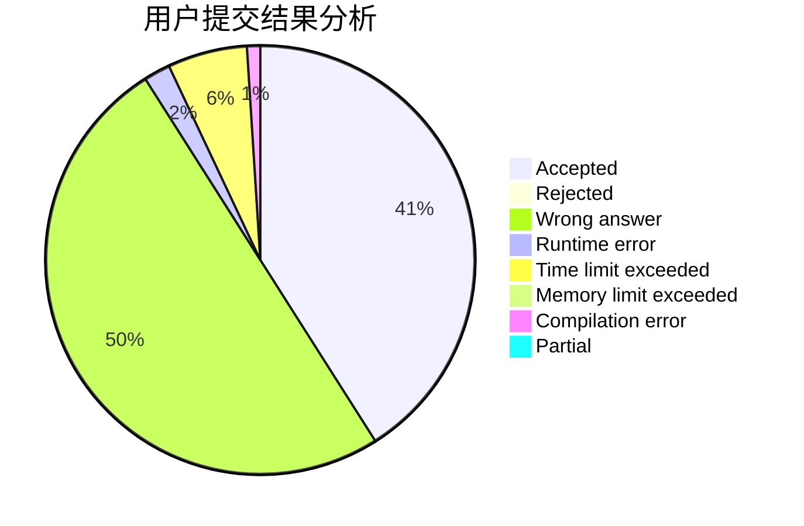
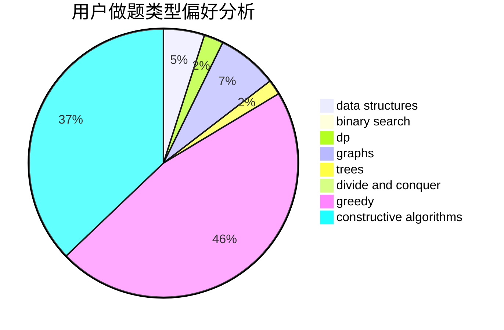
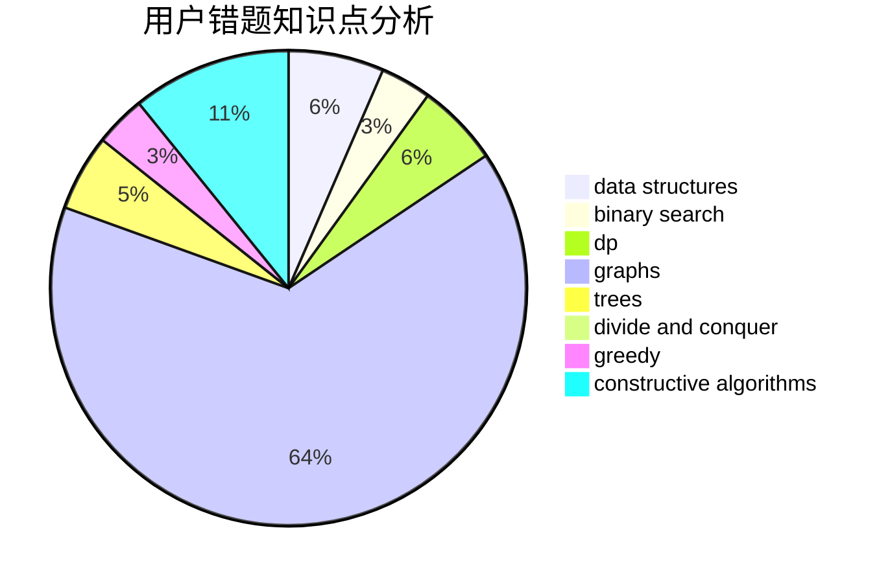

# Xuu

<!-- tabs:start -->

#### **用户提交结果分析**

#### **用户做题类型偏好分析**

#### **用户错题知识点分析**

<!-- tabs:end -->
# 推荐题目
[1504D](https://codeforces.com/contest/1504/problem/D)		dsu,graphs,sortings,trees		  
[1164M](https://codeforces.com/contest/1164/problem/M)		dsu,graphs,sortings,trees		  
[1165C](https://codeforces.com/contest/1165/problem/C)		greedy		  
[309B](https://codeforces.com/contest/309/problem/B)		dp,
                        two pointers		  
[590A](https://codeforces.com/contest/590/problem/A)		implementation		  
[1142C](https://codeforces.com/contest/1142/problem/C)		geometry		  
[762D](https://codeforces.com/contest/762/problem/D)		dp,
                        greedy,
                        implementation		  
[980E](https://codeforces.com/contest/980/problem/E)		data structures,
                        greedy,
                        trees		  
[452B](https://codeforces.com/contest/452/problem/B)		brute force,
                        constructive algorithms,
                        geometry,
                        trees		  
[898A](https://codeforces.com/contest/898/problem/A)		implementation,
                        math		  
