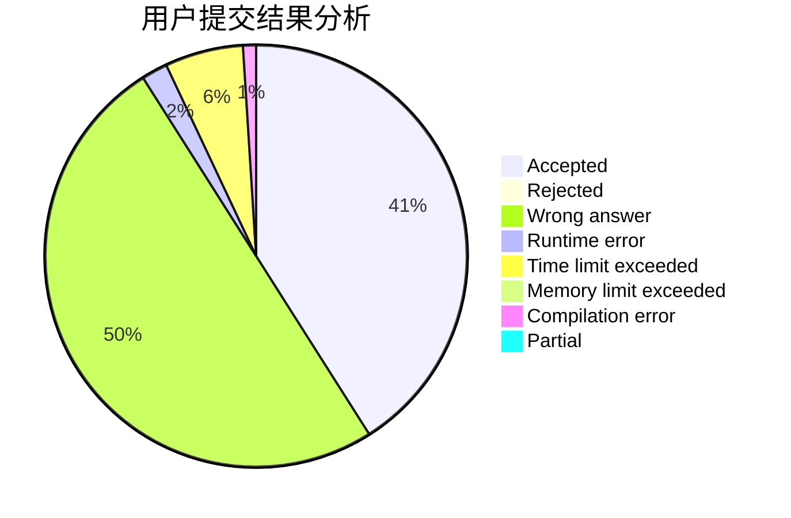
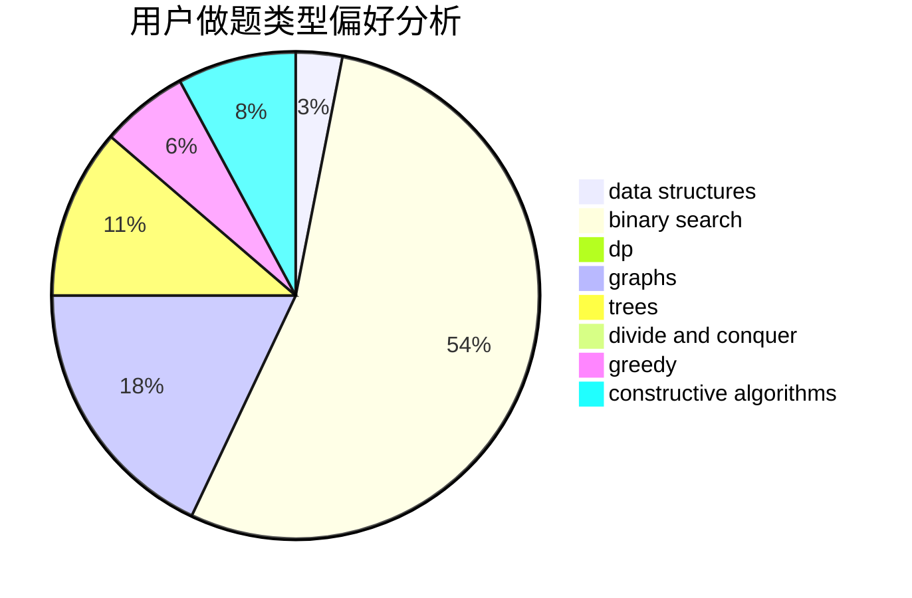

# Xuu

<!-- tabs:start -->

#### **用户提交结果分析**

#### **用户做题类型偏好分析**

#### **用户错题知识点分析**

<!-- tabs:end -->
# 推荐题目
[1513C](https://codeforces.com/contest/1513/problem/C)		dp,
                        matrices		  
[1166D](https://codeforces.com/contest/1166/problem/D)		binary search,
                        brute force,
                        greedy,
                        math		  
[1167E](https://codeforces.com/contest/1167/problem/E)		binary search,
                        combinatorics,
                        data structures,
                        two pointers		  
[32A](https://codeforces.com/contest/32/problem/A)		brute force		  
[609F](https://codeforces.com/contest/609/problem/F)		data structures,
                        greedy		  
[1144E](https://codeforces.com/contest/1144/problem/E)		bitmasks,
                        math,
                        number theory,
                        strings		  
[780H](https://codeforces.com/contest/780/problem/H)		binary search,
                        geometry,
                        implementation,
                        two pointers		  
[996A](https://codeforces.com/contest/996/problem/A)		dp,
                        greedy		  
[474B](https://codeforces.com/contest/474/problem/B)		binary search,
                        implementation		  
[914C](https://codeforces.com/contest/914/problem/C)		brute force,
                        combinatorics,
                        dp		  
