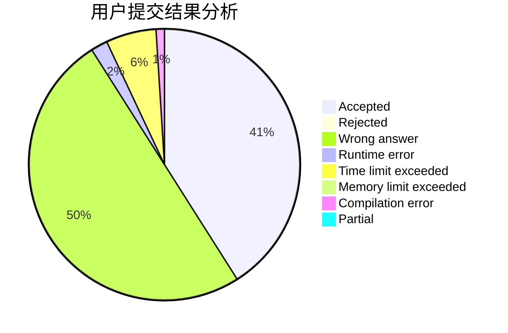
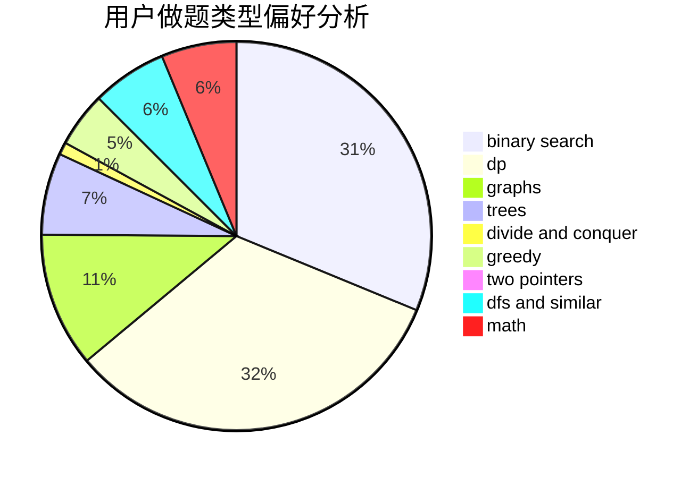

# Xuu

<!-- tabs:start -->

#### **用户提交结果分析**

#### **用户做题类型偏好分析**

<!-- tabs:end -->
# 推荐题目
[1513C](https://codeforces.com/contest/1513/problem/C)
[1166D](https://codeforces.com/contest/1166/problem/D)
[1167E](https://codeforces.com/contest/1167/problem/E)
[32A](https://codeforces.com/contest/32/problem/A)
[609F](https://codeforces.com/contest/609/problem/F)
[1144E](https://codeforces.com/contest/1144/problem/E)
[780H](https://codeforces.com/contest/780/problem/H)
[996A](https://codeforces.com/contest/996/problem/A)
[474B](https://codeforces.com/contest/474/problem/B)
[914C](https://codeforces.com/contest/914/problem/C)
