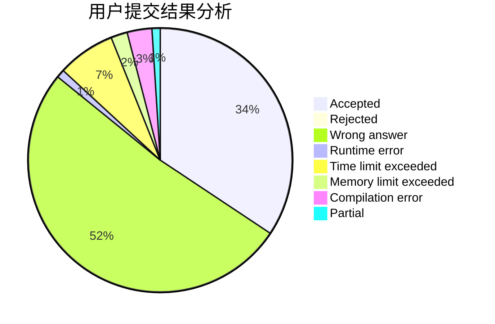
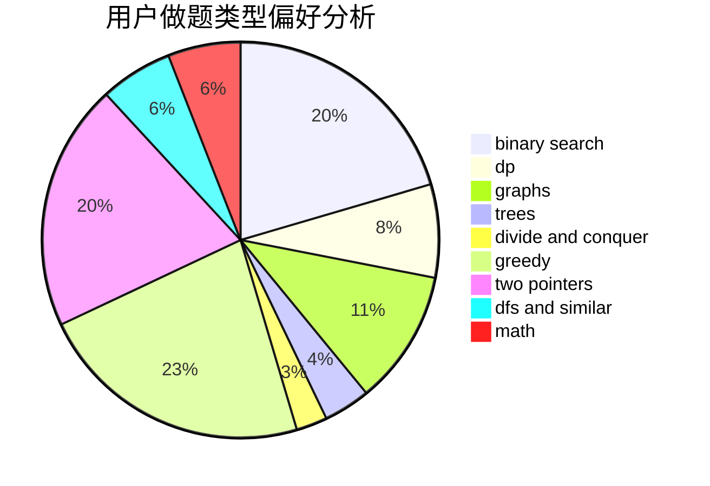

# Y25t

<!-- tabs:start -->

#### **用户提交结果分析**

#### **用户做题类型偏好分析**

<!-- tabs:end -->
# 推荐题目
[1413A](https://codeforces.com/contest/1413/problem/A)
[490F](https://codeforces.com/contest/490/problem/F)
[868E](https://codeforces.com/contest/868/problem/E)
[656E](https://codeforces.com/contest/656/problem/E)
[1159D](https://codeforces.com/contest/1159/problem/D)
[902B](https://codeforces.com/contest/902/problem/B)
[269B](https://codeforces.com/contest/269/problem/B)
[1364E](https://codeforces.com/contest/1364/problem/E)
[1312G](https://codeforces.com/contest/1312/problem/G)
[1328D](https://codeforces.com/contest/1328/problem/D)
