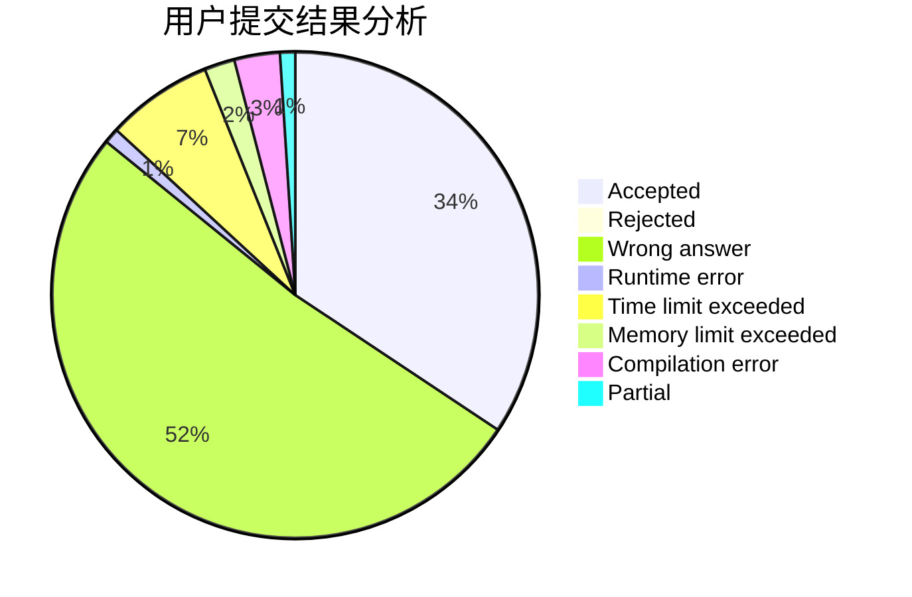
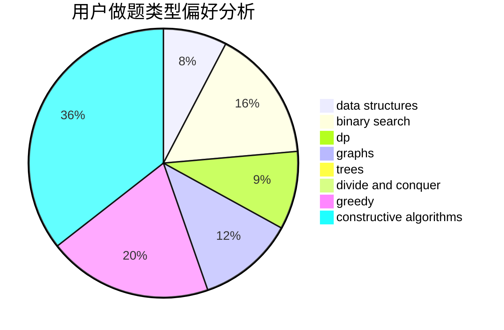
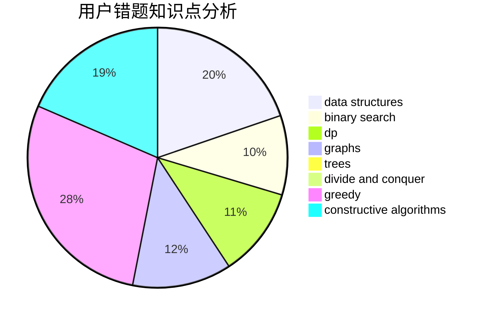

# Y25t

<!-- tabs:start -->

#### **用户提交结果分析**

#### **用户做题类型偏好分析**

#### **用户错题知识点分析**

<!-- tabs:end -->
# 推荐题目
[1401E](https://codeforces.com/contest/1401/problem/E)		data structures,
                        geometry,
                        implementation,
                        sortings		  
[472C](https://codeforces.com/contest/472/problem/C)		greedy		  
[84A](https://codeforces.com/contest/84/problem/A)		math,
                        number theory		  
[628D](https://codeforces.com/contest/628/problem/D)		dp		  
[1157C2](https://codeforces.com/contest/1157C/problem/2)		greedy		  
[884A](https://codeforces.com/contest/884/problem/A)		implementation		  
[24E](https://codeforces.com/contest/24/problem/E)		binary search		  
[1357B2](https://codeforces.com/contest/1357B/problem/2)		nan		  
[1304B](https://codeforces.com/contest/1304/problem/B)		brute force,
                        constructive algorithms,
                        greedy,
                        implementation,
                        strings		  
[1321E](https://codeforces.com/contest/1321/problem/E)		dsu,graphs,sortings,trees		  
