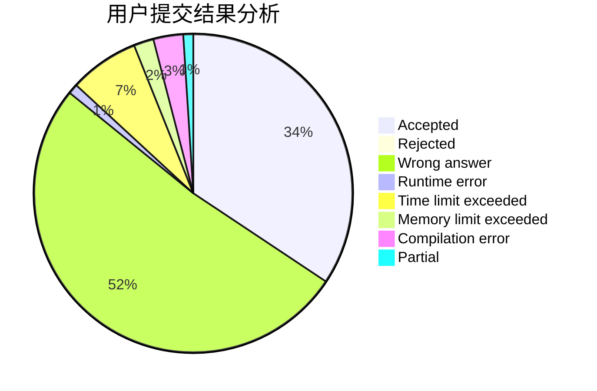
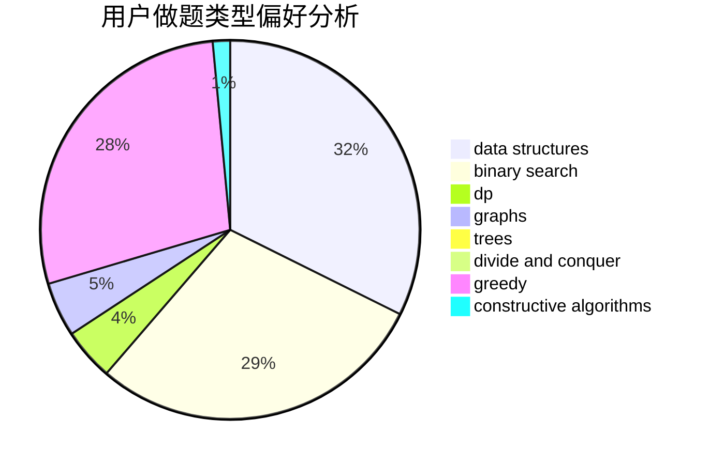
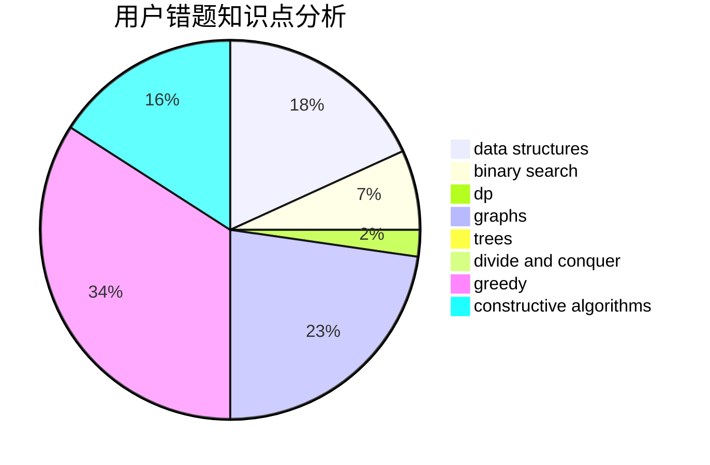

# Y25t

<!-- tabs:start -->

#### **用户提交结果分析**

#### **用户做题类型偏好分析**

#### **用户错题知识点分析**

<!-- tabs:end -->
# 推荐题目
[1413A](https://codeforces.com/contest/1413/problem/A)		constructive algorithms,
                        math		  
[490F](https://codeforces.com/contest/490/problem/F)		data structures,
                        dfs and similar,
                        dp,
                        trees		  
[868E](https://codeforces.com/contest/868/problem/E)		dp,
                        graphs,
                        trees		  
[656E](https://codeforces.com/contest/656/problem/E)		*special problem		  
[1159D](https://codeforces.com/contest/1159/problem/D)		dsu,graphs,sortings,trees		  
[902B](https://codeforces.com/contest/902/problem/B)		dfs and similar,
                        dsu,
                        greedy		  
[269B](https://codeforces.com/contest/269/problem/B)		dp		  
[1364E](https://codeforces.com/contest/1364/problem/E)		bitmasks,
                        constructive algorithms,
                        divide and conquer,
                        interactive,
                        probabilities		  
[1312G](https://codeforces.com/contest/1312/problem/G)		data structures,
                        dfs and similar,
                        dp		  
[1328D](https://codeforces.com/contest/1328/problem/D)		constructive algorithms,
                        dp,
                        graphs,
                        greedy,
                        math		  
