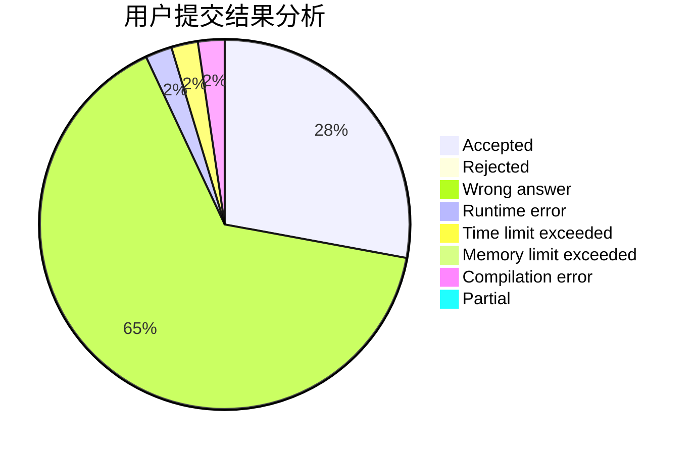
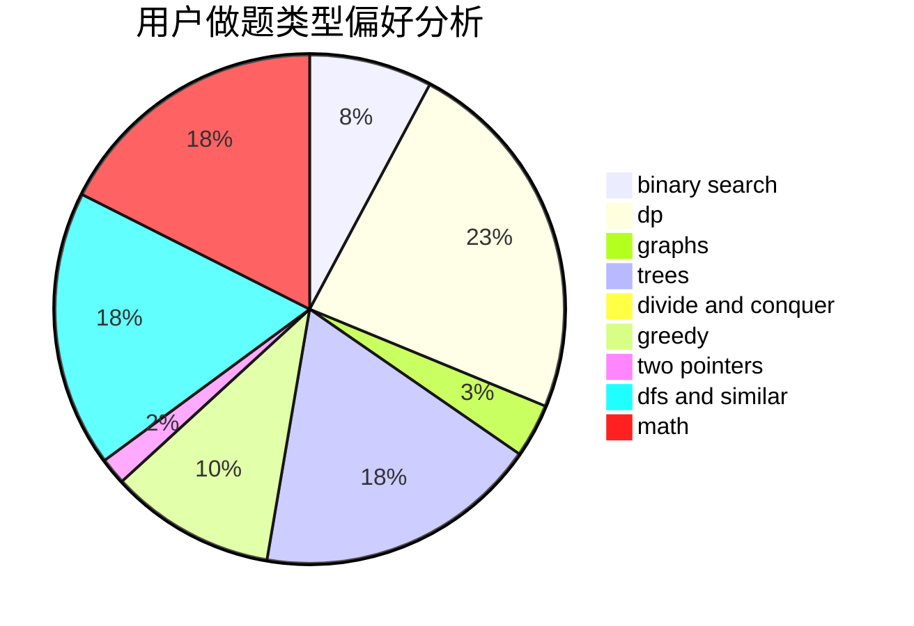

# YHT_CC

<!-- tabs:start -->

#### **用户提交结果分析**

#### **用户做题类型偏好分析**

<!-- tabs:end -->
# 推荐题目
[58E](https://codeforces.com/contest/58/problem/E)
[385E](https://codeforces.com/contest/385/problem/E)
[418B](https://codeforces.com/contest/418/problem/B)
[439D](https://codeforces.com/contest/439/problem/D)
[998B](https://codeforces.com/contest/998/problem/B)
[12542](https://codeforces.com/contest/1254/problem/2)
[12A](https://codeforces.com/contest/12/problem/A)
[13352](https://codeforces.com/contest/1335/problem/2)
[1071D](https://codeforces.com/contest/1071/problem/D)
[997E](https://codeforces.com/contest/997/problem/E)
