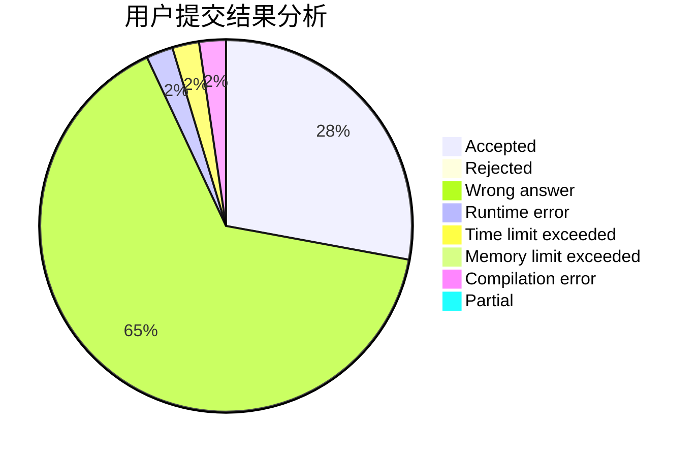
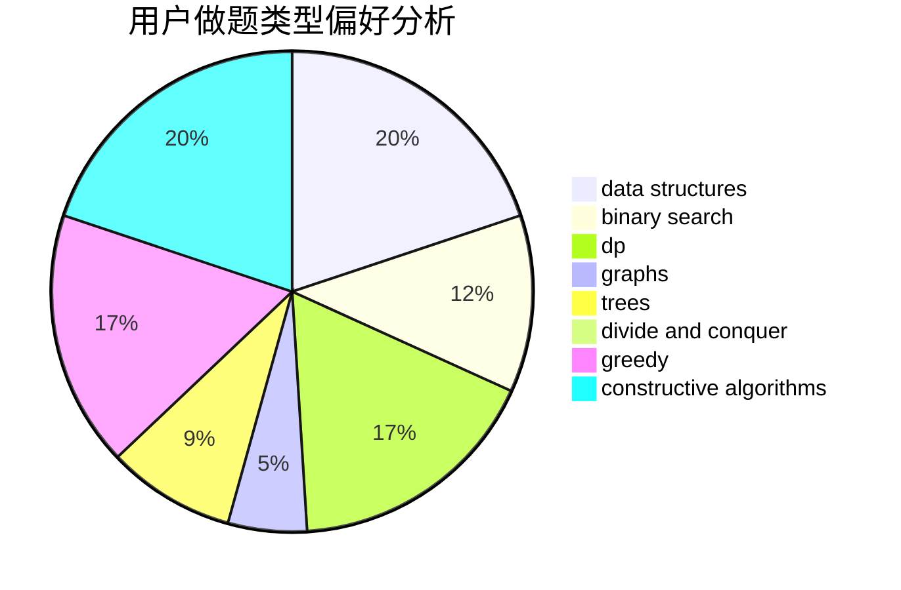
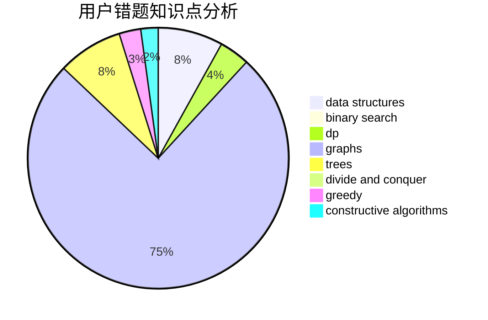

# YHT_CC

<!-- tabs:start -->

#### **用户提交结果分析**

#### **用户做题类型偏好分析**

#### **用户错题知识点分析**

<!-- tabs:end -->
# 推荐题目
[58E](https://codeforces.com/contest/58/problem/E)		dp		  
[385E](https://codeforces.com/contest/385/problem/E)		math,
                        matrices		  
[418B](https://codeforces.com/contest/418/problem/B)		dsu,graphs,sortings,trees		  
[439D](https://codeforces.com/contest/439/problem/D)		binary search,
                        sortings,
                        ternary search,
                        two pointers		  
[998B](https://codeforces.com/contest/998/problem/B)		dp,
                        greedy,
                        sortings		  
[12542](https://codeforces.com/contest/1254/problem/2)		dsu,graphs,sortings,trees		  
[12A](https://codeforces.com/contest/12/problem/A)		implementation		  
[13352](https://codeforces.com/contest/1335/problem/2)		dsu,graphs,sortings,trees		  
[1071D](https://codeforces.com/contest/1071/problem/D)		dsu,graphs,sortings,trees		  
[997E](https://codeforces.com/contest/997/problem/E)		data structures		  
