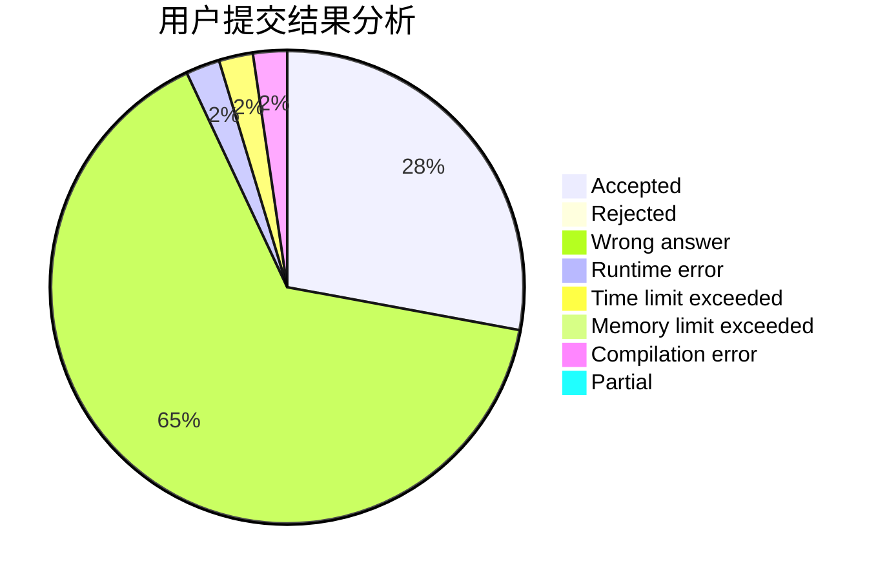
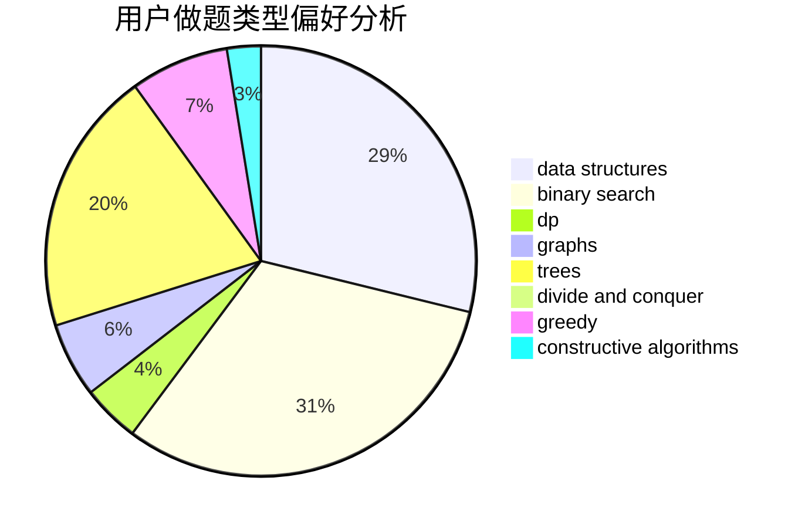
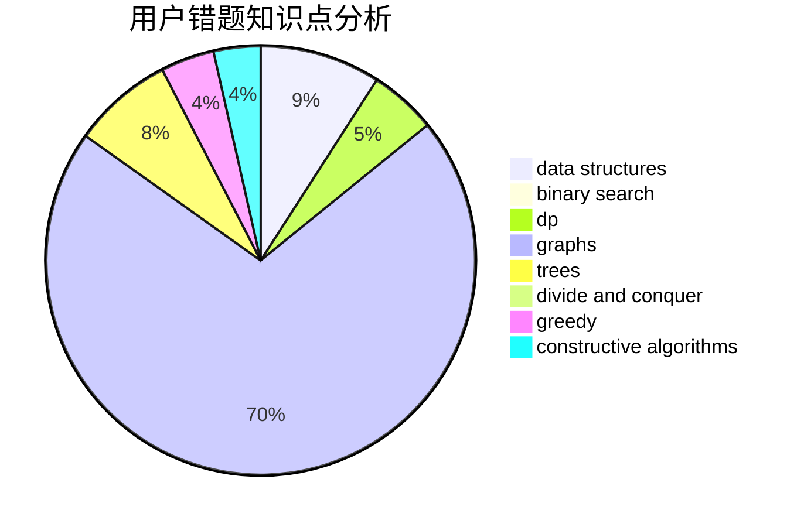

# YHT_CC

<!-- tabs:start -->

#### **用户提交结果分析**

#### **用户做题类型偏好分析**

#### **用户错题知识点分析**

<!-- tabs:end -->
# 推荐题目
[56B](https://codeforces.com/contest/56/problem/B)		implementation		  
[359B](https://codeforces.com/contest/359/problem/B)		constructive algorithms,
                        dp,
                        math		  
[388E](https://codeforces.com/contest/388/problem/E)		geometry		  
[414B](https://codeforces.com/contest/414/problem/B)		combinatorics,
                        dp,
                        number theory		  
[982D](https://codeforces.com/contest/982/problem/D)		brute force,
                        data structures,
                        dsu,
                        trees		  
[1250B](https://codeforces.com/contest/1250/problem/B)		brute force,
                        constructive algorithms,
                        greedy,
                        math		  
[1292F](https://codeforces.com/contest/1292/problem/F)		bitmasks,
                        combinatorics,
                        dp		  
[1328F](https://codeforces.com/contest/1328/problem/F)		greedy		  
[1071A](https://codeforces.com/contest/1071/problem/A)		dsu,graphs,sortings,trees		  
[982B](https://codeforces.com/contest/982/problem/B)		data structures,
                        greedy,
                        implementation		  
