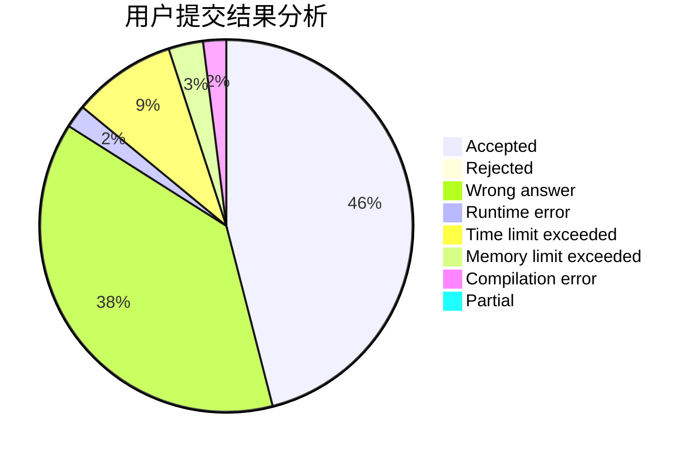
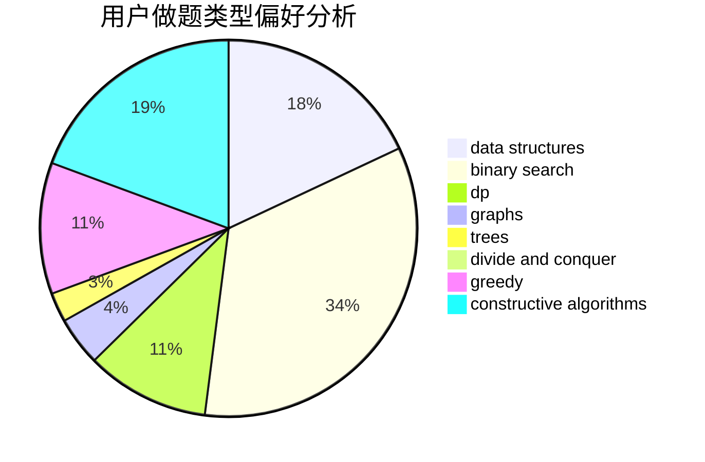

# YIMEI

<!-- tabs:start -->

#### **用户提交结果分析**

#### **用户做题类型偏好分析**

#### **用户错题知识点分析**

<!-- tabs:end -->
# 推荐题目
[185A](https://codeforces.com/contest/185/problem/A)		math		  
[827A](https://codeforces.com/contest/827/problem/A)		data structures,
                        greedy,
                        sortings,
                        strings		  
[594E](https://codeforces.com/contest/594/problem/E)		string suffix structures,
                        strings		  
[1307F](https://codeforces.com/contest/1307/problem/F)		dfs and similar,
                        dsu,
                        trees		  
[939F](https://codeforces.com/contest/939/problem/F)		data structures,
                        dp		  
[292A](https://codeforces.com/contest/292/problem/A)		implementation		  
[1113D](https://codeforces.com/contest/1113/problem/D)		dsu,graphs,sortings,trees		  
[915D](https://codeforces.com/contest/915/problem/D)		dfs and similar,
                        graphs		  
[940D](https://codeforces.com/contest/940/problem/D)		binary search,
                        implementation		  
[548C](https://codeforces.com/contest/548/problem/C)		dsu,graphs,sortings,trees		  
