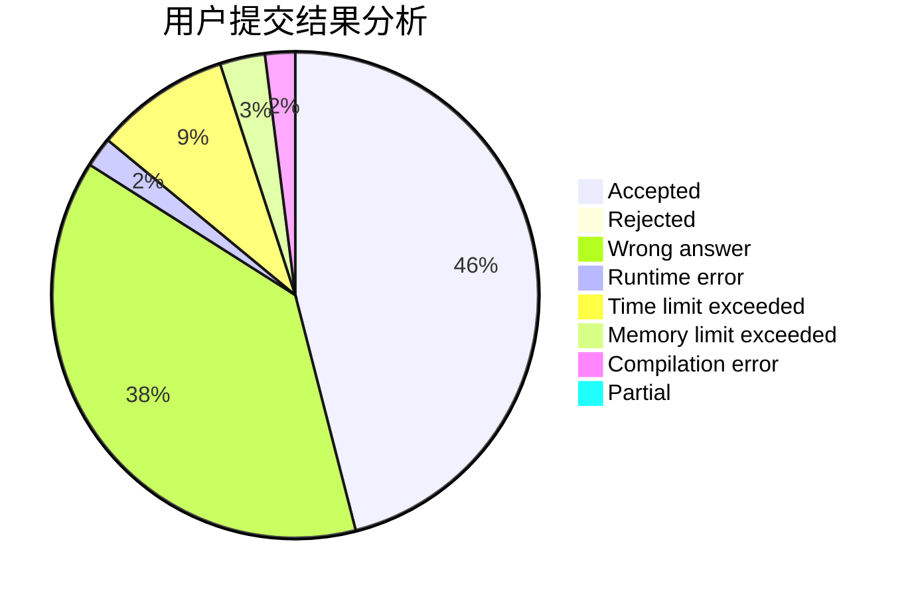
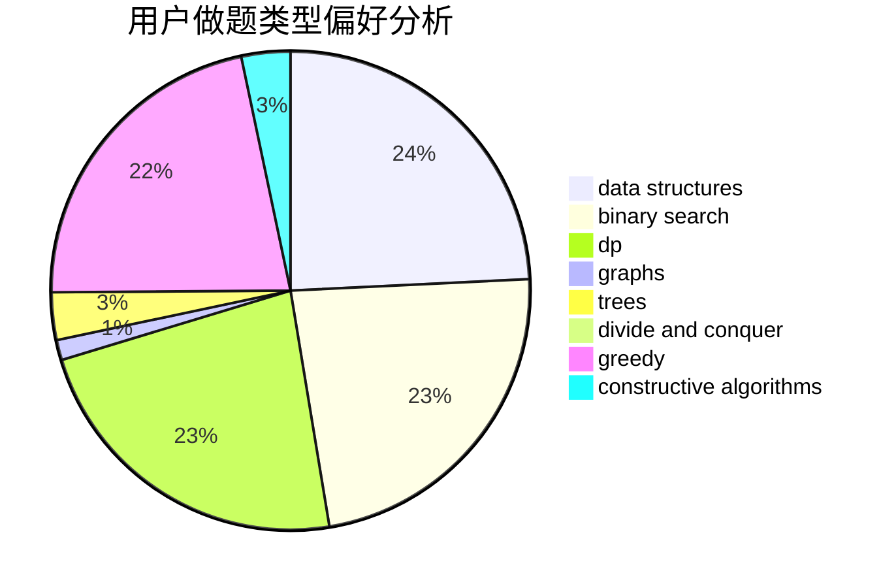

# YIMEI

<!-- tabs:start -->

#### **用户提交结果分析**

#### **用户做题类型偏好分析**

#### **用户错题知识点分析**

<!-- tabs:end -->
# 推荐题目
[160B](https://codeforces.com/contest/160/problem/B)		greedy,
                        sortings		  
[809B](https://codeforces.com/contest/809/problem/B)		binary search,
                        interactive		  
[574D](https://codeforces.com/contest/574/problem/D)		dsu,graphs,sortings,trees		  
[1300A](https://codeforces.com/contest/1300/problem/A)		implementation,
                        math		  
[919E](https://codeforces.com/contest/919/problem/E)		chinese remainder theorem,
                        math,
                        number theory		  
[277B](https://codeforces.com/contest/277/problem/B)		constructive algorithms,
                        geometry		  
[1113A](https://codeforces.com/contest/1113/problem/A)		dp,
                        greedy,
                        math		  
[899D](https://codeforces.com/contest/899/problem/D)		constructive algorithms,
                        math		  
[920E](https://codeforces.com/contest/920/problem/E)		data structures,
                        dfs and similar,
                        dsu,
                        graphs		  
[523D](https://codeforces.com/contest/523/problem/D)		*special problem,
                        data structures,
                        implementation		  
