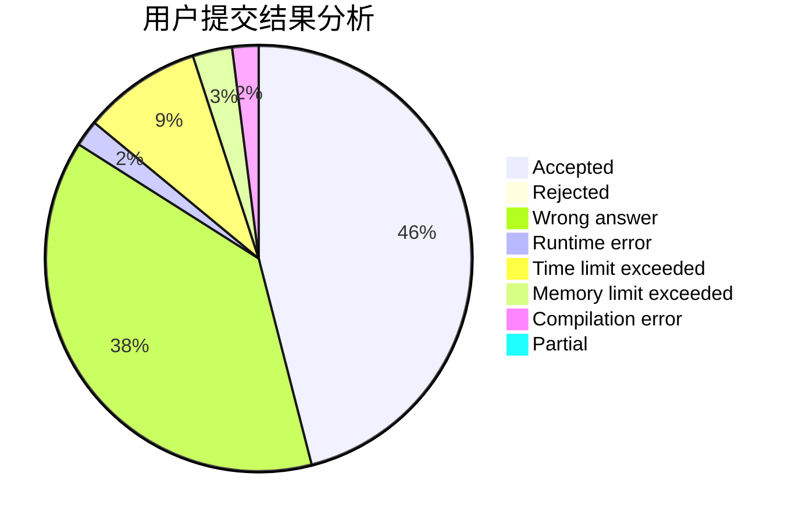
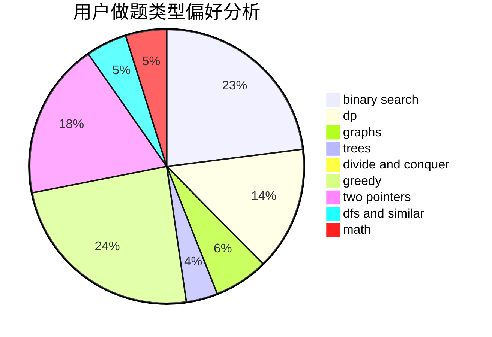

# YIMEI

<!-- tabs:start -->

#### **用户提交结果分析**

#### **用户做题类型偏好分析**

<!-- tabs:end -->
# 推荐题目
[185A](https://codeforces.com/contest/185/problem/A)
[827A](https://codeforces.com/contest/827/problem/A)
[594E](https://codeforces.com/contest/594/problem/E)
[1307F](https://codeforces.com/contest/1307/problem/F)
[939F](https://codeforces.com/contest/939/problem/F)
[292A](https://codeforces.com/contest/292/problem/A)
[1113D](https://codeforces.com/contest/1113/problem/D)
[915D](https://codeforces.com/contest/915/problem/D)
[940D](https://codeforces.com/contest/940/problem/D)
[548C](https://codeforces.com/contest/548/problem/C)
