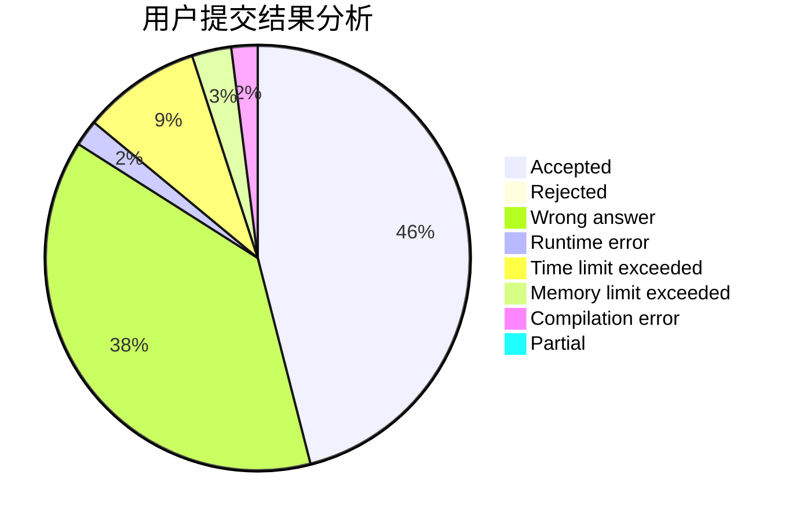
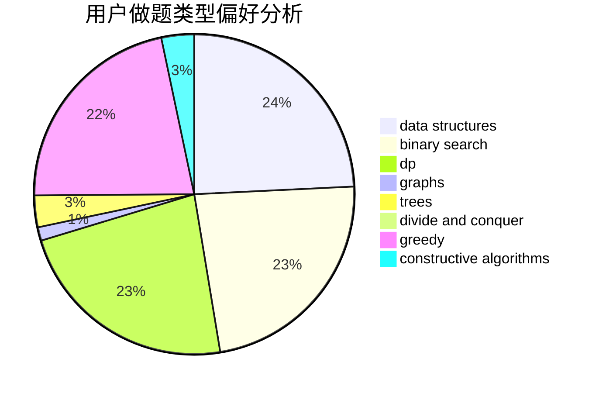

# YIMEI
<!-- tabs:start -->
#### **用户提交结果分析**

#### **用户做题类型偏好分析**

#### **用户错题知识点分析**

<!-- tabs:end -->
# 推荐题目
[Unlucky Ticket](http://codeforces.com/problemset/problem/160/B)		greedy,
                        sortings		  
[Sasha and His Trip](http://codeforces.com/problemset/problem/1113/A)		dp,
                        greedy,
                        math		  
[Numbers](http://codeforces.com/problemset/problem/13/A)		implementation,
                        math		  
[Non-zero](http://codeforces.com/problemset/problem/1300/A)		implementation,
                        math		  
[New Year and Hurry](http://codeforces.com/problemset/problem/750/A)		binary search,
                        brute force,
                        implementation,
                        math		  
[Ordering Pizza](http://codeforces.com/problemset/problem/865/B)		binary search,
                        sortings,
                        ternary search		  
[Table Tennis](http://codeforces.com/problemset/problem/879/B)		data structures,
                        implementation		  
[Statistics of Recompressing Videos](http://codeforces.com/problemset/problem/523/D)		*special problem,
                        data structures,
                        implementation		  
[Bribes](http://codeforces.com/problemset/problem/575/B)		dfs and similar,
                        graphs,
                        trees		  
[Distinguish Rz(θ) from Ry(θ)](http://codeforces.com/problemset/problem/1357/A5)		nan		  
<!-- tabs:start -->
#### **data structures**
[Unlucky Ticket](http://codeforces.com/problemset/problem/879/B)		data structures,
                        implementation		  
[Sasha and His Trip](http://codeforces.com/problemset/problem/523/D)		*special problem,
                        data structures,
                        implementation		  
[Numbers](https://codeforces.com/contest/205/problem/D)		binary search,
                        data structures		  
[Non-zero](http://codeforces.com/problemset/problem/920/E)		data structures,
                        dfs and similar,
                        dsu,
                        graphs		  
[New Year and Hurry](http://codeforces.com/problemset/problem/47/E)		data structures,
                        geometry,
                        sortings		  
[Ordering Pizza](http://codeforces.com/problemset/problem/1389/F)		data structures,
                        dp,
                        graph matchings,
                        sortings		  
[Table Tennis](http://codeforces.com/problemset/problem/846/F)		data structures,
                        math,
                        probabilities,
                        two pointers		  
[Statistics of Recompressing Videos](http://codeforces.com/problemset/problem/266/E)		data structures,
                        math		  
[Bribes](https://codeforces.com/contest/462/problem/E)		data structures,
                        implementation		  
[Distinguish Rz(θ) from Ry(θ)](http://codeforces.com/problemset/problem/208/E)		binary search,
                        data structures,
                        dfs and similar,
                        trees		  
#### **binary search**
[Unlucky Ticket](http://codeforces.com/problemset/problem/750/A)		binary search,
                        brute force,
                        implementation,
                        math		  
[Sasha and His Trip](http://codeforces.com/problemset/problem/865/B)		binary search,
                        sortings,
                        ternary search		  
[Numbers](https://codeforces.com/contest/205/problem/D)		binary search,
                        data structures		  
[Non-zero](http://codeforces.com/problemset/problem/208/E)		binary search,
                        data structures,
                        dfs and similar,
                        trees		  
[New Year and Hurry](http://codeforces.com/problemset/problem/749/D)		binary search,
                        data structures		  
[Ordering Pizza](https://codeforces.com/contest/574/problem/D)		binary search,
                        data structures,
                        dp,
                        math		  
[Table Tennis](http://codeforces.com/problemset/problem/817/C)		binary search,
                        brute force,
                        dp,
                        math		  
[Statistics of Recompressing Videos](http://codeforces.com/problemset/problem/809/B)		binary search,
                        interactive		  
[Bribes](http://codeforces.com/problemset/problem/1260/B)		binary search,
                        math		  
[Distinguish Rz(θ) from Ry(θ)](http://codeforces.com/problemset/problem/920/G)		binary search,
                        bitmasks,
                        brute force,
                        combinatorics,
                        math,
                        number theory		  
#### **dp**
[Unlucky Ticket](http://codeforces.com/problemset/problem/1113/A)		dp,
                        greedy,
                        math		  
[Sasha and His Trip](http://codeforces.com/problemset/problem/1455/F)		dp,
                        greedy		  
[Numbers](http://codeforces.com/problemset/problem/788/A)		dp,
                        two pointers		  
[Non-zero](http://codeforces.com/problemset/problem/1389/F)		data structures,
                        dp,
                        graph matchings,
                        sortings		  
[New Year and Hurry](https://codeforces.com/contest/438/problem/C)		dp,
                        geometry		  
[Ordering Pizza](http://codeforces.com/problemset/problem/1016/C)		dp,
                        implementation		  
[Table Tennis](https://codeforces.com/contest/574/problem/D)		binary search,
                        data structures,
                        dp,
                        math		  
[Statistics of Recompressing Videos](http://codeforces.com/problemset/problem/817/C)		binary search,
                        brute force,
                        dp,
                        math		  
[Bribes](http://codeforces.com/problemset/problem/1366/G)		data structures,
                        dp,
                        strings		  
[Distinguish Rz(θ) from Ry(θ)](http://codeforces.com/problemset/problem/797/F)		data structures,
                        dp,
                        greedy,
                        sortings		  
#### **graph**
[Unlucky Ticket](http://codeforces.com/problemset/problem/575/B)		dfs and similar,
                        graphs,
                        trees		  
[Sasha and His Trip](http://codeforces.com/problemset/problem/920/E)		data structures,
                        dfs and similar,
                        dsu,
                        graphs		  
[Numbers](http://codeforces.com/problemset/problem/1389/F)		data structures,
                        dp,
                        graph matchings,
                        sortings		  
[Non-zero](http://codeforces.com/problemset/problem/1487/C)		brute force,
                        constructive algorithms,
                        dfs and similar,
                        graphs,
                        greedy,
                        implementation,
                        math		  
[New Year and Hurry](http://codeforces.com/problemset/problem/1437/C)		dp,
                        flows,
                        graph matchings,
                        greedy,
                        math,
                        sortings		  
[Ordering Pizza](http://codeforces.com/problemset/problem/1470/D)		constructive algorithms,
                        dfs and similar,
                        graph matchings,
                        graphs,
                        greedy		  
[Table Tennis](http://codeforces.com/problemset/problem/1476/C)		dp,
                        graphs,
                        greedy		  
[Statistics of Recompressing Videos](http://codeforces.com/problemset/problem/1304/D)		constructive algorithms,
                        graphs,
                        greedy,
                        two pointers		  
[Bribes](http://codeforces.com/problemset/problem/1475/C)		combinatorics,
                        graphs,
                        math		  
[Distinguish Rz(θ) from Ry(θ)](http://codeforces.com/problemset/problem/553/E)		dp,
                        fft,
                        graphs,
                        math,
                        probabilities		  
#### **trees**
[Unlucky Ticket](http://codeforces.com/problemset/problem/575/B)		dfs and similar,
                        graphs,
                        trees		  
[Sasha and His Trip](http://codeforces.com/problemset/problem/1363/C)		games,
                        trees		  
[Numbers](http://codeforces.com/problemset/problem/208/E)		binary search,
                        data structures,
                        dfs and similar,
                        trees		  
[Non-zero](https://codeforces.com/contest/318/problem/D)		2-sat,
                        data structures,
                        trees		  
[New Year and Hurry](http://codeforces.com/problemset/problem/959/C)		constructive algorithms,
                        trees		  
[Ordering Pizza](http://codeforces.com/problemset/problem/1479/D)		binary search,
                        bitmasks,
                        brute force,
                        data structures,
                        probabilities,
                        trees		  
[Table Tennis](http://codeforces.com/problemset/problem/1511/C)		brute force,
                        data structures,
                        implementation,
                        trees		  
[Statistics of Recompressing Videos](http://codeforces.com/problemset/problem/1499/F)		combinatorics,
                        dfs and similar,
                        dp,
                        trees		  
[Bribes](http://codeforces.com/problemset/problem/1491/E)		brute force,
                        dfs and similar,
                        divide and conquer,
                        number theory,
                        trees		  
[Distinguish Rz(θ) from Ry(θ)](http://codeforces.com/problemset/problem/1466/D)		data structures,
                        greedy,
                        sortings,
                        trees		  
#### **divide and conquer**
[Unlucky Ticket](http://codeforces.com/problemset/problem/1428/F)		binary search,
                        data structures,
                        divide and conquer,
                        dp,
                        two pointers		  
[Sasha and His Trip](http://codeforces.com/problemset/problem/1461/D)		binary search,
                        brute force,
                        data structures,
                        divide and conquer,
                        implementation,
                        sortings		  
[Numbers](http://codeforces.com/problemset/problem/1466/G)		combinatorics,
                        divide and conquer,
                        hashing,
                        math,
                        string suffix structures,
                        strings		  
[Non-zero](http://codeforces.com/problemset/problem/1490/D)		dfs and similar,
                        divide and conquer,
                        implementation		  
[New Year and Hurry](https://codeforces.com/contest/1483/problem/C)		data structures,
                        divide and conquer,
                        dp		  
[Ordering Pizza](http://codeforces.com/problemset/problem/1491/E)		brute force,
                        dfs and similar,
                        divide and conquer,
                        number theory,
                        trees		  
[Table Tennis](http://codeforces.com/problemset/problem/1303/G)		data structures,
                        divide and conquer,
                        geometry,
                        trees		  
[Statistics of Recompressing Videos](http://codeforces.com/problemset/problem/1494/D)		constructive algorithms,
                        data structures,
                        dfs and similar,
                        divide and conquer,
                        dsu,
                        greedy,
                        sortings,
                        trees		  
[Bribes](http://codeforces.com/problemset/problem/1482/E)		data structures,
                        divide and conquer,
                        dp		  
[Distinguish Rz(θ) from Ry(θ)](http://codeforces.com/problemset/problem/566/C)		dfs and similar,
                        divide and conquer,
                        trees		  
#### **greedy**
[Unlucky Ticket](http://codeforces.com/problemset/problem/160/B)		greedy,
                        sortings		  
[Sasha and His Trip](http://codeforces.com/problemset/problem/1113/A)		dp,
                        greedy,
                        math		  
[Numbers](http://codeforces.com/problemset/problem/845/B)		brute force,
                        greedy,
                        implementation		  
[Non-zero](http://codeforces.com/problemset/problem/1455/F)		dp,
                        greedy		  
[New Year and Hurry](http://codeforces.com/problemset/problem/1311/A)		greedy,
                        implementation,
                        math		  
[Ordering Pizza](http://codeforces.com/problemset/problem/339/A)		greedy,
                        implementation,
                        sortings,
                        strings		  
[Table Tennis](http://codeforces.com/problemset/problem/797/F)		data structures,
                        dp,
                        greedy,
                        sortings		  
[Statistics of Recompressing Videos](http://codeforces.com/problemset/problem/1428/E)		binary search,
                        data structures,
                        greedy,
                        math,
                        sortings		  
[Bribes](http://codeforces.com/problemset/problem/1491/A)		brute force,
                        greedy,
                        implementation		  
[Distinguish Rz(θ) from Ry(θ)](http://codeforces.com/problemset/problem/1492/B)		data structures,
                        greedy,
                        math		  
#### **constructive algorithms**
[Unlucky Ticket](http://codeforces.com/problemset/problem/277/B)		constructive algorithms,
                        geometry		  
[Sasha and His Trip](http://codeforces.com/problemset/problem/1025/E)		constructive algorithms,
                        implementation,
                        matrices		  
[Numbers](http://codeforces.com/problemset/problem/730/B)		constructive algorithms,
                        interactive		  
[Non-zero](http://codeforces.com/problemset/problem/254/A)		constructive algorithms,
                        sortings		  
[New Year and Hurry](http://codeforces.com/problemset/problem/1012/D)		constructive algorithms,
                        strings		  
[Ordering Pizza](http://codeforces.com/problemset/problem/899/D)		constructive algorithms,
                        math		  
[Table Tennis](http://codeforces.com/problemset/problem/803/A)		constructive algorithms		  
[Statistics of Recompressing Videos](http://codeforces.com/problemset/problem/959/C)		constructive algorithms,
                        trees		  
[Bribes](http://codeforces.com/problemset/problem/1454/D)		constructive algorithms,
                        math,
                        number theory		  
[Distinguish Rz(θ) from Ry(θ)](http://codeforces.com/problemset/problem/1493/A)		constructive algorithms,
                        greedy		  
#### **sortings**
[Unlucky Ticket](http://codeforces.com/problemset/problem/160/B)		greedy,
                        sortings		  
[Sasha and His Trip](http://codeforces.com/problemset/problem/865/B)		binary search,
                        sortings,
                        ternary search		  
[Numbers](http://codeforces.com/problemset/problem/47/E)		data structures,
                        geometry,
                        sortings		  
[Non-zero](http://codeforces.com/problemset/problem/1389/F)		data structures,
                        dp,
                        graph matchings,
                        sortings		  
[New Year and Hurry](http://codeforces.com/problemset/problem/254/A)		constructive algorithms,
                        sortings		  
[Ordering Pizza](http://codeforces.com/problemset/problem/339/A)		greedy,
                        implementation,
                        sortings,
                        strings		  
[Table Tennis](http://codeforces.com/problemset/problem/797/F)		data structures,
                        dp,
                        greedy,
                        sortings		  
[Statistics of Recompressing Videos](http://codeforces.com/problemset/problem/1428/E)		binary search,
                        data structures,
                        greedy,
                        math,
                        sortings		  
[Bribes](https://codeforces.com/contest/1496/problem/C)		geometry,
                        greedy,
                        math,
                        sortings		  
[Distinguish Rz(θ) from Ry(θ)](http://codeforces.com/problemset/problem/1495/A)		geometry,
                        greedy,
                        math,
                        sortings		  
<!-- tabs:end -->
