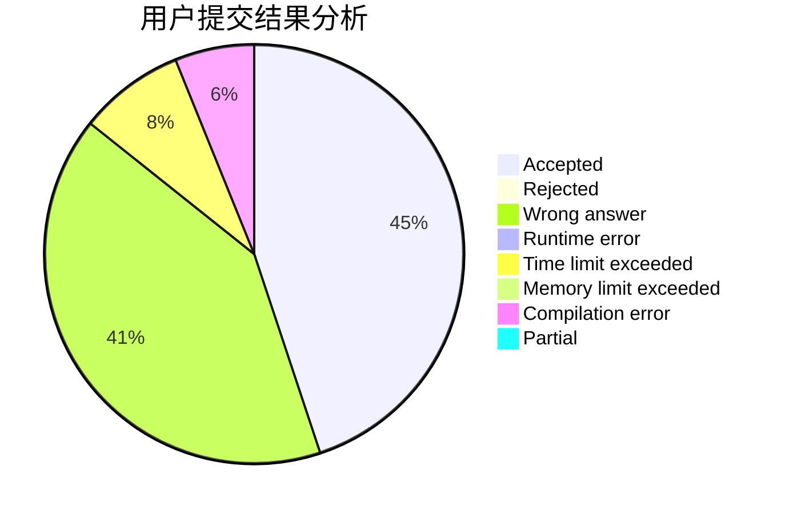
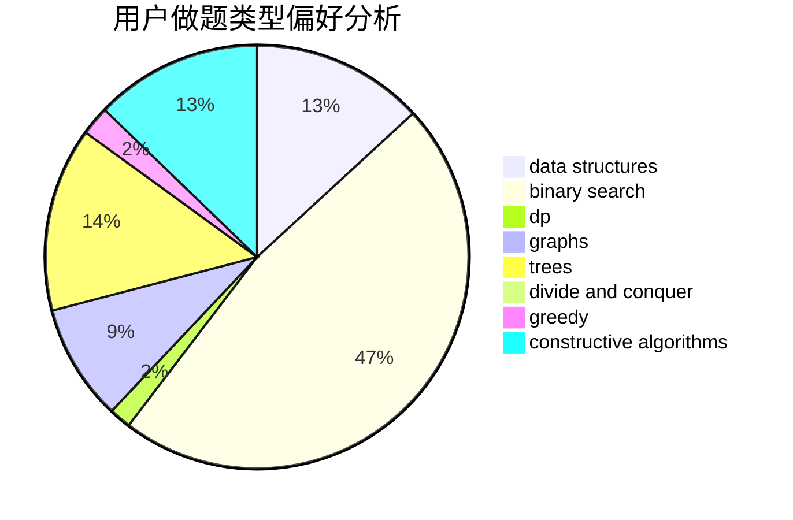
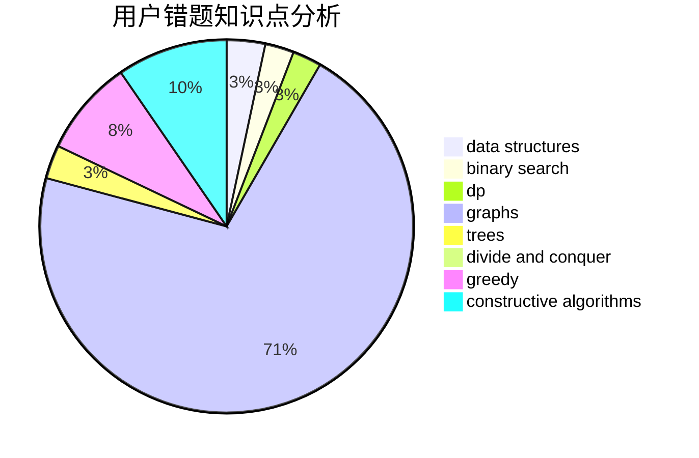

# YKgsmUDq

<!-- tabs:start -->

#### **用户提交结果分析**

#### **用户做题类型偏好分析**

#### **用户错题知识点分析**

<!-- tabs:end -->
# 推荐题目
[764A](https://codeforces.com/contest/764/problem/A)		brute force,
                        implementation,
                        math		  
[653C](https://codeforces.com/contest/653/problem/C)		brute force,
                        implementation		  
[782E](https://codeforces.com/contest/782/problem/E)		dsu,graphs,sortings,trees		  
[1379E](https://codeforces.com/contest/1379/problem/E)		constructive algorithms,
                        divide and conquer,
                        dp,
                        math,
                        trees		  
[607E](https://codeforces.com/contest/607/problem/E)		binary search,
                        geometry		  
[1047D](https://codeforces.com/contest/1047/problem/D)		dsu,graphs,sortings,trees		  
[1030A](https://codeforces.com/contest/1030/problem/A)		implementation		  
[860D](https://codeforces.com/contest/860/problem/D)		dsu,graphs,sortings,trees		  
[887D](https://codeforces.com/contest/887/problem/D)		data structures,
                        two pointers		  
[246B](https://codeforces.com/contest/246/problem/B)		greedy,
                        math		  
