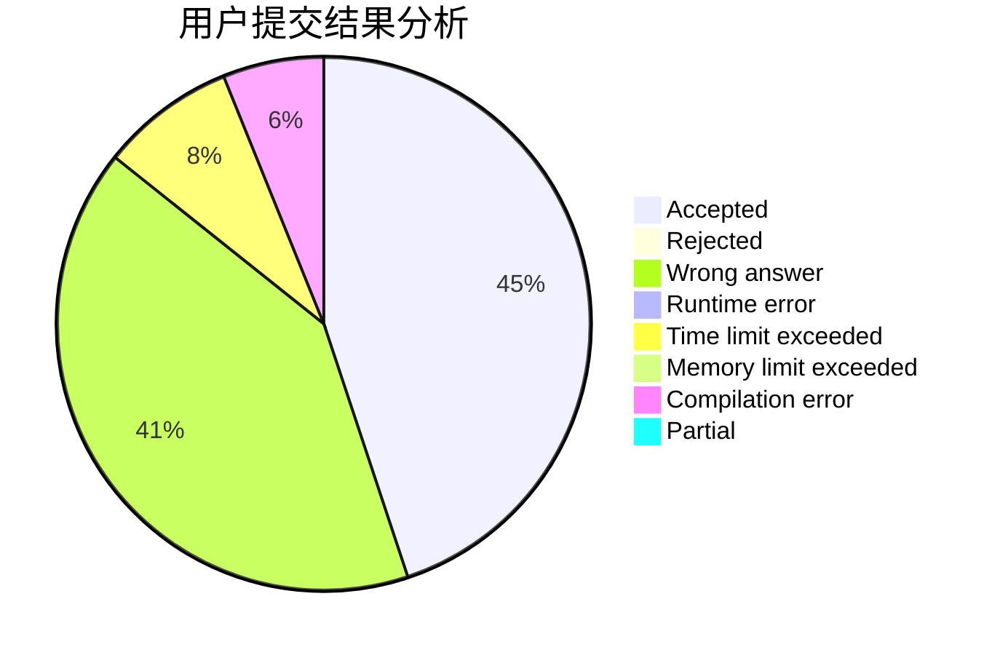
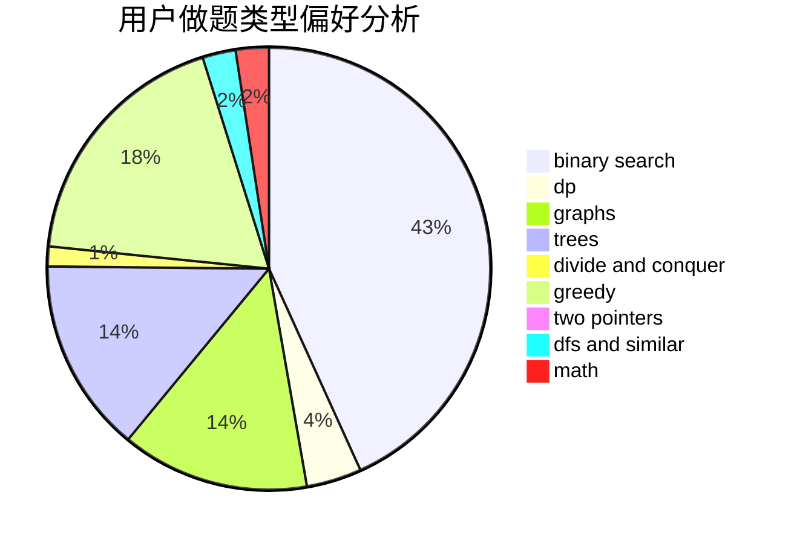

# YKgsmUDq

<!-- tabs:start -->

#### **用户提交结果分析**

#### **用户做题类型偏好分析**

<!-- tabs:end -->
# 推荐题目
[764A](https://codeforces.com/contest/764/problem/A)
[653C](https://codeforces.com/contest/653/problem/C)
[782E](https://codeforces.com/contest/782/problem/E)
[1379E](https://codeforces.com/contest/1379/problem/E)
[607E](https://codeforces.com/contest/607/problem/E)
[1047D](https://codeforces.com/contest/1047/problem/D)
[1030A](https://codeforces.com/contest/1030/problem/A)
[860D](https://codeforces.com/contest/860/problem/D)
[887D](https://codeforces.com/contest/887/problem/D)
[246B](https://codeforces.com/contest/246/problem/B)
