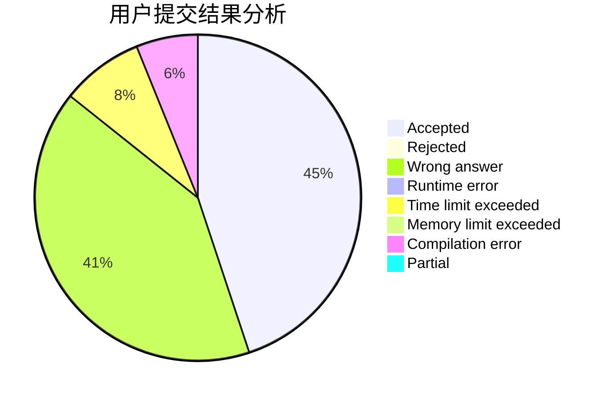
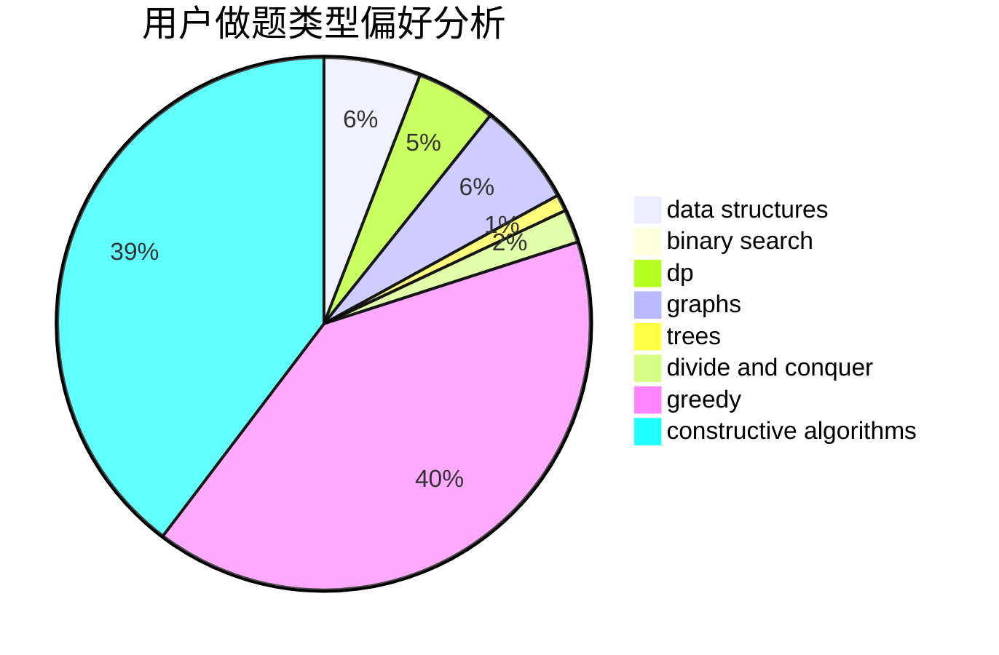
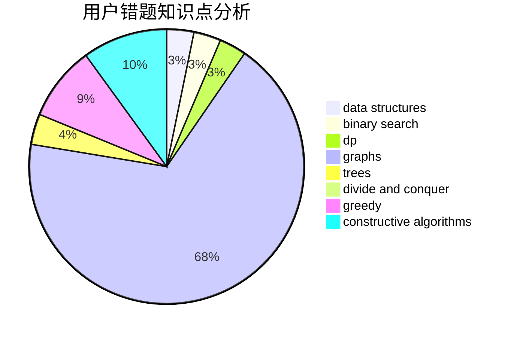

# YKgsmUDq

<!-- tabs:start -->

#### **用户提交结果分析**

#### **用户做题类型偏好分析**

#### **用户错题知识点分析**

<!-- tabs:end -->
# 推荐题目
[743E](https://codeforces.com/contest/743/problem/E)		binary search,
                        bitmasks,
                        brute force,
                        dp		  
[627C](https://codeforces.com/contest/627/problem/C)		data structures,
                        divide and conquer,
                        greedy		  
[764B](https://codeforces.com/contest/764/problem/B)		constructive algorithms,
                        implementation		  
[1371A](https://codeforces.com/contest/1371/problem/A)		math		  
[587D](https://codeforces.com/contest/587/problem/D)		2-sat,
                        binary search		  
[1047A](https://codeforces.com/contest/1047/problem/A)		math		  
[1029F](https://codeforces.com/contest/1029/problem/F)		binary search,
                        brute force,
                        math,
                        number theory		  
[841D](https://codeforces.com/contest/841/problem/D)		dsu,graphs,sortings,trees		  
[868B](https://codeforces.com/contest/868/problem/B)		implementation		  
[227A](https://codeforces.com/contest/227/problem/A)		geometry		  
