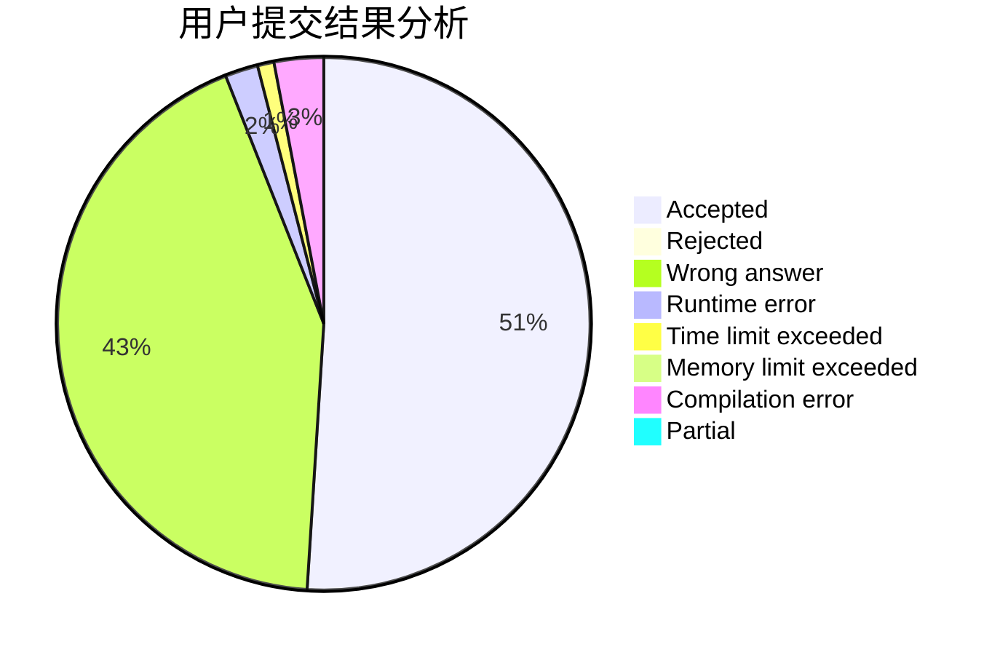
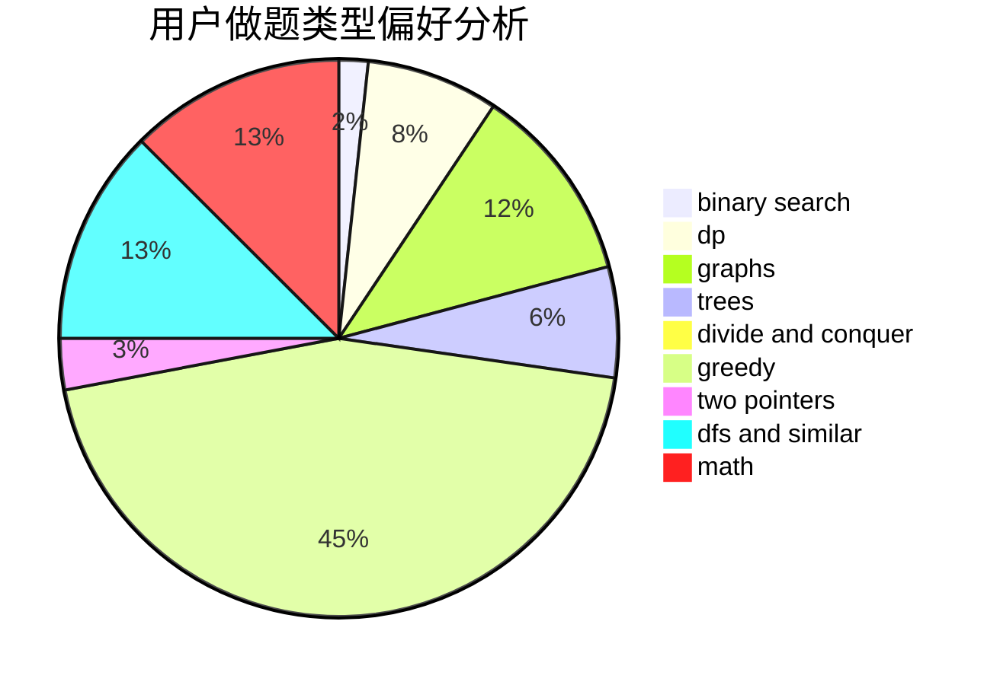

# Y_Y

<!-- tabs:start -->

#### **用户提交结果分析**

#### **用户做题类型偏好分析**

<!-- tabs:end -->
# 推荐题目
[225E](https://codeforces.com/contest/225/problem/E)
[656A](https://codeforces.com/contest/656/problem/A)
[1188C](https://codeforces.com/contest/1188/problem/C)
[523A](https://codeforces.com/contest/523/problem/A)
[452B](https://codeforces.com/contest/452/problem/B)
[482C](https://codeforces.com/contest/482/problem/C)
[1248C](https://codeforces.com/contest/1248/problem/C)
[990A](https://codeforces.com/contest/990/problem/A)
[998E](https://codeforces.com/contest/998/problem/E)
[61B](https://codeforces.com/contest/61/problem/B)
