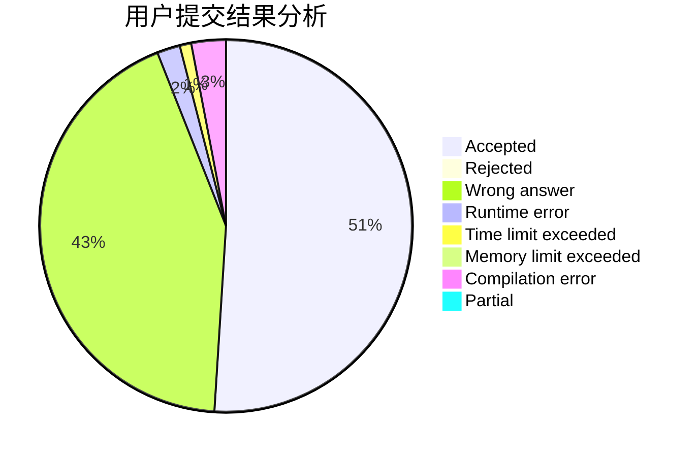
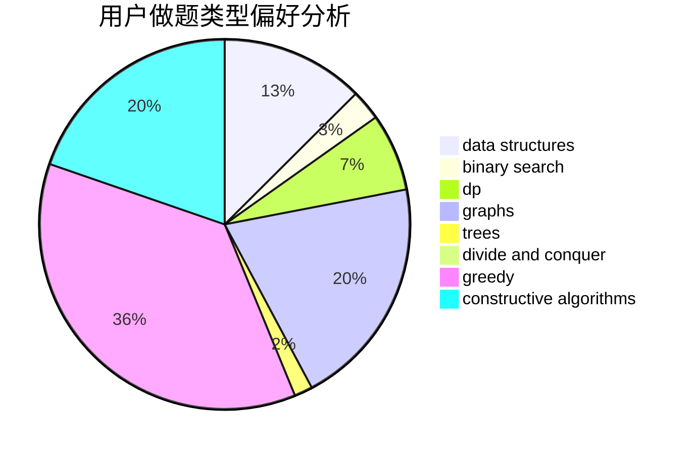
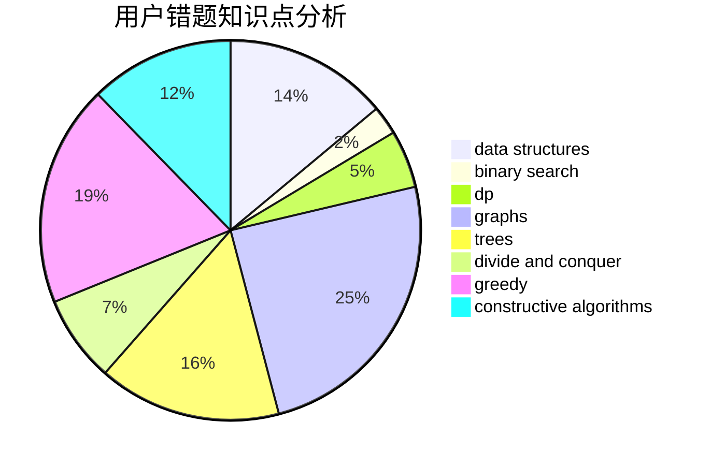

# Y_Y

<!-- tabs:start -->

#### **用户提交结果分析**

#### **用户做题类型偏好分析**

#### **用户错题知识点分析**

<!-- tabs:end -->
# 推荐题目
[225E](https://codeforces.com/contest/225/problem/E)		math,
                        number theory		  
[656A](https://codeforces.com/contest/656/problem/A)		*special problem		  
[1188C](https://codeforces.com/contest/1188/problem/C)		dp		  
[523A](https://codeforces.com/contest/523/problem/A)		*special problem,
                        implementation		  
[452B](https://codeforces.com/contest/452/problem/B)		brute force,
                        constructive algorithms,
                        geometry,
                        trees		  
[482C](https://codeforces.com/contest/482/problem/C)		bitmasks,
                        dp,
                        probabilities		  
[1248C](https://codeforces.com/contest/1248/problem/C)		dsu,graphs,sortings,trees		  
[990A](https://codeforces.com/contest/990/problem/A)		implementation,
                        math		  
[998E](https://codeforces.com/contest/998/problem/E)		dsu,graphs,sortings,trees		  
[61B](https://codeforces.com/contest/61/problem/B)		strings		  
