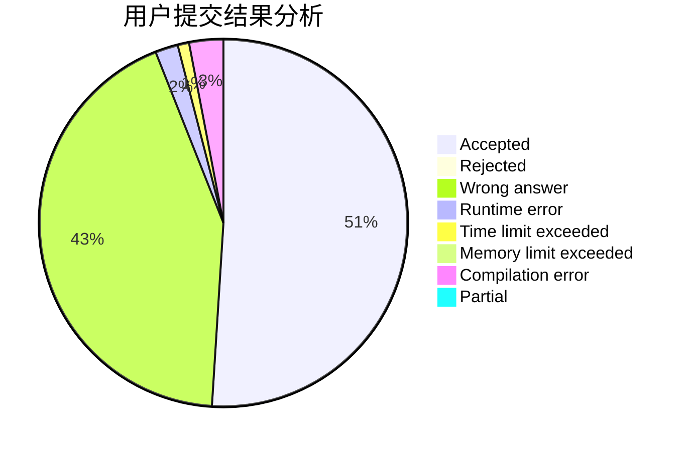
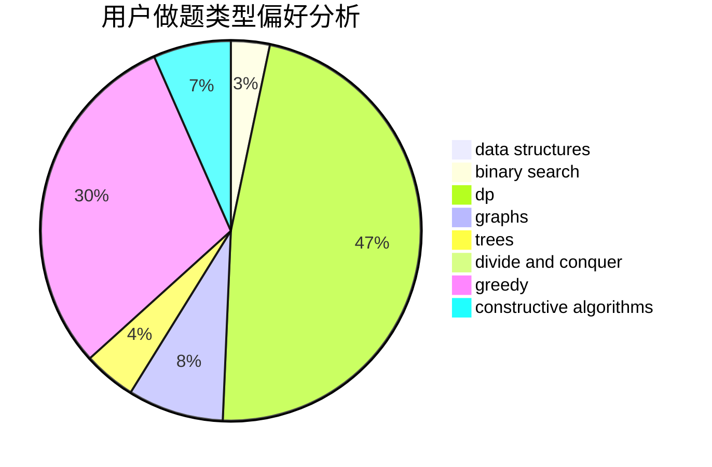
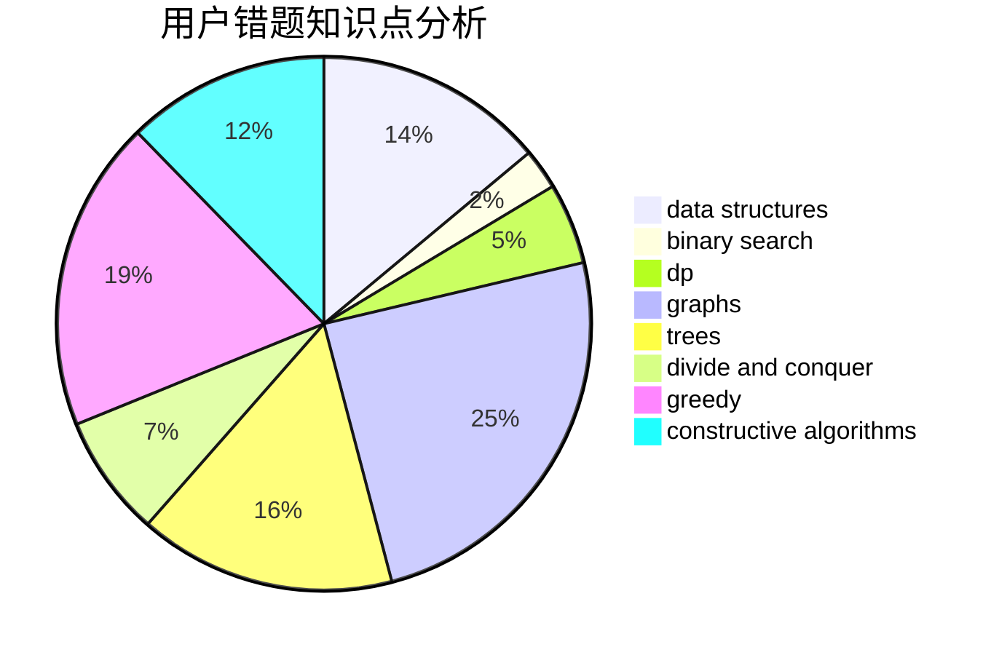

# Y_Y

<!-- tabs:start -->

#### **用户提交结果分析**

#### **用户做题类型偏好分析**

#### **用户错题知识点分析**

<!-- tabs:end -->
# 推荐题目
[200C](https://codeforces.com/contest/200/problem/C)		brute force,
                        implementation		  
[628B](https://codeforces.com/contest/628/problem/B)		dp		  
[1184E1](https://codeforces.com/contest/1184E/problem/1)		graphs,
                        trees		  
[501C](https://codeforces.com/contest/501/problem/C)		constructive algorithms,
                        data structures,
                        greedy,
                        sortings,
                        trees		  
[430A](https://codeforces.com/contest/430/problem/A)		constructive algorithms,
                        sortings		  
[462C](https://codeforces.com/contest/462/problem/C)		dsu,graphs,sortings,trees		  
[1243C](https://codeforces.com/contest/1243/problem/C)		dsu,graphs,sortings,trees		  
[976B](https://codeforces.com/contest/976/problem/B)		implementation,
                        math		  
[983A](https://codeforces.com/contest/983/problem/A)		implementation,
                        math		  
[600C](https://codeforces.com/contest/600/problem/C)		constructive algorithms,
                        greedy,
                        strings		  
