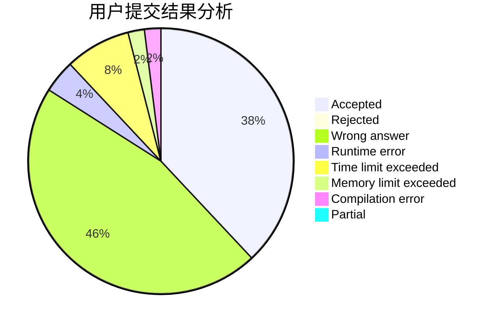
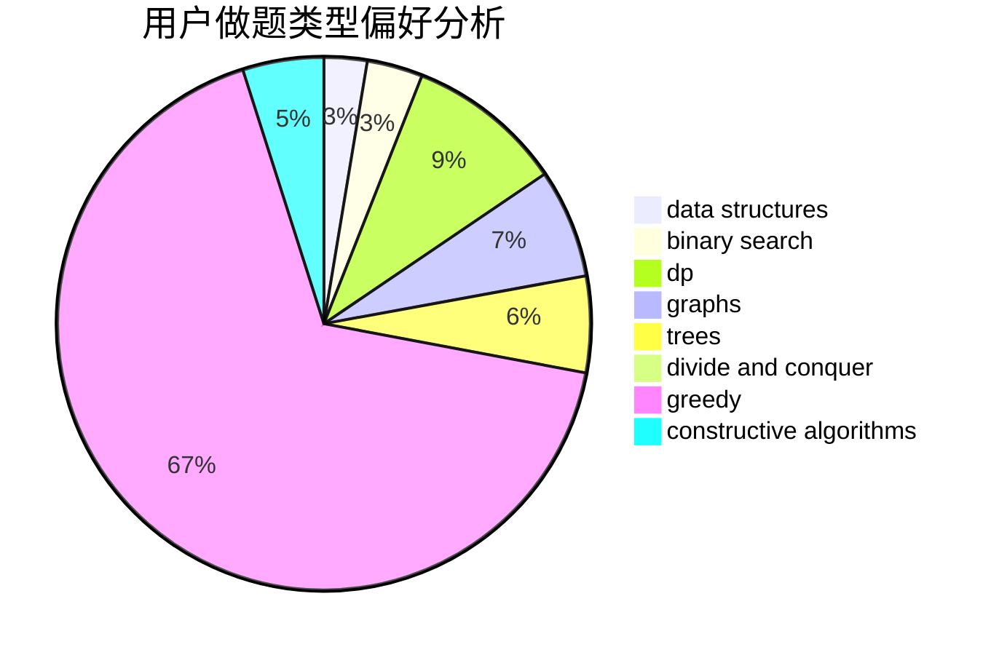

# YanLei

<!-- tabs:start -->

#### **用户提交结果分析**

#### **用户做题类型偏好分析**

#### **用户错题知识点分析**

<!-- tabs:end -->
# 推荐题目
[522D](https://codeforces.com/contest/522/problem/D)		*special problem,
                        data structures		  
[571D](https://codeforces.com/contest/571/problem/D)		binary search,
                        data structures,
                        dsu,
                        trees		  
[316E2](https://codeforces.com/contest/316E/problem/2)		data structures,
                        math		  
[898F](https://codeforces.com/contest/898/problem/F)		brute force,
                        hashing,
                        math		  
[171H](https://codeforces.com/contest/171/problem/H)		*special problem,
                        implementation		  
[1065B](https://codeforces.com/contest/1065/problem/B)		constructive algorithms,
                        graphs		  
[877C](https://codeforces.com/contest/877/problem/C)		constructive algorithms		  
[847K](https://codeforces.com/contest/847/problem/K)		greedy,
                        implementation,
                        sortings		  
[740D](https://codeforces.com/contest/740/problem/D)		dsu,graphs,sortings,trees		  
[947D](https://codeforces.com/contest/947/problem/D)		dsu,graphs,sortings,trees		  
