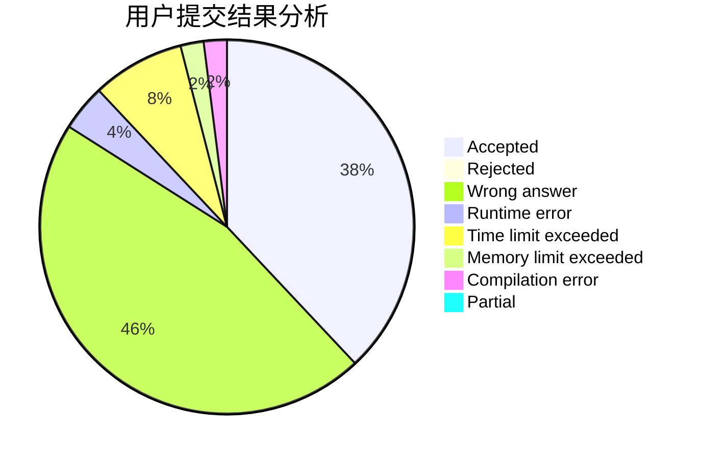
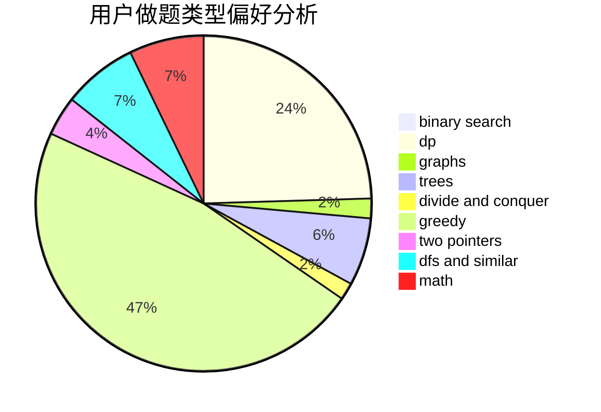

# YanLei

<!-- tabs:start -->

#### **用户提交结果分析**

#### **用户做题类型偏好分析**

<!-- tabs:end -->
# 推荐题目
[548A](https://codeforces.com/contest/548/problem/A)
[592A](https://codeforces.com/contest/592/problem/A)
[343A](https://codeforces.com/contest/343/problem/A)
[914H](https://codeforces.com/contest/914/problem/H)
[19A](https://codeforces.com/contest/19/problem/A)
[1065F](https://codeforces.com/contest/1065/problem/F)
[898B](https://codeforces.com/contest/898/problem/B)
[866C](https://codeforces.com/contest/866/problem/C)
[761F](https://codeforces.com/contest/761/problem/F)
[964C](https://codeforces.com/contest/964/problem/C)
