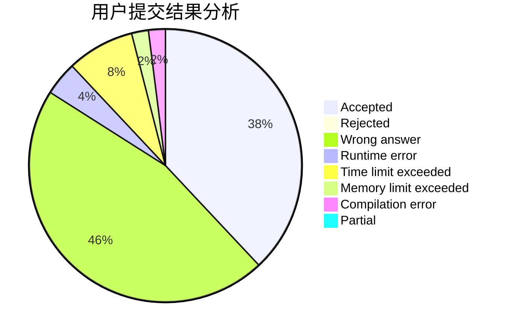
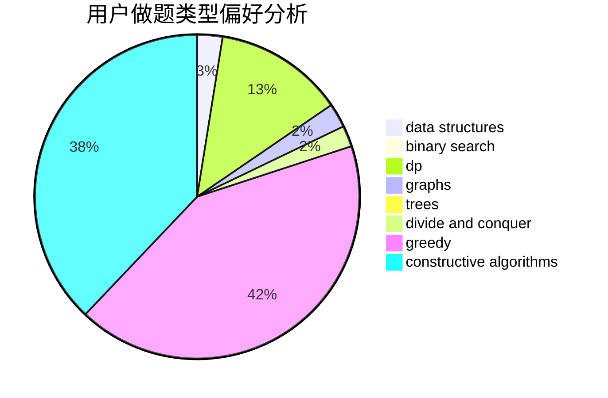

# YanLei

<!-- tabs:start -->

#### **用户提交结果分析**

#### **用户做题类型偏好分析**

#### **用户错题知识点分析**

<!-- tabs:end -->
# 推荐题目
[548A](https://codeforces.com/contest/548/problem/A)		brute force,
                        implementation,
                        strings		  
[592A](https://codeforces.com/contest/592/problem/A)		implementation		  
[343A](https://codeforces.com/contest/343/problem/A)		math,
                        number theory		  
[914H](https://codeforces.com/contest/914/problem/H)		combinatorics,
                        dp,
                        games,
                        trees		  
[19A](https://codeforces.com/contest/19/problem/A)		implementation		  
[1065F](https://codeforces.com/contest/1065/problem/F)		dfs and similar,
                        dp,
                        trees		  
[898B](https://codeforces.com/contest/898/problem/B)		brute force,
                        implementation,
                        number theory		  
[866C](https://codeforces.com/contest/866/problem/C)		dsu,graphs,sortings,trees		  
[761F](https://codeforces.com/contest/761/problem/F)		brute force,
                        data structures,
                        dp,
                        implementation		  
[964C](https://codeforces.com/contest/964/problem/C)		dsu,graphs,sortings,trees		  
