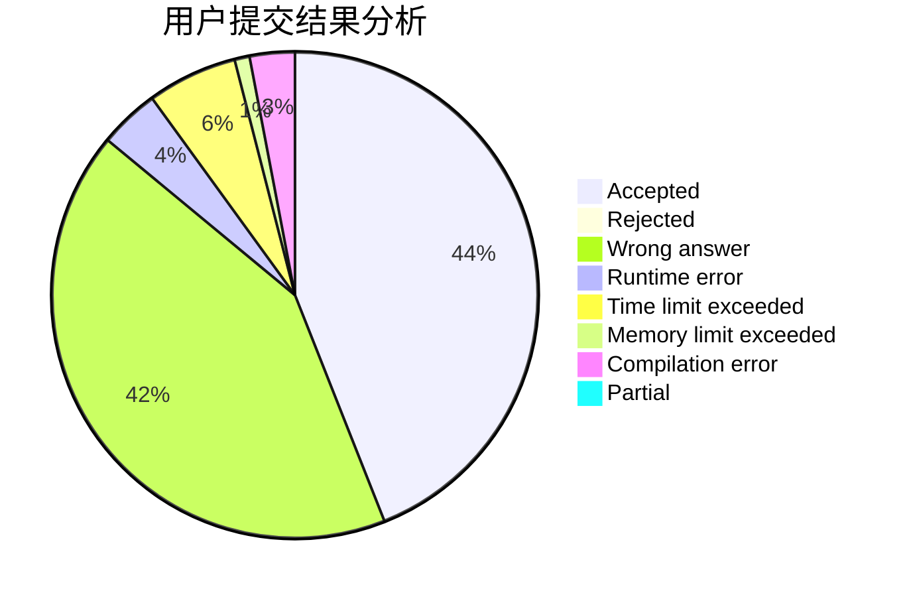
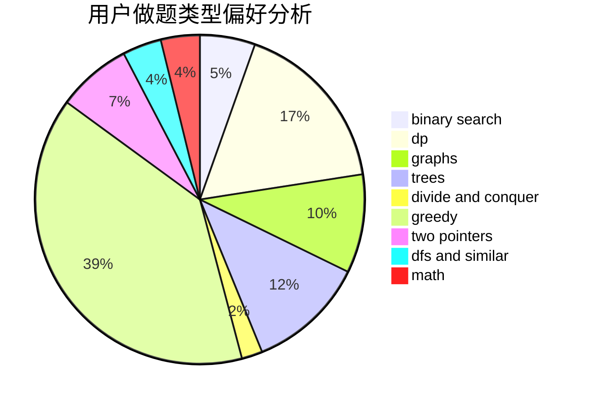

# YanXiaohan

<!-- tabs:start -->

#### **用户提交结果分析**

#### **用户做题类型偏好分析**

<!-- tabs:end -->
# 推荐题目
[1285D](https://codeforces.com/contest/1285/problem/D)
[1004C](https://codeforces.com/contest/1004/problem/C)
[327A](https://codeforces.com/contest/327/problem/A)
[741E](https://codeforces.com/contest/741/problem/E)
[1361C](https://codeforces.com/contest/1361/problem/C)
[234A](https://codeforces.com/contest/234/problem/A)
[920A](https://codeforces.com/contest/920/problem/A)
[934A](https://codeforces.com/contest/934/problem/A)
[533A](https://codeforces.com/contest/533/problem/A)
[455B](https://codeforces.com/contest/455/problem/B)
