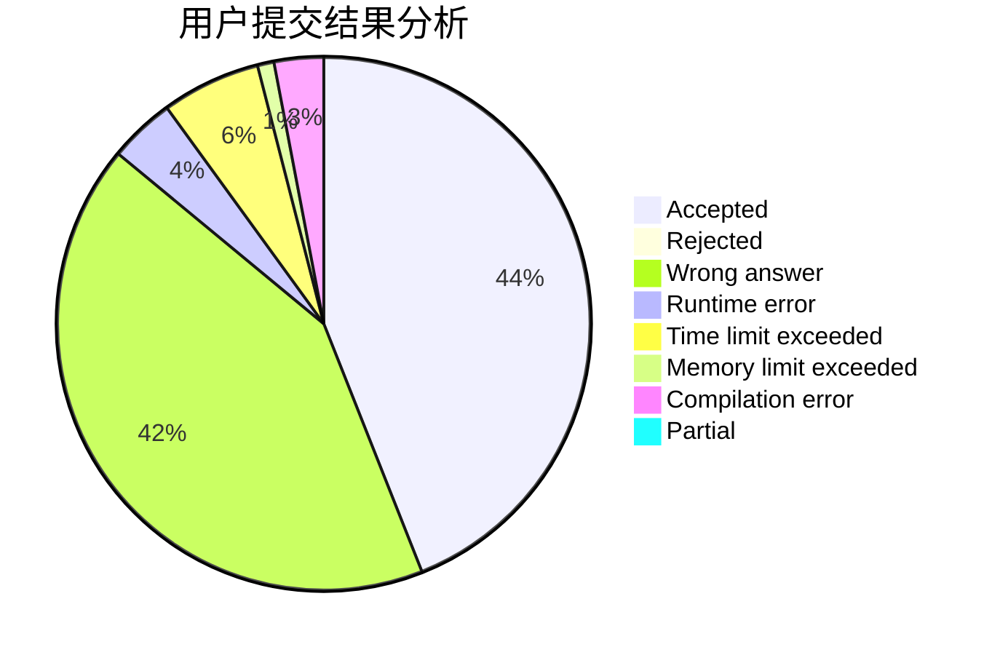
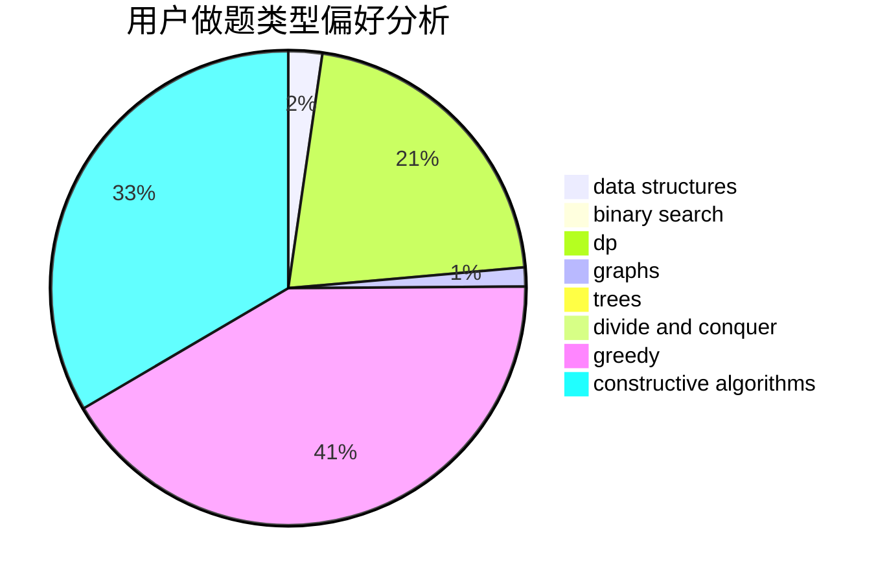

# YanXiaohan

<!-- tabs:start -->

#### **用户提交结果分析**

#### **用户做题类型偏好分析**

#### **用户错题知识点分析**

<!-- tabs:end -->
# 推荐题目
[1285D](https://codeforces.com/contest/1285/problem/D)		bitmasks,
                        brute force,
                        dfs and similar,
                        divide and conquer,
                        dp,
                        greedy,
                        strings,
                        trees		  
[1004C](https://codeforces.com/contest/1004/problem/C)		constructive algorithms,
                        implementation		  
[327A](https://codeforces.com/contest/327/problem/A)		brute force,
                        dp,
                        implementation		  
[741E](https://codeforces.com/contest/741/problem/E)		data structures,
                        string suffix structures		  
[1361C](https://codeforces.com/contest/1361/problem/C)		binary search,
                        bitmasks,
                        constructive algorithms,
                        dfs and similar,
                        dsu,
                        graphs		  
[234A](https://codeforces.com/contest/234/problem/A)		implementation		  
[920A](https://codeforces.com/contest/920/problem/A)		implementation		  
[934A](https://codeforces.com/contest/934/problem/A)		brute force,
                        games		  
[533A](https://codeforces.com/contest/533/problem/A)		binary search,
                        data structures,
                        dfs and similar,
                        greedy,
                        trees		  
[455B](https://codeforces.com/contest/455/problem/B)		dfs and similar,
                        dp,
                        games,
                        implementation,
                        strings,
                        trees		  
