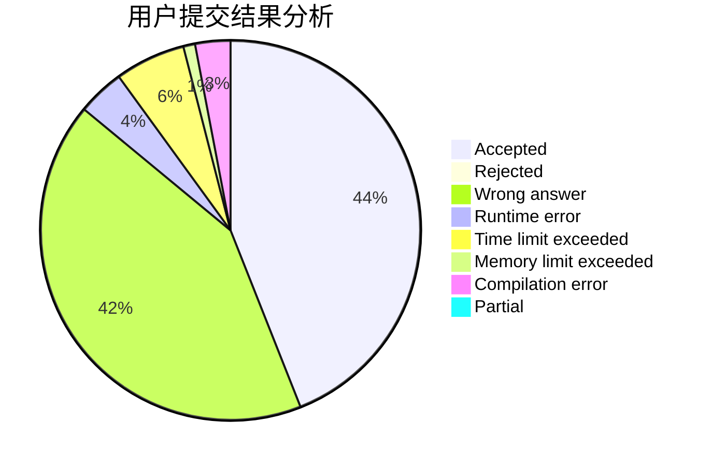
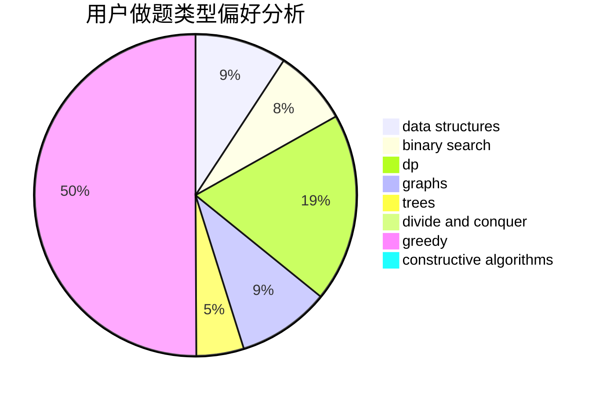
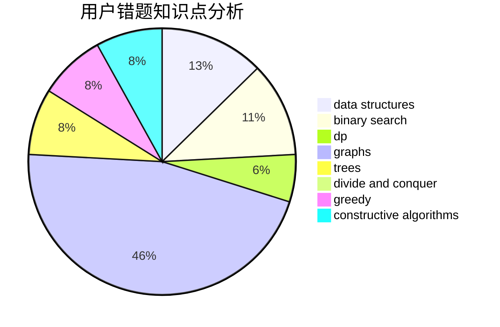

# YanXiaohan

<!-- tabs:start -->

#### **用户提交结果分析**

#### **用户做题类型偏好分析**

#### **用户错题知识点分析**

<!-- tabs:end -->
# 推荐题目
[1279C](https://codeforces.com/contest/1279/problem/C)		data structures,
                        implementation		  
[1003F](https://codeforces.com/contest/1003/problem/F)		dp,
                        hashing,
                        strings		  
[305D](https://codeforces.com/contest/305/problem/D)		combinatorics,
                        math		  
[724E](https://codeforces.com/contest/724/problem/E)		dp,
                        flows,
                        greedy		  
[1354F](https://codeforces.com/contest/1354/problem/F)		constructive algorithms,
                        dp,
                        flows,
                        graph matchings,
                        greedy,
                        sortings		  
[215B](https://codeforces.com/contest/215/problem/B)		greedy,
                        math		  
[906C](https://codeforces.com/contest/906/problem/C)		bitmasks,
                        brute force,
                        dp,
                        graphs		  
[914E](https://codeforces.com/contest/914/problem/E)		bitmasks,
                        data structures,
                        divide and conquer,
                        trees		  
[50A](https://codeforces.com/contest/50/problem/A)		greedy,
                        math		  
[434C](https://codeforces.com/contest/434/problem/C)		dsu,graphs,sortings,trees		  
