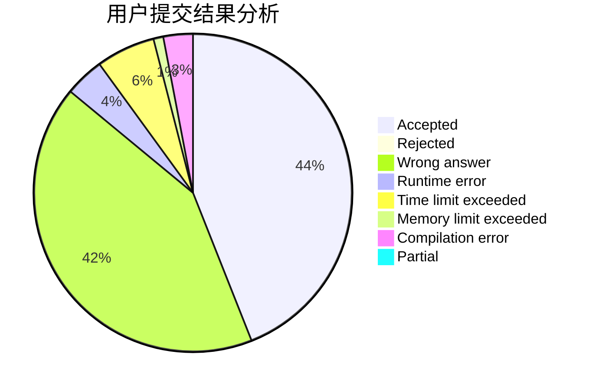
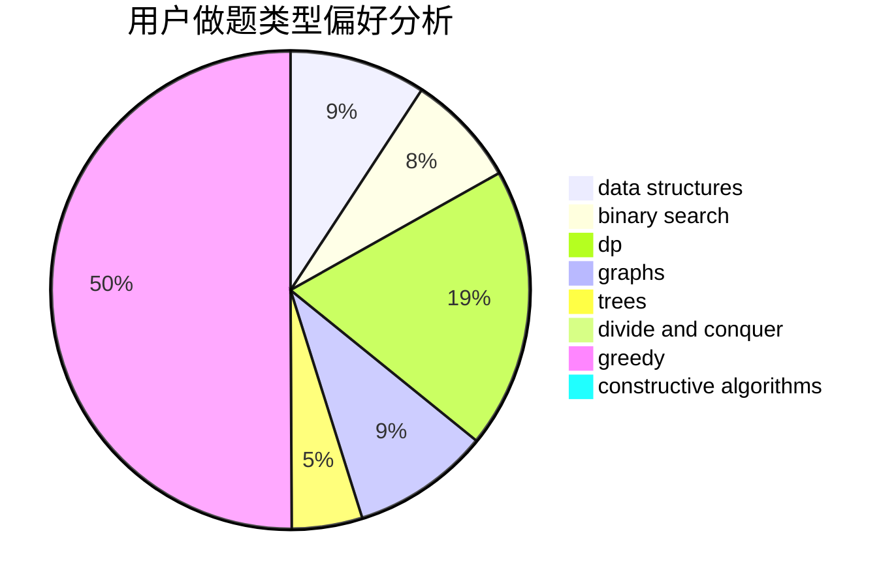
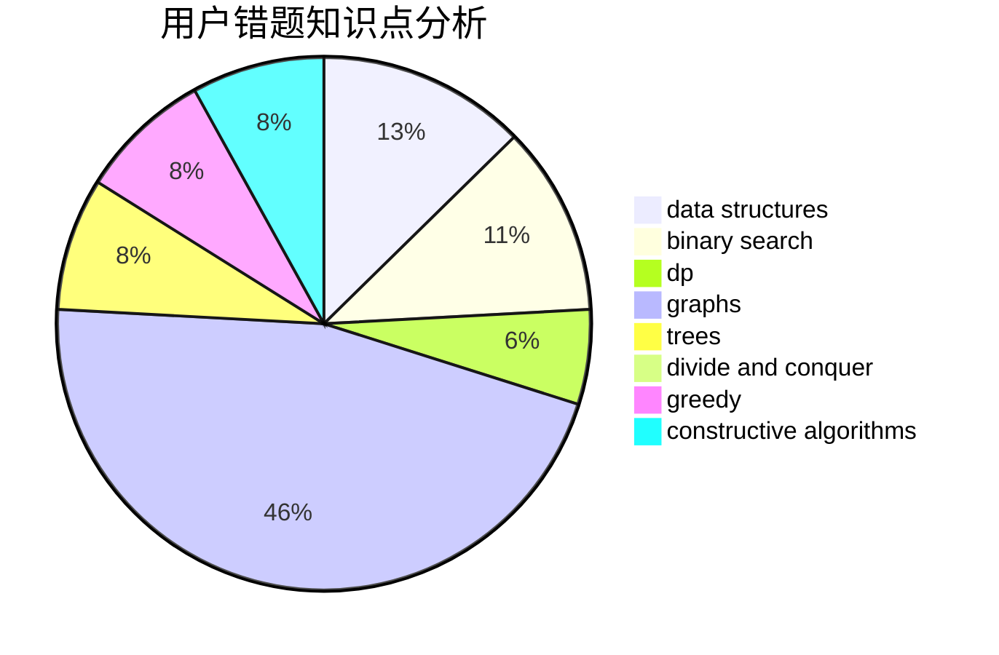

# YanXiaohan
<!-- tabs:start -->
#### **用户提交结果分析**

#### **用户做题类型偏好分析**

#### **用户错题知识点分析**

<!-- tabs:end -->
# 推荐题目
[Calendar Ambiguity](http://codeforces.com/problemset/problem/1389/E)		math,
                        number theory		  
[Olya and Graph](http://codeforces.com/problemset/problem/305/D)		combinatorics,
                        math		  
[Olympic Medal](http://codeforces.com/problemset/problem/215/B)		greedy,
                        math		  
[Abbreviation](http://codeforces.com/problemset/problem/1003/F)		dp,
                        hashing,
                        strings		  
[Hongcow Draws a Circle](http://codeforces.com/problemset/problem/744/D)		geometry		  
[Eevee](http://codeforces.com/problemset/problem/452/A)		brute force,
                        implementation,
                        strings		  
[Summoning Minions](http://codeforces.com/problemset/problem/1354/F)		constructive algorithms,
                        dp,
                        flows,
                        graph matchings,
                        greedy,
                        sortings		  
[Nanami's Digital Board](https://codeforces.com/contest/434/problem/B)		dsu,
                        implementation		  
[Rock Is Push](http://codeforces.com/problemset/problem/1225/E)		binary search,
                        dp		  
[Party](http://codeforces.com/problemset/problem/906/C)		bitmasks,
                        brute force,
                        dp,
                        graphs		  
<!-- tabs:start -->
#### **data structures**
[Calendar Ambiguity](https://codeforces.com/contest/318/problem/D)		2-sat,
                        data structures,
                        trees		  
[Olya and Graph](http://codeforces.com/problemset/problem/767/A)		data structures,
                        implementation		  
[Olympic Medal](http://codeforces.com/problemset/problem/1380/A)		brute force,
                        data structures		  
[Abbreviation](http://codeforces.com/problemset/problem/914/E)		bitmasks,
                        data structures,
                        divide and conquer,
                        trees		  
[Hongcow Draws a Circle](http://codeforces.com/problemset/problem/815/D)		binary search,
                        combinatorics,
                        data structures,
                        geometry		  
[Eevee](http://codeforces.com/problemset/problem/891/C)		data structures,
                        dsu,
                        graphs		  
[Summoning Minions](http://codeforces.com/problemset/problem/1279/C)		data structures,
                        implementation		  
[Nanami's Digital Board](http://codeforces.com/problemset/problem/1500/E)		binary search,
                        data structures		  
[Rock Is Push](http://codeforces.com/problemset/problem/1406/D)		constructive algorithms,
                        data structures,
                        greedy,
                        math		  
[Party](http://codeforces.com/problemset/problem/1462/F)		binary search,
                        data structures,
                        greedy		  
#### **binary search**
[Calendar Ambiguity](http://codeforces.com/problemset/problem/1225/E)		binary search,
                        dp		  
[Olya and Graph](https://codeforces.com/contest/1395/problem/F)		binary search,
                        geometry,
                        ternary search		  
[Olympic Medal](http://codeforces.com/problemset/problem/1285/F)		binary search,
                        combinatorics,
                        number theory		  
[Abbreviation](http://codeforces.com/problemset/problem/815/D)		binary search,
                        combinatorics,
                        data structures,
                        geometry		  
[Hongcow Draws a Circle](http://codeforces.com/problemset/problem/1500/E)		binary search,
                        data structures		  
[Eevee](http://codeforces.com/problemset/problem/1462/F)		binary search,
                        data structures,
                        greedy		  
[Summoning Minions](http://codeforces.com/problemset/problem/1492/C)		binary search,
                        data structures,
                        dp,
                        greedy,
                        two pointers		  
[Nanami's Digital Board](http://codeforces.com/problemset/problem/1463/D)		binary search,
                        constructive algorithms,
                        greedy,
                        two pointers		  
[Rock Is Push](http://codeforces.com/problemset/problem/1490/G)		binary search,
                        data structures,
                        math		  
[Party](http://codeforces.com/problemset/problem/1479/D)		binary search,
                        bitmasks,
                        brute force,
                        data structures,
                        probabilities,
                        trees		  
#### **dp**
[Calendar Ambiguity](http://codeforces.com/problemset/problem/1003/F)		dp,
                        hashing,
                        strings		  
[Olya and Graph](http://codeforces.com/problemset/problem/1354/F)		constructive algorithms,
                        dp,
                        flows,
                        graph matchings,
                        greedy,
                        sortings		  
[Olympic Medal](http://codeforces.com/problemset/problem/1225/E)		binary search,
                        dp		  
[Abbreviation](http://codeforces.com/problemset/problem/906/C)		bitmasks,
                        brute force,
                        dp,
                        graphs		  
[Hongcow Draws a Circle](http://codeforces.com/problemset/problem/724/E)		dp,
                        flows,
                        greedy		  
[Eevee](http://codeforces.com/problemset/problem/455/C)		dfs and similar,
                        dp,
                        dsu,
                        ternary search,
                        trees		  
[Summoning Minions](http://codeforces.com/problemset/problem/1209/E1)		bitmasks,
                        brute force,
                        dp,
                        greedy,
                        sortings		  
[Nanami's Digital Board](https://codeforces.com/contest/434/problem/C)		dp		  
[Rock Is Push](http://codeforces.com/problemset/problem/1453/F)		dp		  
[Party](http://codeforces.com/problemset/problem/540/D)		dp,
                        probabilities		  
#### **graph**
[Calendar Ambiguity](http://codeforces.com/problemset/problem/1354/F)		constructive algorithms,
                        dp,
                        flows,
                        graph matchings,
                        greedy,
                        sortings		  
[Olya and Graph](http://codeforces.com/problemset/problem/906/C)		bitmasks,
                        brute force,
                        dp,
                        graphs		  
[Olympic Medal](http://codeforces.com/problemset/problem/891/C)		data structures,
                        dsu,
                        graphs		  
[Abbreviation](http://codeforces.com/problemset/problem/1487/C)		brute force,
                        constructive algorithms,
                        dfs and similar,
                        graphs,
                        greedy,
                        implementation,
                        math		  
[Hongcow Draws a Circle](http://codeforces.com/problemset/problem/1437/C)		dp,
                        flows,
                        graph matchings,
                        greedy,
                        math,
                        sortings		  
[Eevee](http://codeforces.com/problemset/problem/1470/D)		constructive algorithms,
                        dfs and similar,
                        graph matchings,
                        graphs,
                        greedy		  
[Summoning Minions](http://codeforces.com/problemset/problem/1476/C)		dp,
                        graphs,
                        greedy		  
[Nanami's Digital Board](http://codeforces.com/problemset/problem/1304/D)		constructive algorithms,
                        graphs,
                        greedy,
                        two pointers		  
[Rock Is Push](http://codeforces.com/problemset/problem/1475/C)		combinatorics,
                        graphs,
                        math		  
[Party](http://codeforces.com/problemset/problem/553/E)		dp,
                        fft,
                        graphs,
                        math,
                        probabilities		  
#### **trees**
[Calendar Ambiguity](https://codeforces.com/contest/318/problem/D)		2-sat,
                        data structures,
                        trees		  
[Olya and Graph](http://codeforces.com/problemset/problem/455/C)		dfs and similar,
                        dp,
                        dsu,
                        ternary search,
                        trees		  
[Olympic Medal](http://codeforces.com/problemset/problem/1387/B2)		*special problem,
                        dfs and similar,
                        trees		  
[Abbreviation](http://codeforces.com/problemset/problem/914/E)		bitmasks,
                        data structures,
                        divide and conquer,
                        trees		  
[Hongcow Draws a Circle](http://codeforces.com/problemset/problem/1479/D)		binary search,
                        bitmasks,
                        brute force,
                        data structures,
                        probabilities,
                        trees		  
[Eevee](http://codeforces.com/problemset/problem/1511/C)		brute force,
                        data structures,
                        implementation,
                        trees		  
[Summoning Minions](http://codeforces.com/problemset/problem/1499/F)		combinatorics,
                        dfs and similar,
                        dp,
                        trees		  
[Nanami's Digital Board](http://codeforces.com/problemset/problem/1491/E)		brute force,
                        dfs and similar,
                        divide and conquer,
                        number theory,
                        trees		  
[Rock Is Push](http://codeforces.com/problemset/problem/1466/D)		data structures,
                        greedy,
                        sortings,
                        trees		  
[Party](http://codeforces.com/problemset/problem/1495/D)		combinatorics,
                        dfs and similar,
                        graphs,
                        math,
                        shortest paths,
                        trees		  
#### **divide and conquer**
[Calendar Ambiguity](http://codeforces.com/problemset/problem/873/D)		constructive algorithms,
                        divide and conquer		  
[Olya and Graph](http://codeforces.com/problemset/problem/914/E)		bitmasks,
                        data structures,
                        divide and conquer,
                        trees		  
[Olympic Medal](http://codeforces.com/problemset/problem/1461/D)		binary search,
                        brute force,
                        data structures,
                        divide and conquer,
                        implementation,
                        sortings		  
[Abbreviation](http://codeforces.com/problemset/problem/1466/G)		combinatorics,
                        divide and conquer,
                        hashing,
                        math,
                        string suffix structures,
                        strings		  
[Hongcow Draws a Circle](http://codeforces.com/problemset/problem/1490/D)		dfs and similar,
                        divide and conquer,
                        implementation		  
[Eevee](https://codeforces.com/contest/1483/problem/C)		data structures,
                        divide and conquer,
                        dp		  
[Summoning Minions](http://codeforces.com/problemset/problem/1491/E)		brute force,
                        dfs and similar,
                        divide and conquer,
                        number theory,
                        trees		  
[Nanami's Digital Board](http://codeforces.com/problemset/problem/1303/G)		data structures,
                        divide and conquer,
                        geometry,
                        trees		  
[Rock Is Push](http://codeforces.com/problemset/problem/1494/D)		constructive algorithms,
                        data structures,
                        dfs and similar,
                        divide and conquer,
                        dsu,
                        greedy,
                        sortings,
                        trees		  
[Party](http://codeforces.com/problemset/problem/1482/E)		data structures,
                        divide and conquer,
                        dp		  
#### **greedy**
[Calendar Ambiguity](http://codeforces.com/problemset/problem/215/B)		greedy,
                        math		  
[Olya and Graph](http://codeforces.com/problemset/problem/1354/F)		constructive algorithms,
                        dp,
                        flows,
                        graph matchings,
                        greedy,
                        sortings		  
[Olympic Medal](http://codeforces.com/problemset/problem/724/E)		dp,
                        flows,
                        greedy		  
[Abbreviation](http://codeforces.com/problemset/problem/898/E)		constructive algorithms,
                        greedy		  
[Hongcow Draws a Circle](http://codeforces.com/problemset/problem/1209/E1)		bitmasks,
                        brute force,
                        dp,
                        greedy,
                        sortings		  
[Eevee](http://codeforces.com/problemset/problem/1215/C)		constructive algorithms,
                        greedy		  
[Summoning Minions](http://codeforces.com/problemset/problem/1283/E)		dp,
                        greedy		  
[Nanami's Digital Board](http://codeforces.com/problemset/problem/50/A)		greedy,
                        math		  
[Rock Is Push](http://codeforces.com/problemset/problem/1406/D)		constructive algorithms,
                        data structures,
                        greedy,
                        math		  
[Party](http://codeforces.com/problemset/problem/1462/F)		binary search,
                        data structures,
                        greedy		  
#### **constructive algorithms**
[Calendar Ambiguity](http://codeforces.com/problemset/problem/1354/F)		constructive algorithms,
                        dp,
                        flows,
                        graph matchings,
                        greedy,
                        sortings		  
[Olya and Graph](http://codeforces.com/problemset/problem/898/E)		constructive algorithms,
                        greedy		  
[Olympic Medal](http://codeforces.com/problemset/problem/873/D)		constructive algorithms,
                        divide and conquer		  
[Abbreviation](http://codeforces.com/problemset/problem/1215/C)		constructive algorithms,
                        greedy		  
[Hongcow Draws a Circle](http://codeforces.com/problemset/problem/1103/A)		constructive algorithms,
                        implementation		  
[Eevee](http://codeforces.com/problemset/problem/1406/D)		constructive algorithms,
                        data structures,
                        greedy,
                        math		  
[Summoning Minions](http://codeforces.com/problemset/problem/1304/B)		brute force,
                        constructive algorithms,
                        greedy,
                        implementation,
                        strings		  
[Nanami's Digital Board](http://codeforces.com/problemset/problem/1493/A)		constructive algorithms,
                        greedy		  
[Rock Is Push](http://codeforces.com/problemset/problem/1463/D)		binary search,
                        constructive algorithms,
                        greedy,
                        two pointers		  
[Party](https://codeforces.com/contest/1456/problem/B)		bitmasks,
                        brute force,
                        constructive algorithms		  
#### **sortings**
[Calendar Ambiguity](http://codeforces.com/problemset/problem/1354/F)		constructive algorithms,
                        dp,
                        flows,
                        graph matchings,
                        greedy,
                        sortings		  
[Olya and Graph](http://codeforces.com/problemset/problem/1209/E1)		bitmasks,
                        brute force,
                        dp,
                        greedy,
                        sortings		  
[Olympic Medal](https://codeforces.com/contest/1445/problem/D)		combinatorics,
                        math,
                        sortings		  
[Abbreviation](https://codeforces.com/contest/1496/problem/C)		geometry,
                        greedy,
                        math,
                        sortings		  
[Hongcow Draws a Circle](http://codeforces.com/problemset/problem/1495/A)		geometry,
                        greedy,
                        math,
                        sortings		  
[Eevee](http://codeforces.com/problemset/problem/1497/A)		brute force,
                        data structures,
                        greedy,
                        sortings		  
[Summoning Minions](http://codeforces.com/problemset/problem/1427/A)		math,
                        sortings		  
[Nanami's Digital Board](http://codeforces.com/problemset/problem/1461/D)		binary search,
                        brute force,
                        data structures,
                        divide and conquer,
                        implementation,
                        sortings		  
[Rock Is Push](http://codeforces.com/problemset/problem/1437/C)		dp,
                        flows,
                        graph matchings,
                        greedy,
                        math,
                        sortings		  
[Party](http://codeforces.com/problemset/problem/1473/A)		greedy,
                        implementation,
                        math,
                        sortings		  
<!-- tabs:end -->
