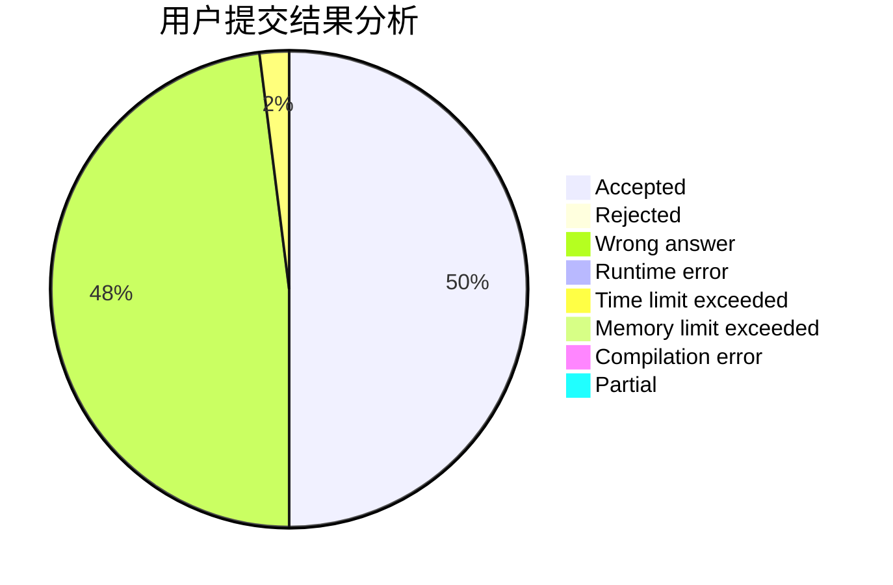
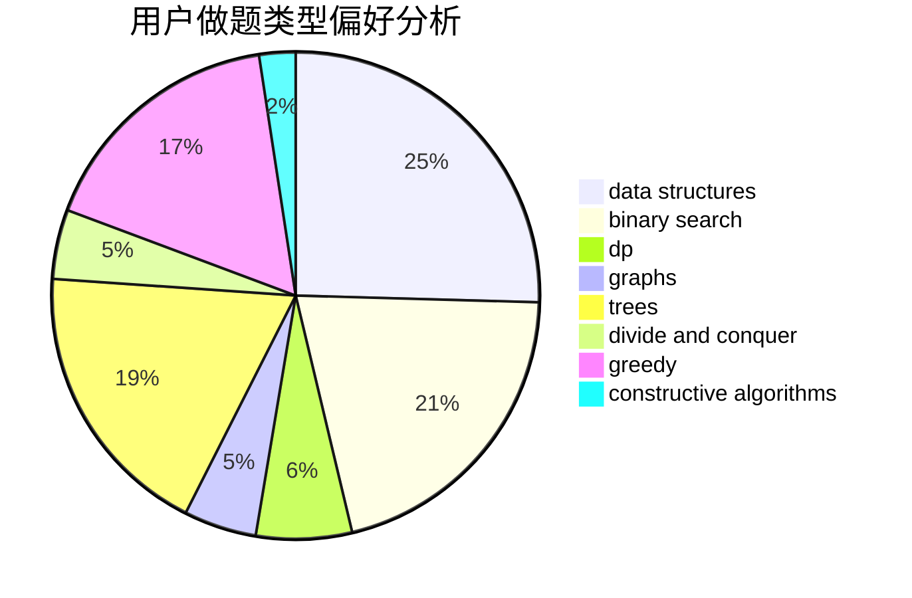
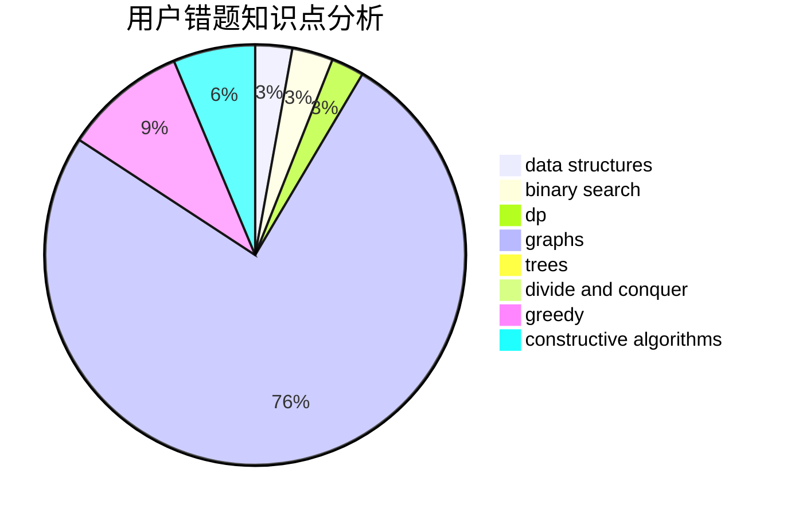

# YangTY

<!-- tabs:start -->

#### **用户提交结果分析**

#### **用户做题类型偏好分析**

#### **用户错题知识点分析**

<!-- tabs:end -->
# 推荐题目
[545A](https://codeforces.com/contest/545/problem/A)		implementation		  
[446E](https://codeforces.com/contest/446/problem/E)		math,
                        matrices		  
[736A](https://codeforces.com/contest/736/problem/A)		dsu,graphs,sortings,trees		  
[1372A](https://codeforces.com/contest/1372/problem/A)		constructive algorithms,
                        implementation		  
[1086B](https://codeforces.com/contest/1086/problem/B)		dsu,graphs,sortings,trees		  
[791E](https://codeforces.com/contest/791/problem/E)		dsu,graphs,sortings,trees		  
[269B](https://codeforces.com/contest/269/problem/B)		dp		  
[1061C](https://codeforces.com/contest/1061/problem/C)		data structures,
                        dp,
                        implementation,
                        math,
                        number theory		  
[294B](https://codeforces.com/contest/294/problem/B)		dp,
                        greedy		  
[509D](https://codeforces.com/contest/509/problem/D)		constructive algorithms,
                        math		  
