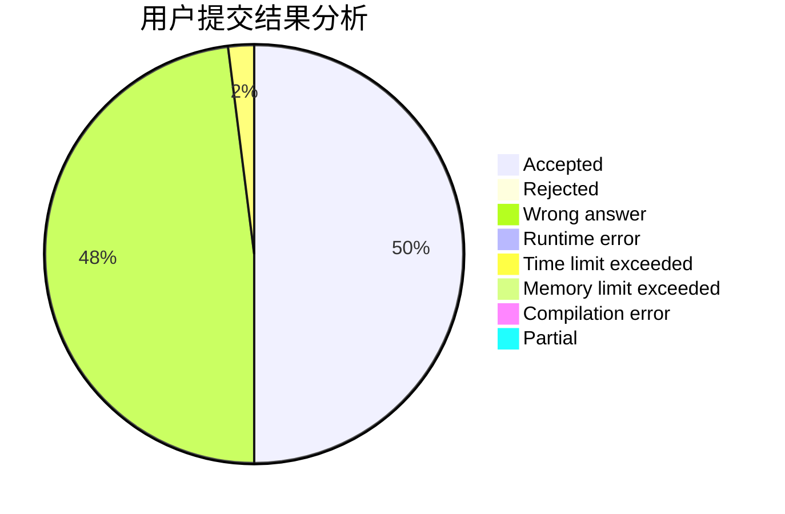
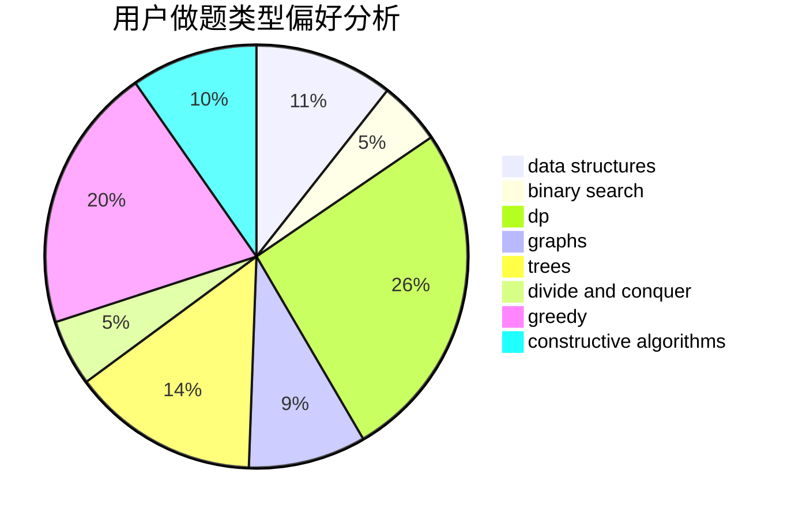
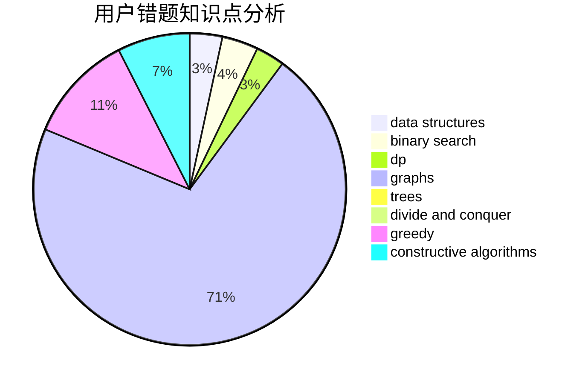

# YangTY

<!-- tabs:start -->

#### **用户提交结果分析**

#### **用户做题类型偏好分析**

#### **用户错题知识点分析**

<!-- tabs:end -->
# 推荐题目
[56A](https://codeforces.com/contest/56/problem/A)		implementation		  
[467A](https://codeforces.com/contest/467/problem/A)		implementation		  
[757F](https://codeforces.com/contest/757/problem/F)		data structures,
                        graphs,
                        shortest paths		  
[1380F](https://codeforces.com/contest/1380/problem/F)		data structures,
                        dp,
                        matrices		  
[1086E](https://codeforces.com/contest/1086/problem/E)		dsu,graphs,sortings,trees		  
[807C](https://codeforces.com/contest/807/problem/C)		dsu,graphs,sortings,trees		  
[284E](https://codeforces.com/contest/284/problem/E)		dsu,graphs,sortings,trees		  
[1062A](https://codeforces.com/contest/1062/problem/A)		greedy,
                        implementation		  
[30C](https://codeforces.com/contest/30/problem/C)		dp,
                        probabilities		  
[52C](https://codeforces.com/contest/52/problem/C)		data structures		  
