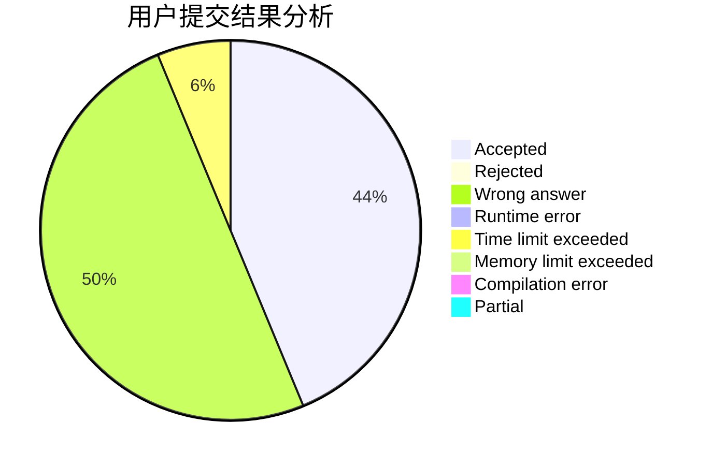
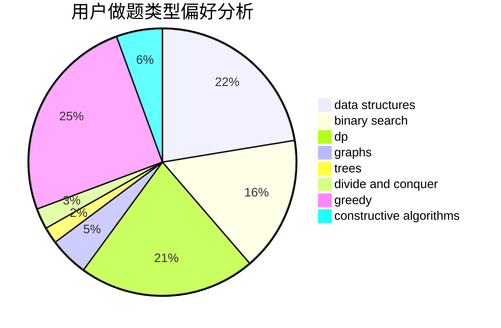
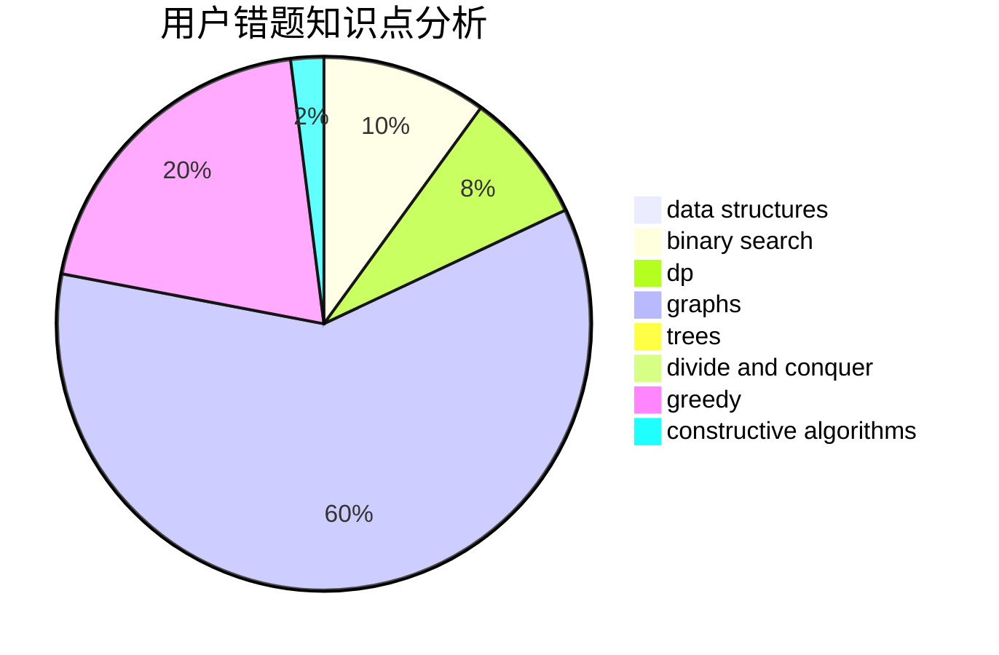

# AlexCui

<!-- tabs:start -->

#### **用户提交结果分析**

#### **用户做题类型偏好分析**

#### **用户错题知识点分析**

<!-- tabs:end -->
# 推荐题目
[1501F](https://codeforces.com/contest/1501/problem/F)		dsu,graphs,sortings,trees		  
[1462C](https://codeforces.com/contest/1462/problem/C)		brute force,
                        greedy,
                        math		  
[245H](https://codeforces.com/contest/245/problem/H)		dp,
                        hashing,
                        strings		  
[1372B](https://codeforces.com/contest/1372/problem/B)		greedy,
                        math,
                        number theory		  
[1184E2](https://codeforces.com/contest/1184E/problem/2)		dfs and similar,
                        graphs,
                        shortest paths,
                        trees		  
[251B](https://codeforces.com/contest/251/problem/B)		implementation,
                        math		  
[21D](https://codeforces.com/contest/21/problem/D)		bitmasks,
                        graph matchings,
                        graphs		  
[1187C](https://codeforces.com/contest/1187/problem/C)		constructive algorithms,
                        greedy,
                        implementation		  
[253A](https://codeforces.com/contest/253/problem/A)		greedy		  
[24D](https://codeforces.com/contest/24/problem/D)		dp,
                        math,
                        probabilities		  
