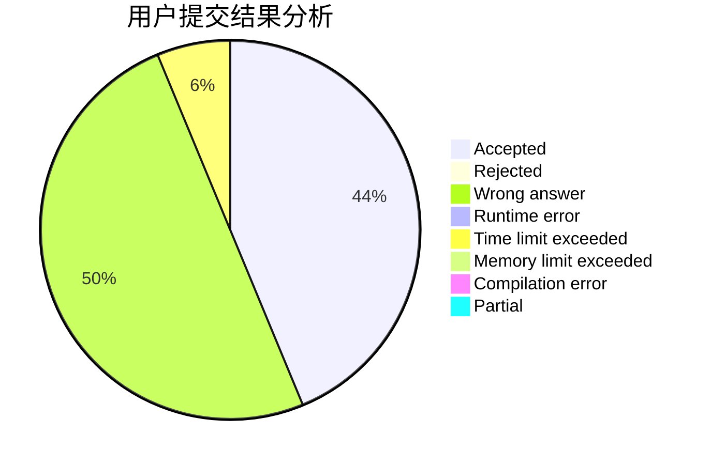
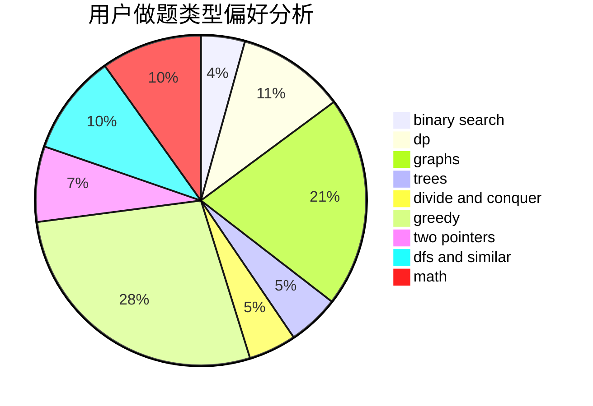

# AlexCui

<!-- tabs:start -->

#### **用户提交结果分析**

#### **用户做题类型偏好分析**

<!-- tabs:end -->
# 推荐题目
[1511G](https://codeforces.com/contest/1511/problem/G)
[1469E](https://codeforces.com/contest/1469/problem/E)
[266B](https://codeforces.com/contest/266/problem/B)
[1380G](https://codeforces.com/contest/1380/problem/G)
[1188D](https://codeforces.com/contest/1188/problem/D)
[269D](https://codeforces.com/contest/269/problem/D)
[23B](https://codeforces.com/contest/23/problem/B)
[1190E](https://codeforces.com/contest/1190/problem/E)
[26D](https://codeforces.com/contest/26/problem/D)
[268E](https://codeforces.com/contest/268/problem/E)
