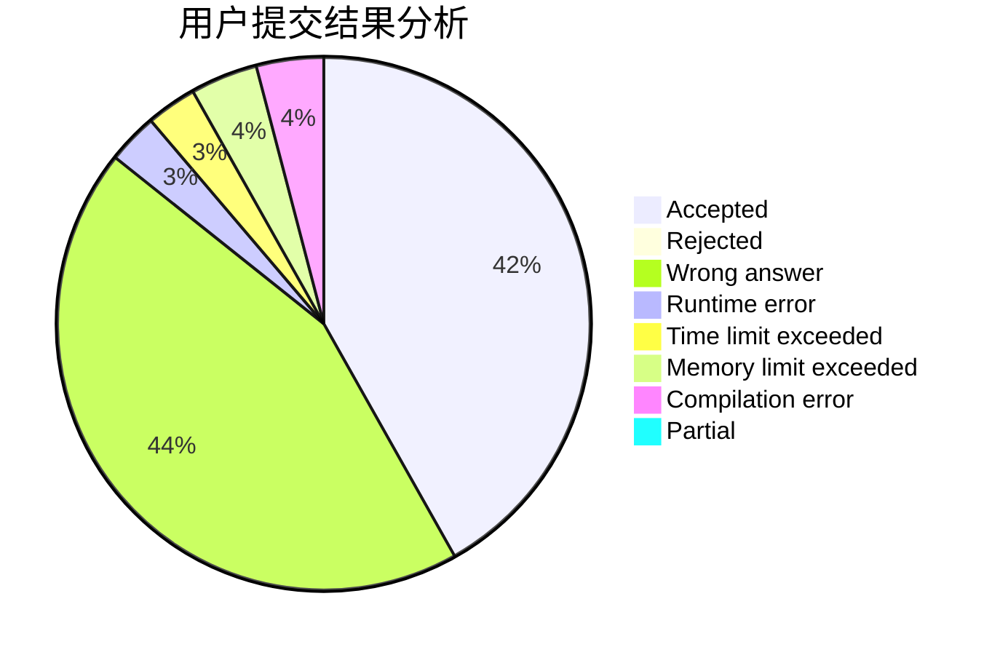
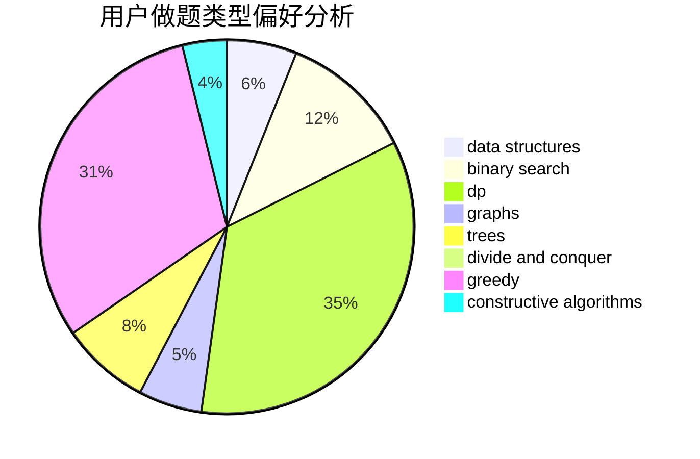
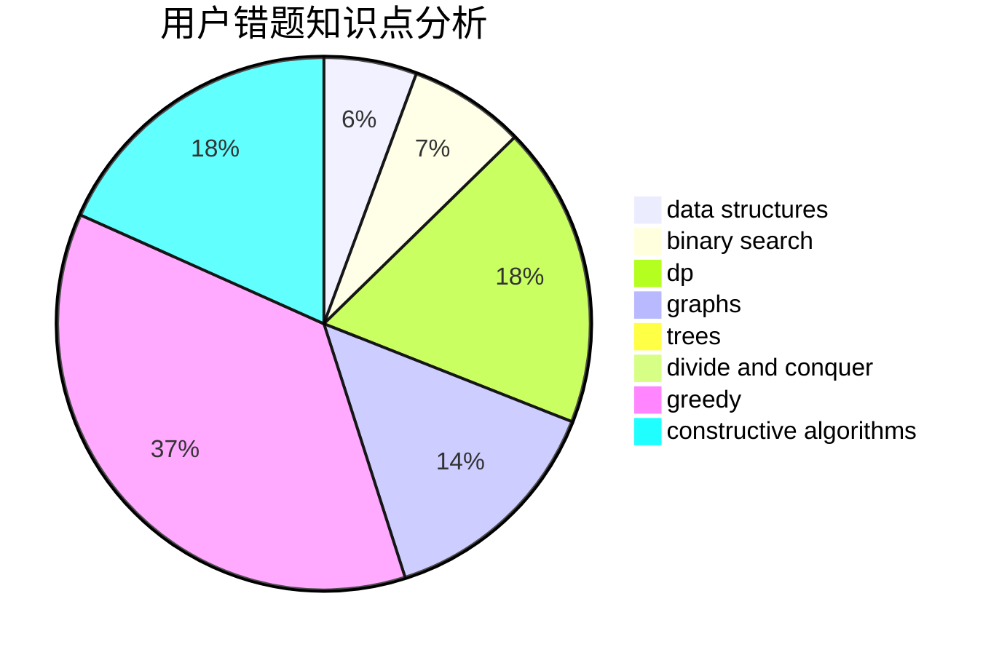

# YannLiu

<!-- tabs:start -->

#### **用户提交结果分析**

#### **用户做题类型偏好分析**

#### **用户错题知识点分析**

<!-- tabs:end -->
# 推荐题目
[13131](https://codeforces.com/contest/1313/problem/1)		dsu,graphs,sortings,trees		  
[11843](https://codeforces.com/contest/1184/problem/3)		dsu,graphs,sortings,trees		  
[185A](https://codeforces.com/contest/185/problem/A)		math		  
[11291](https://codeforces.com/contest/1129/problem/1)		dsu,graphs,sortings,trees		  
[1399C](https://codeforces.com/contest/1399/problem/C)		brute force,
                        greedy,
                        two pointers		  
[707B](https://codeforces.com/contest/707/problem/B)		graphs		  
[13571](https://codeforces.com/contest/1357/problem/1)		dsu,graphs,sortings,trees		  
[269D](https://codeforces.com/contest/269/problem/D)		data structures,
                        dp,
                        graphs,
                        sortings		  
[916C](https://codeforces.com/contest/916/problem/C)		constructive algorithms,
                        graphs,
                        shortest paths		  
[1511F](https://codeforces.com/contest/1511/problem/F)		brute force,
                        data structures,
                        dp,
                        matrices,
                        string suffix structures,
                        strings		  
