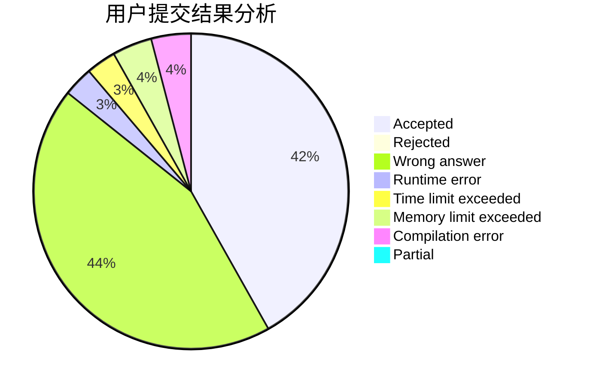
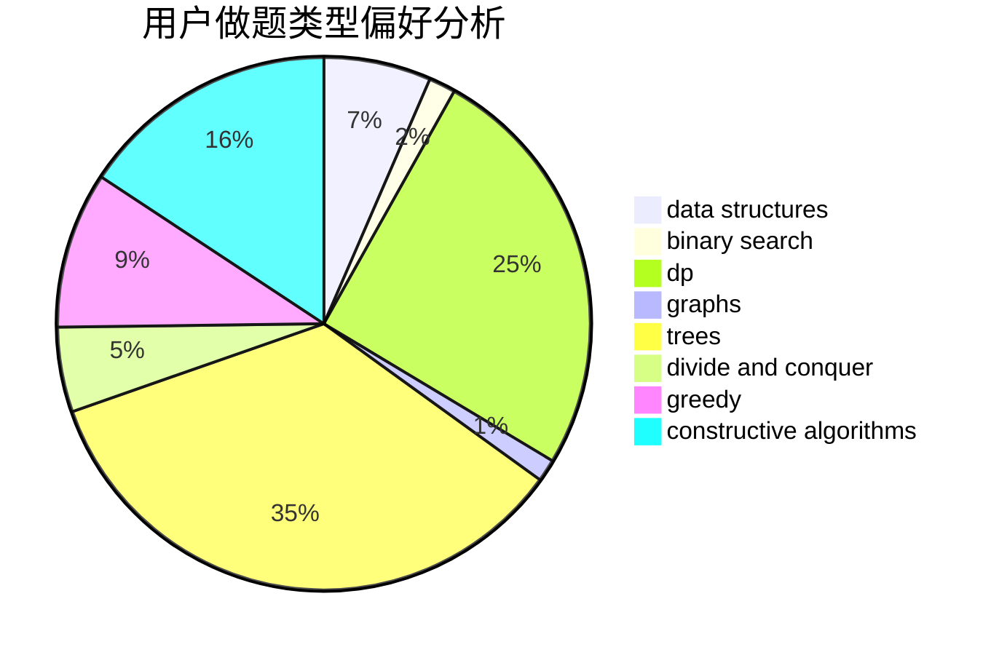
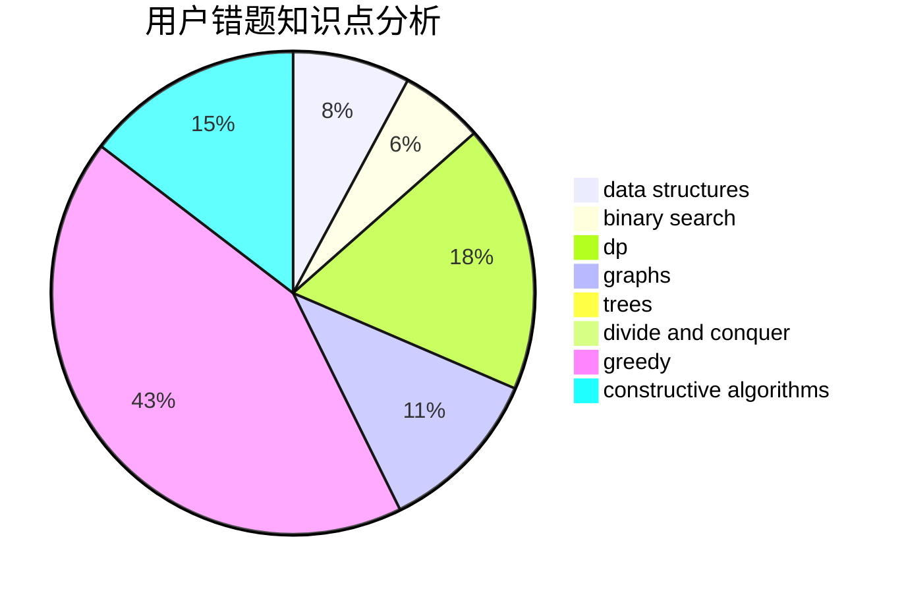

# YannLiu

<!-- tabs:start -->

#### **用户提交结果分析**

#### **用户做题类型偏好分析**

#### **用户错题知识点分析**

<!-- tabs:end -->
# 推荐题目
[1304C](https://codeforces.com/contest/1304/problem/C)		dp,
                        greedy,
                        implementation,
                        sortings,
                        two pointers		  
[1182B](https://codeforces.com/contest/1182/problem/B)		dfs and similar,
                        implementation,
                        strings		  
[160B](https://codeforces.com/contest/160/problem/B)		greedy,
                        sortings		  
[1119D](https://codeforces.com/contest/1119/problem/D)		binary search,
                        sortings		  
[138D](https://codeforces.com/contest/138/problem/D)		dp,
                        games		  
[683A](https://codeforces.com/contest/683/problem/A)		*special problem,
                        geometry		  
[1349F1](https://codeforces.com/contest/1349F/problem/1)		dp,
                        fft,
                        math		  
[251B](https://codeforces.com/contest/251/problem/B)		implementation,
                        math		  
[8E](https://codeforces.com/contest/8/problem/E)		dp,
                        graphs		  
[1501E](https://codeforces.com/contest/1501/problem/E)		dsu,graphs,sortings,trees		  
