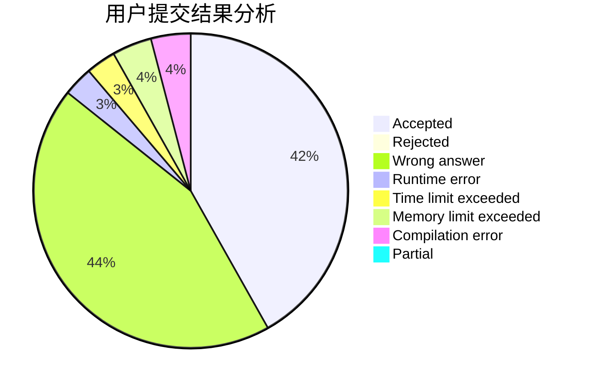
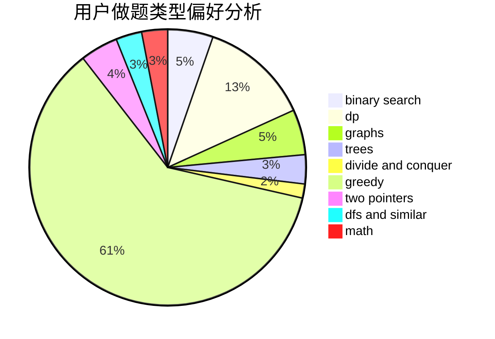

# YannLiu

<!-- tabs:start -->

#### **用户提交结果分析**

#### **用户做题类型偏好分析**

<!-- tabs:end -->
# 推荐题目
[13131](https://codeforces.com/contest/1313/problem/1)
[11843](https://codeforces.com/contest/1184/problem/3)
[185A](https://codeforces.com/contest/185/problem/A)
[11291](https://codeforces.com/contest/1129/problem/1)
[1399C](https://codeforces.com/contest/1399/problem/C)
[707B](https://codeforces.com/contest/707/problem/B)
[13571](https://codeforces.com/contest/1357/problem/1)
[269D](https://codeforces.com/contest/269/problem/D)
[916C](https://codeforces.com/contest/916/problem/C)
[1511F](https://codeforces.com/contest/1511/problem/F)
