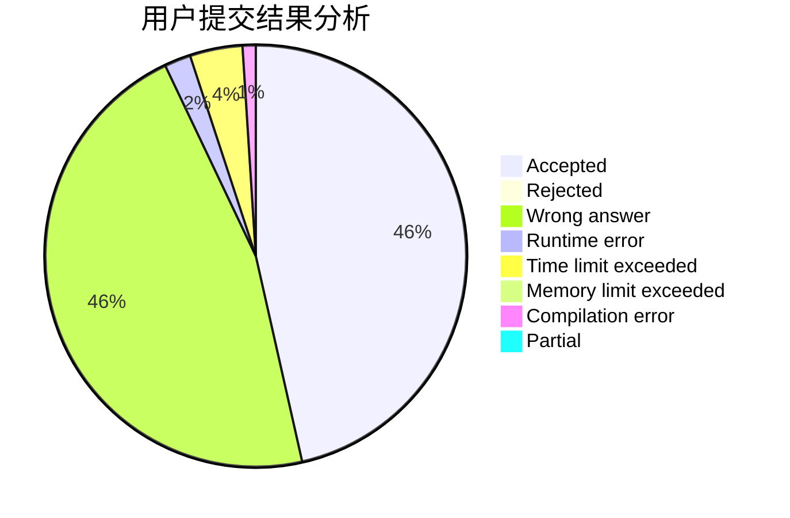
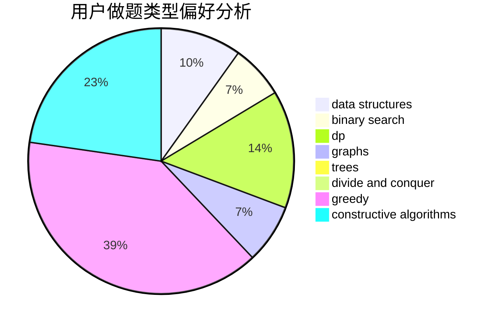
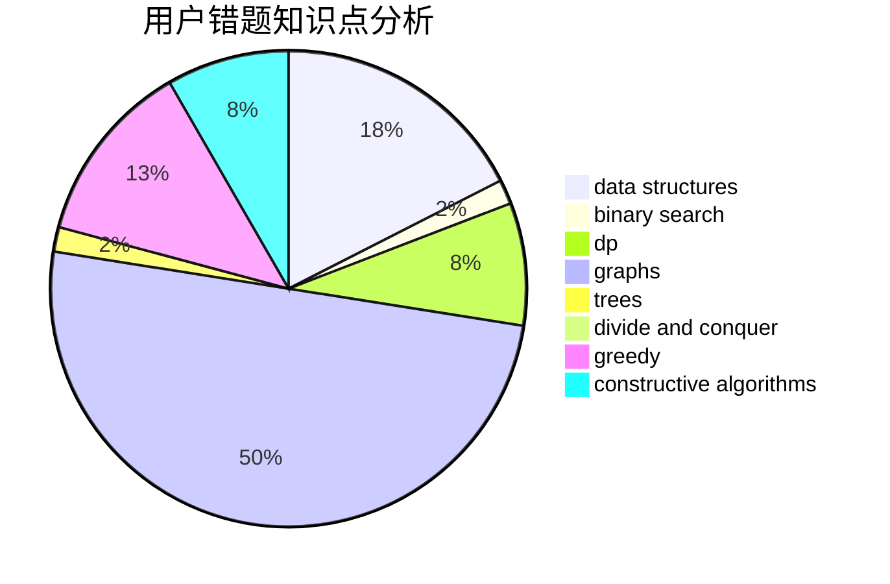

# Yao_

<!-- tabs:start -->

#### **用户提交结果分析**

#### **用户做题类型偏好分析**

#### **用户错题知识点分析**

<!-- tabs:end -->
# 推荐题目
[1494D](https://codeforces.com/contest/1494/problem/D)		constructive algorithms,
                        data structures,
                        dfs and similar,
                        divide and conquer,
                        dsu,
                        greedy,
                        sortings,
                        trees		  
[850C](https://codeforces.com/contest/850/problem/C)		bitmasks,
                        dp,
                        games		  
[483D](https://codeforces.com/contest/483/problem/D)		dsu,graphs,sortings,trees		  
[1311C](https://codeforces.com/contest/1311/problem/C)		brute force		  
[816B](https://codeforces.com/contest/816/problem/B)		binary search,
                        data structures,
                        implementation		  
[1424G](https://codeforces.com/contest/1424/problem/G)		data structures,
                        sortings		  
[982B](https://codeforces.com/contest/982/problem/B)		data structures,
                        greedy,
                        implementation		  
[2A](https://codeforces.com/contest/2/problem/A)		hashing,
                        implementation		  
[1088B](https://codeforces.com/contest/1088/problem/B)		implementation,
                        sortings		  
[534F](https://codeforces.com/contest/534/problem/F)		bitmasks,
                        dp,
                        hashing,
                        meet-in-the-middle		  
