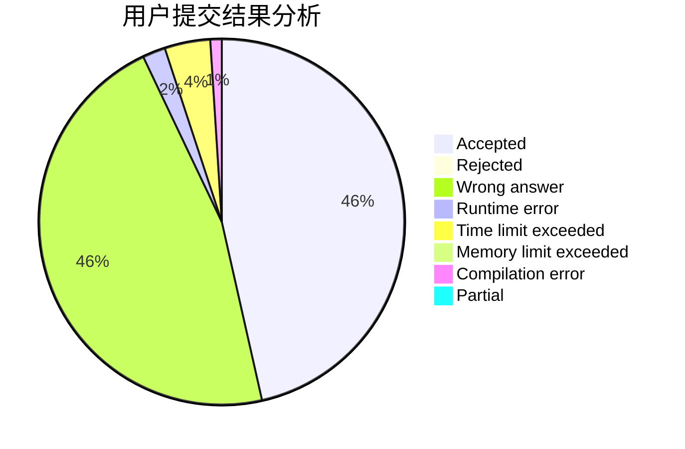
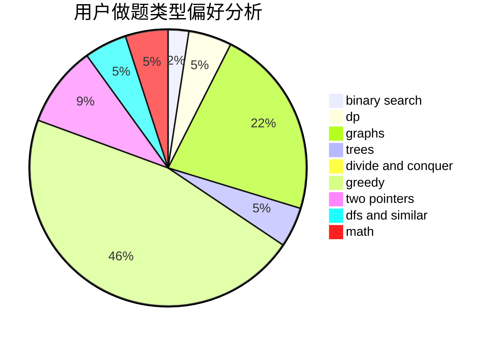

# Yao_

<!-- tabs:start -->

#### **用户提交结果分析**

#### **用户做题类型偏好分析**

<!-- tabs:end -->
# 推荐题目
[1503D](https://codeforces.com/contest/1503/problem/D)
[869B](https://codeforces.com/contest/869/problem/B)
[504E](https://codeforces.com/contest/504/problem/E)
[1320D](https://codeforces.com/contest/1320/problem/D)
[835C](https://codeforces.com/contest/835/problem/C)
[1432F](https://codeforces.com/contest/1432/problem/F)
[997E](https://codeforces.com/contest/997/problem/E)
[317E](https://codeforces.com/contest/317/problem/E)
[1088E](https://codeforces.com/contest/1088/problem/E)
[557B](https://codeforces.com/contest/557/problem/B)
