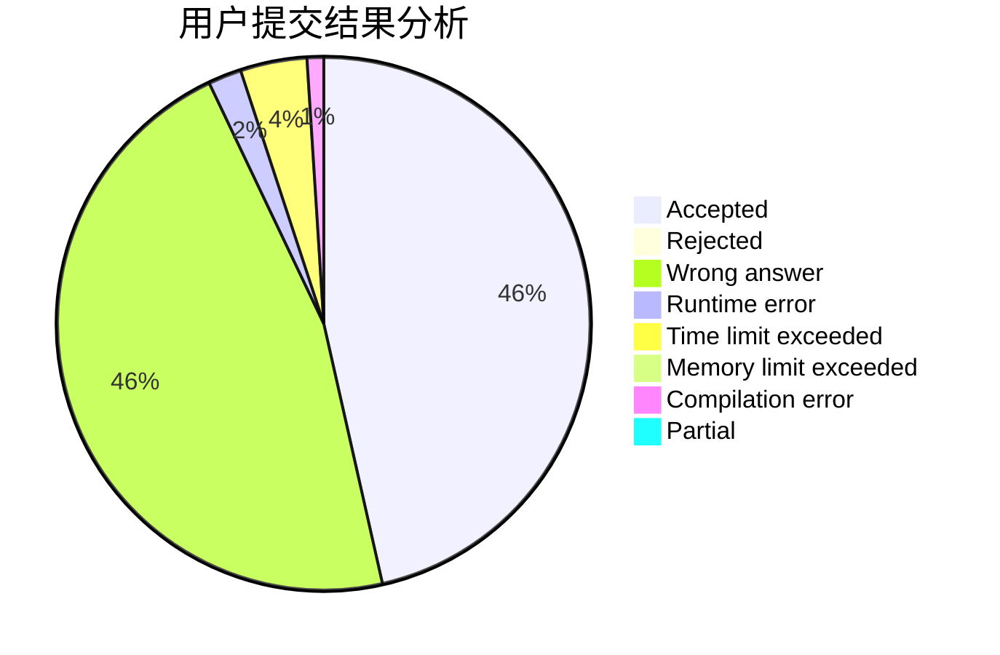
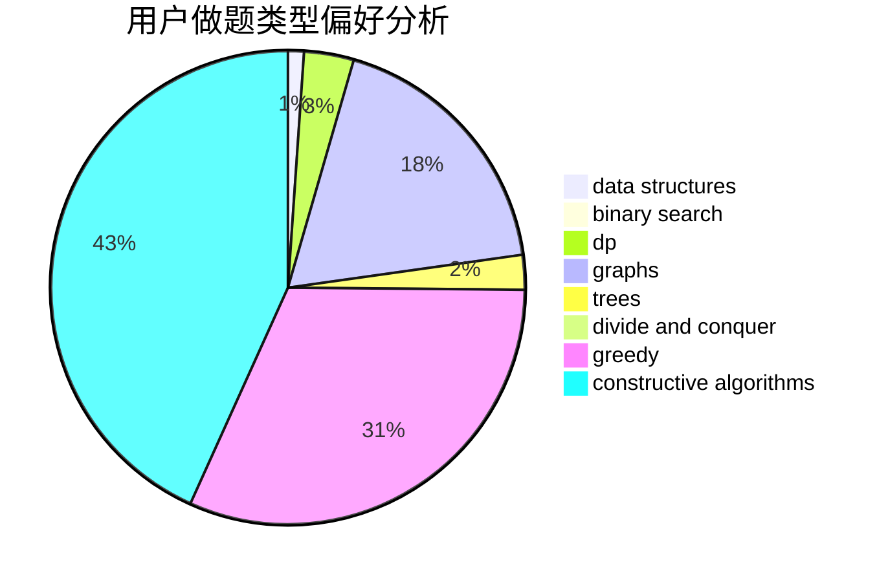
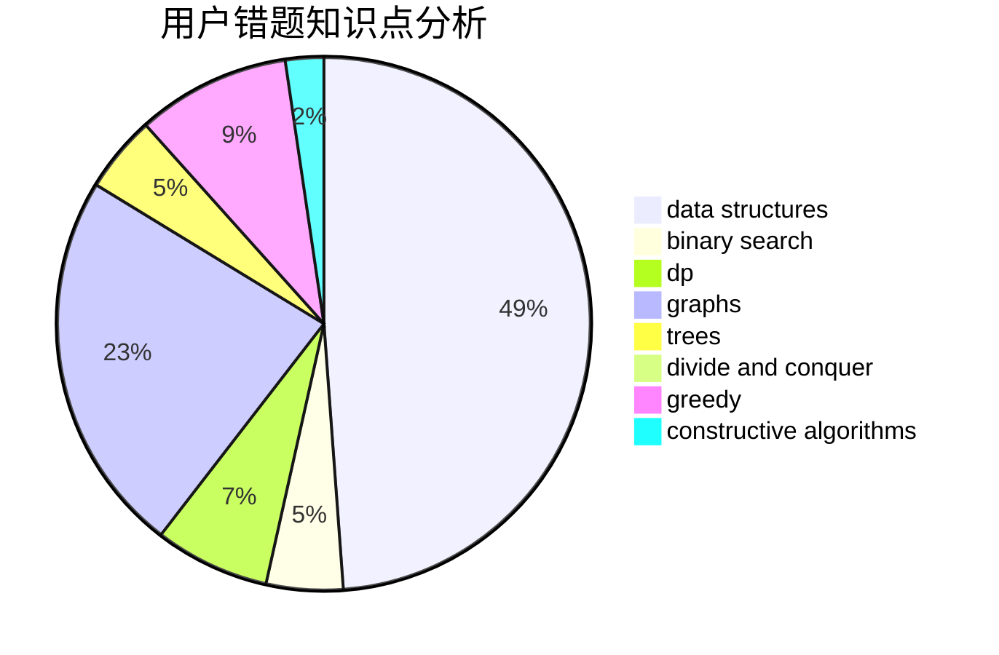

# Yao_

<!-- tabs:start -->

#### **用户提交结果分析**

#### **用户做题类型偏好分析**

#### **用户错题知识点分析**

<!-- tabs:end -->
# 推荐题目
[1503D](https://codeforces.com/contest/1503/problem/D)		2-sat,
                        constructive algorithms,
                        data structures,
                        greedy,
                        sortings,
                        two pointers		  
[869B](https://codeforces.com/contest/869/problem/B)		math		  
[504E](https://codeforces.com/contest/504/problem/E)		binary search,
                        dfs and similar,
                        hashing,
                        string suffix structures,
                        trees		  
[1320D](https://codeforces.com/contest/1320/problem/D)		data structures,
                        hashing,
                        strings		  
[835C](https://codeforces.com/contest/835/problem/C)		dp,
                        implementation		  
[1432F](https://codeforces.com/contest/1432/problem/F)		dsu,graphs,sortings,trees		  
[997E](https://codeforces.com/contest/997/problem/E)		data structures		  
[317E](https://codeforces.com/contest/317/problem/E)		constructive algorithms,
                        shortest paths		  
[1088E](https://codeforces.com/contest/1088/problem/E)		dp,
                        greedy,
                        math,
                        trees		  
[557B](https://codeforces.com/contest/557/problem/B)		constructive algorithms,
                        implementation,
                        math,
                        sortings		  
