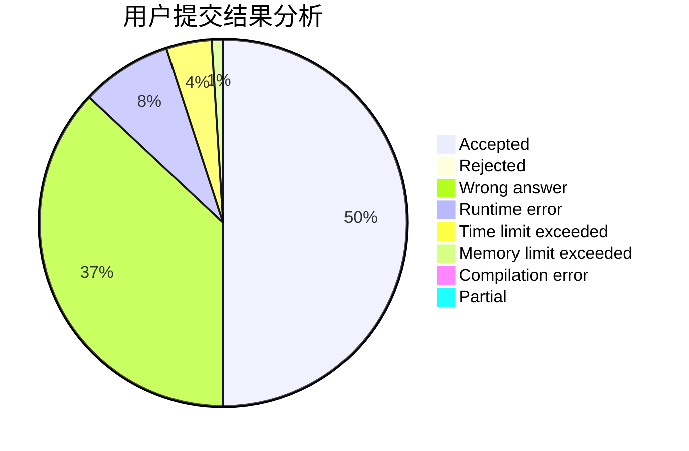
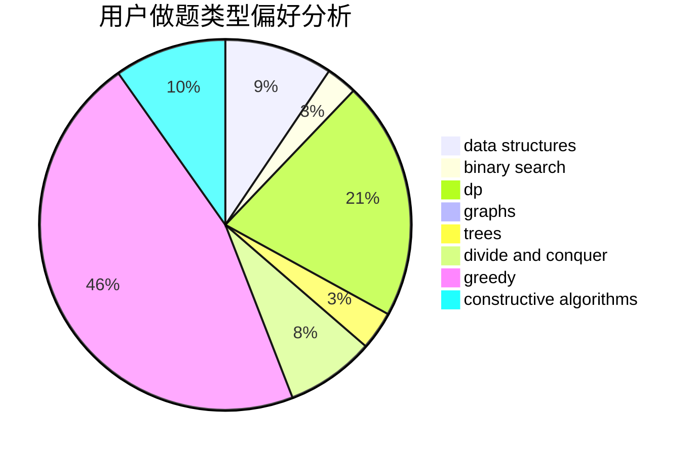

# Yazmin

<!-- tabs:start -->

#### **用户提交结果分析**

#### **用户做题类型偏好分析**

#### **用户错题知识点分析**

<!-- tabs:end -->
# 推荐题目
[487C](https://codeforces.com/contest/487/problem/C)		constructive algorithms,
                        math,
                        number theory		  
[182D](https://codeforces.com/contest/182/problem/D)		brute force,
                        hashing,
                        implementation,
                        math,
                        strings		  
[1030G](https://codeforces.com/contest/1030/problem/G)		number theory		  
[1159C](https://codeforces.com/contest/1159/problem/C)		dsu,graphs,sortings,trees		  
[1179B](https://codeforces.com/contest/1179/problem/B)		constructive algorithms		  
[236D](https://codeforces.com/contest/236/problem/D)		dsu,graphs,sortings,trees		  
[44C](https://codeforces.com/contest/44/problem/C)		implementation		  
[924A](https://codeforces.com/contest/924/problem/A)		greedy,
                        implementation		  
[209C](https://codeforces.com/contest/209/problem/C)		constructive algorithms,
                        dsu,
                        graphs,
                        greedy		  
[707E](https://codeforces.com/contest/707/problem/E)		data structures		  
