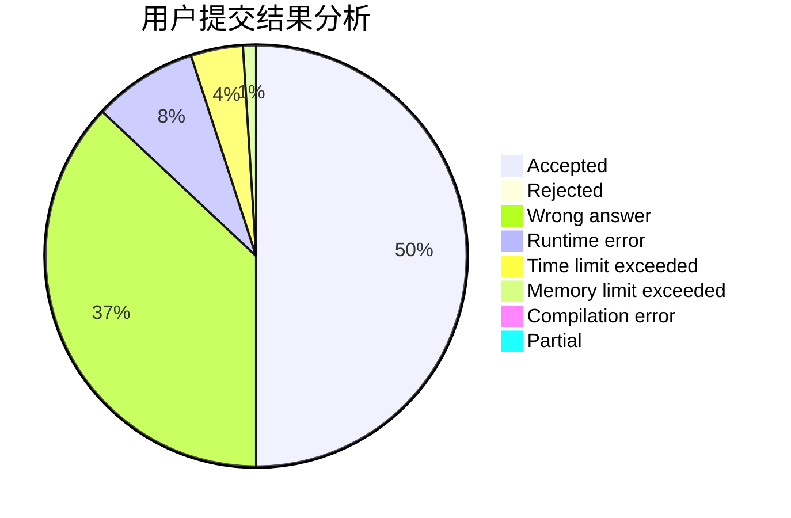
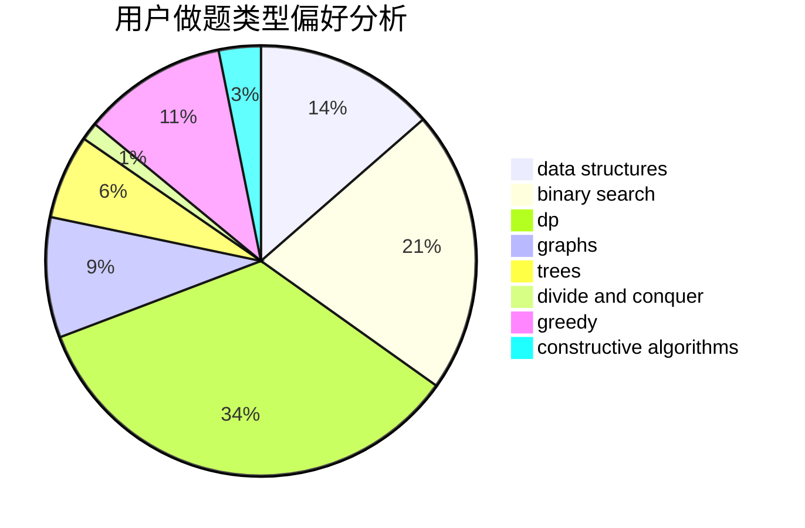
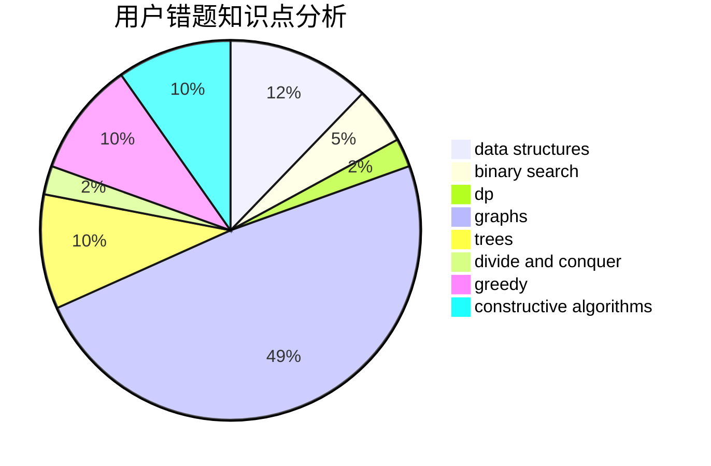

# Yazmin

<!-- tabs:start -->

#### **用户提交结果分析**

#### **用户做题类型偏好分析**

#### **用户错题知识点分析**

<!-- tabs:end -->
# 推荐题目
[468B](https://codeforces.com/contest/468/problem/B)		2-sat,
                        dfs and similar,
                        dsu,
                        graph matchings,
                        greedy		  
[15C](https://codeforces.com/contest/15/problem/C)		games		  
[1030C](https://codeforces.com/contest/1030/problem/C)		implementation		  
[1157C1](https://codeforces.com/contest/1157C/problem/1)		greedy		  
[1176A](https://codeforces.com/contest/1176/problem/A)		brute force,
                        greedy,
                        implementation		  
[218A](https://codeforces.com/contest/218/problem/A)		brute force,
                        constructive algorithms,
                        implementation		  
[427D](https://codeforces.com/contest/427/problem/D)		dp,
                        string suffix structures,
                        strings		  
[909C](https://codeforces.com/contest/909/problem/C)		dp		  
[183A](https://codeforces.com/contest/183/problem/A)		constructive algorithms,
                        math		  
[685C](https://codeforces.com/contest/685/problem/C)		binary search,
                        math		  
