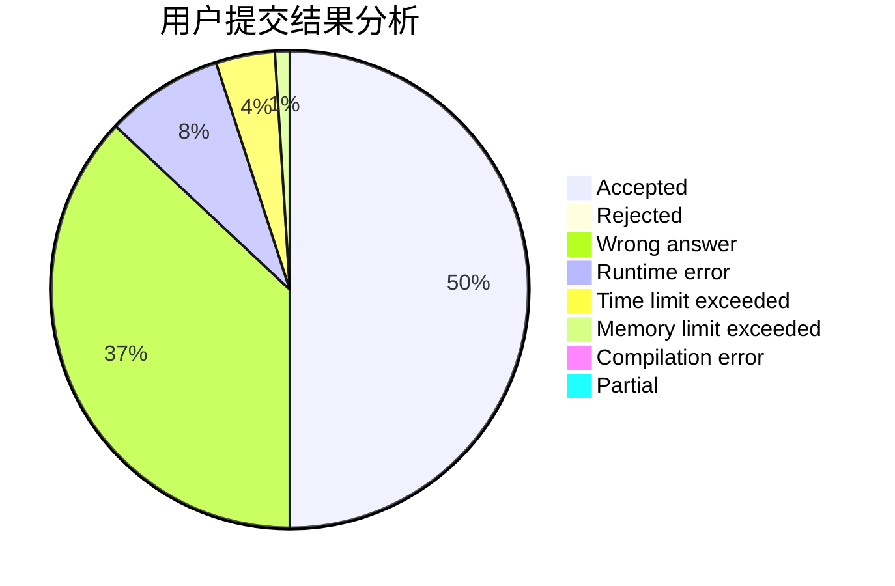
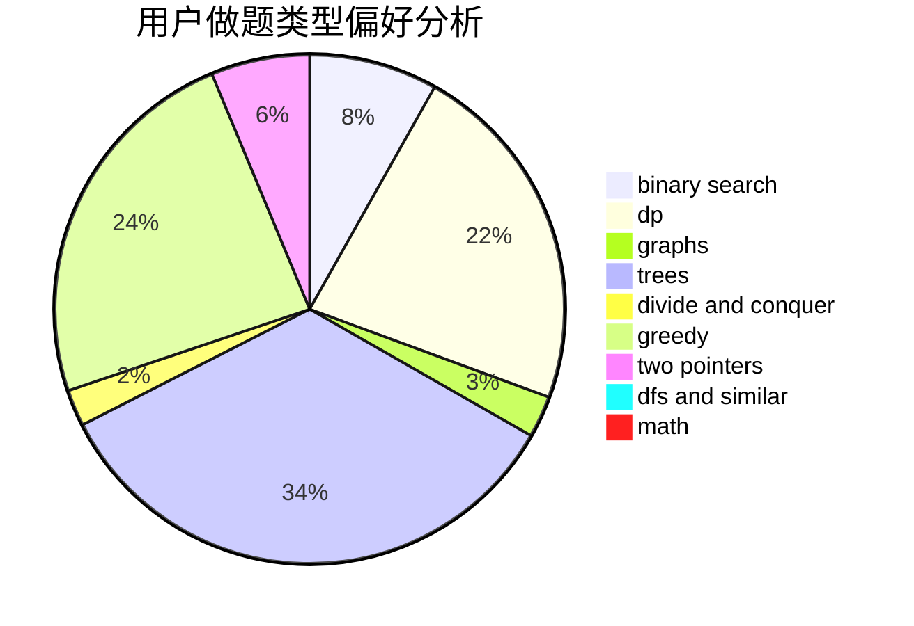

# Yazmin

<!-- tabs:start -->

#### **用户提交结果分析**

#### **用户做题类型偏好分析**

<!-- tabs:end -->
# 推荐题目
[487C](https://codeforces.com/contest/487/problem/C)
[182D](https://codeforces.com/contest/182/problem/D)
[1030G](https://codeforces.com/contest/1030/problem/G)
[1159C](https://codeforces.com/contest/1159/problem/C)
[1179B](https://codeforces.com/contest/1179/problem/B)
[236D](https://codeforces.com/contest/236/problem/D)
[44C](https://codeforces.com/contest/44/problem/C)
[924A](https://codeforces.com/contest/924/problem/A)
[209C](https://codeforces.com/contest/209/problem/C)
[707E](https://codeforces.com/contest/707/problem/E)
