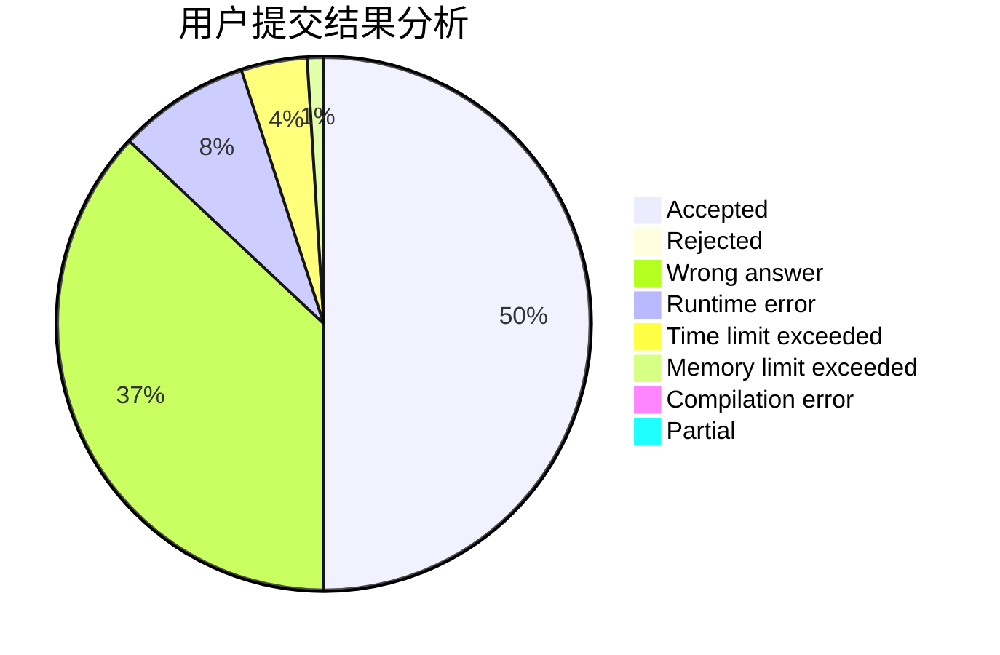
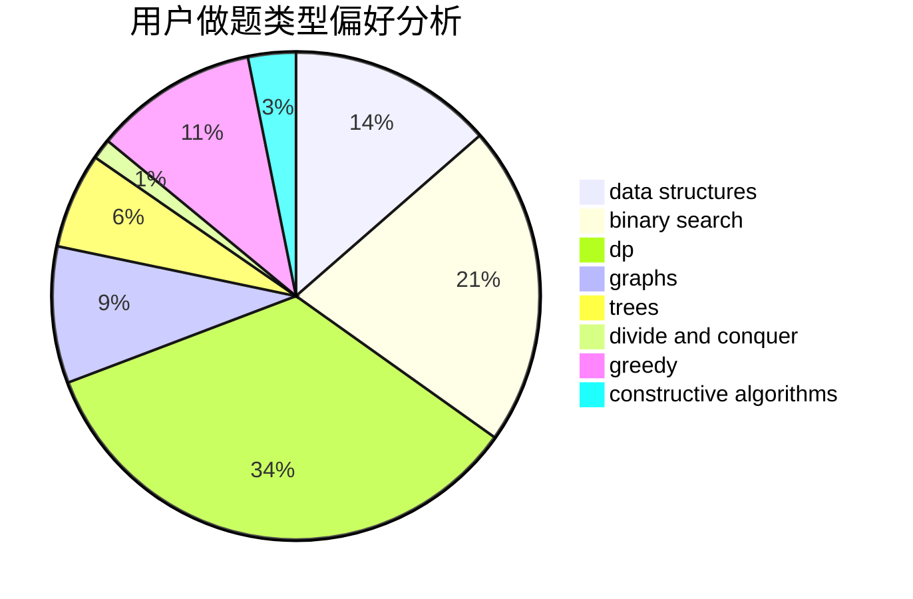
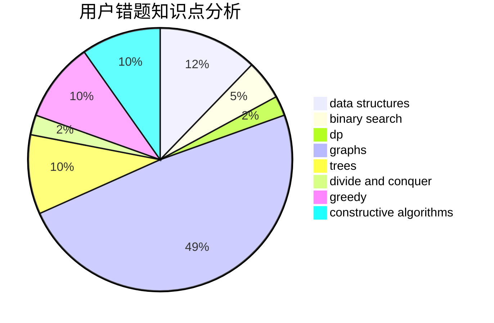

# Yazmin
<!-- tabs:start -->
#### **用户提交结果分析**

#### **用户做题类型偏好分析**

#### **用户错题知识点分析**

<!-- tabs:end -->
# 推荐题目
[Ithea Plays With Chtholly](http://codeforces.com/problemset/problem/896/B)		binary search,
                        constructive algorithms,
                        games,
                        greedy,
                        interactive		  
[New Year Shopping](http://codeforces.com/problemset/problem/500/F)		divide and conquer,
                        dp		  
[Vasya and Golden Ticket](http://codeforces.com/problemset/problem/1030/C)		implementation		  
[Industrial Nim](http://codeforces.com/problemset/problem/15/C)		games		  
[Han Solo and Lazer Gun](http://codeforces.com/problemset/problem/514/B)		brute force,
                        data structures,
                        geometry,
                        implementation,
                        math		  
[Spongebob and Squares](http://codeforces.com/problemset/problem/599/D)		brute force,
                        math		  
[Games with Rectangle](http://codeforces.com/problemset/problem/128/C)		combinatorics,
                        dp		  
[Room Leader](http://codeforces.com/problemset/problem/74/A)		implementation		  
[Mountain Scenery](http://codeforces.com/problemset/problem/218/A)		brute force,
                        constructive algorithms,
                        implementation		  
[Headquarters](http://codeforces.com/problemset/problem/183/A)		constructive algorithms,
                        math		  
<!-- tabs:start -->
#### **data structures**
[Ithea Plays With Chtholly](http://codeforces.com/problemset/problem/514/B)		brute force,
                        data structures,
                        geometry,
                        implementation,
                        math		  
[New Year Shopping](http://codeforces.com/problemset/problem/799/E)		data structures,
                        greedy,
                        two pointers		  
[Vasya and Golden Ticket](http://codeforces.com/problemset/problem/920/F)		brute force,
                        data structures,
                        dsu,
                        number theory		  
[Industrial Nim](http://codeforces.com/problemset/problem/1492/C)		binary search,
                        data structures,
                        dp,
                        greedy,
                        two pointers		  
[Han Solo and Lazer Gun](http://codeforces.com/problemset/problem/1490/G)		binary search,
                        data structures,
                        math		  
[Spongebob and Squares](http://codeforces.com/problemset/problem/1479/D)		binary search,
                        bitmasks,
                        brute force,
                        data structures,
                        probabilities,
                        trees		  
[Games with Rectangle](http://codeforces.com/problemset/problem/1497/A)		brute force,
                        data structures,
                        greedy,
                        sortings		  
[Room Leader](http://codeforces.com/problemset/problem/1491/C)		brute force,
                        data structures,
                        dp,
                        greedy,
                        implementation		  
[Mountain Scenery](http://codeforces.com/problemset/problem/1492/B)		data structures,
                        greedy,
                        math		  
[Headquarters](http://codeforces.com/problemset/problem/1436/E)		binary search,
                        data structures,
                        two pointers		  
#### **binary search**
[Ithea Plays With Chtholly](http://codeforces.com/problemset/problem/896/B)		binary search,
                        constructive algorithms,
                        games,
                        greedy,
                        interactive		  
[New Year Shopping](http://codeforces.com/problemset/problem/685/C)		binary search,
                        math		  
[Vasya and Golden Ticket](http://codeforces.com/problemset/problem/471/C)		binary search,
                        brute force,
                        greedy,
                        math		  
[Industrial Nim](http://codeforces.com/problemset/problem/1348/D)		binary search,
                        constructive algorithms,
                        greedy,
                        implementation,
                        math		  
[Han Solo and Lazer Gun](http://codeforces.com/problemset/problem/1168/A)		binary search,
                        greedy		  
[Spongebob and Squares](http://codeforces.com/problemset/problem/912/E)		binary search,
                        dfs and similar,
                        math,
                        meet-in-the-middle,
                        number theory,
                        two pointers		  
[Games with Rectangle](http://codeforces.com/problemset/problem/1492/C)		binary search,
                        data structures,
                        dp,
                        greedy,
                        two pointers		  
[Room Leader](http://codeforces.com/problemset/problem/1463/D)		binary search,
                        constructive algorithms,
                        greedy,
                        two pointers		  
[Mountain Scenery](http://codeforces.com/problemset/problem/1490/G)		binary search,
                        data structures,
                        math		  
[Headquarters](http://codeforces.com/problemset/problem/1479/D)		binary search,
                        bitmasks,
                        brute force,
                        data structures,
                        probabilities,
                        trees		  
#### **dp**
[Ithea Plays With Chtholly](http://codeforces.com/problemset/problem/500/F)		divide and conquer,
                        dp		  
[New Year Shopping](http://codeforces.com/problemset/problem/128/C)		combinatorics,
                        dp		  
[Vasya and Golden Ticket](http://codeforces.com/problemset/problem/1007/E)		dp		  
[Industrial Nim](http://codeforces.com/problemset/problem/1360/F)		bitmasks,
                        brute force,
                        constructive algorithms,
                        dp,
                        hashing,
                        strings		  
[Han Solo and Lazer Gun](http://codeforces.com/problemset/problem/909/C)		dp		  
[Spongebob and Squares](http://codeforces.com/problemset/problem/427/D)		dp,
                        string suffix structures,
                        strings		  
[Games with Rectangle](http://codeforces.com/problemset/problem/868/E)		dp,
                        graphs,
                        trees		  
[Room Leader](http://codeforces.com/problemset/problem/1501/B)		dp,
                        implementation,
                        sortings		  
[Mountain Scenery](http://codeforces.com/problemset/problem/1492/C)		binary search,
                        data structures,
                        dp,
                        greedy,
                        two pointers		  
[Headquarters](https://codeforces.com/contest/1457/problem/C)		brute force,
                        dp,
                        implementation		  
#### **graph**
[Ithea Plays With Chtholly](http://codeforces.com/problemset/problem/1198/E)		flows,
                        graph matchings,
                        graphs		  
[New Year Shopping](http://codeforces.com/problemset/problem/468/B)		2-sat,
                        dfs and similar,
                        dsu,
                        graph matchings,
                        greedy		  
[Vasya and Golden Ticket](http://codeforces.com/problemset/problem/868/E)		dp,
                        graphs,
                        trees		  
[Industrial Nim](http://codeforces.com/problemset/problem/1487/C)		brute force,
                        constructive algorithms,
                        dfs and similar,
                        graphs,
                        greedy,
                        implementation,
                        math		  
[Han Solo and Lazer Gun](http://codeforces.com/problemset/problem/1437/C)		dp,
                        flows,
                        graph matchings,
                        greedy,
                        math,
                        sortings		  
[Spongebob and Squares](http://codeforces.com/problemset/problem/1470/D)		constructive algorithms,
                        dfs and similar,
                        graph matchings,
                        graphs,
                        greedy		  
[Games with Rectangle](http://codeforces.com/problemset/problem/1476/C)		dp,
                        graphs,
                        greedy		  
[Room Leader](http://codeforces.com/problemset/problem/1304/D)		constructive algorithms,
                        graphs,
                        greedy,
                        two pointers		  
[Mountain Scenery](http://codeforces.com/problemset/problem/1475/C)		combinatorics,
                        graphs,
                        math		  
[Headquarters](http://codeforces.com/problemset/problem/553/E)		dp,
                        fft,
                        graphs,
                        math,
                        probabilities		  
#### **trees**
[Ithea Plays With Chtholly](http://codeforces.com/problemset/problem/1252/F)		hashing,
                        trees		  
[New Year Shopping](http://codeforces.com/problemset/problem/1307/F)		dfs and similar,
                        dsu,
                        trees		  
[Vasya and Golden Ticket](http://codeforces.com/problemset/problem/868/E)		dp,
                        graphs,
                        trees		  
[Industrial Nim](http://codeforces.com/problemset/problem/1479/D)		binary search,
                        bitmasks,
                        brute force,
                        data structures,
                        probabilities,
                        trees		  
[Han Solo and Lazer Gun](http://codeforces.com/problemset/problem/1511/C)		brute force,
                        data structures,
                        implementation,
                        trees		  
[Spongebob and Squares](http://codeforces.com/problemset/problem/1499/F)		combinatorics,
                        dfs and similar,
                        dp,
                        trees		  
[Games with Rectangle](http://codeforces.com/problemset/problem/1491/E)		brute force,
                        dfs and similar,
                        divide and conquer,
                        number theory,
                        trees		  
[Room Leader](http://codeforces.com/problemset/problem/1466/D)		data structures,
                        greedy,
                        sortings,
                        trees		  
[Mountain Scenery](http://codeforces.com/problemset/problem/1495/D)		combinatorics,
                        dfs and similar,
                        graphs,
                        math,
                        shortest paths,
                        trees		  
[Headquarters](http://codeforces.com/problemset/problem/1303/G)		data structures,
                        divide and conquer,
                        geometry,
                        trees		  
#### **divide and conquer**
[Ithea Plays With Chtholly](http://codeforces.com/problemset/problem/500/F)		divide and conquer,
                        dp		  
[New Year Shopping](http://codeforces.com/problemset/problem/1461/D)		binary search,
                        brute force,
                        data structures,
                        divide and conquer,
                        implementation,
                        sortings		  
[Vasya and Golden Ticket](http://codeforces.com/problemset/problem/1466/G)		combinatorics,
                        divide and conquer,
                        hashing,
                        math,
                        string suffix structures,
                        strings		  
[Industrial Nim](http://codeforces.com/problemset/problem/1490/D)		dfs and similar,
                        divide and conquer,
                        implementation		  
[Han Solo and Lazer Gun](https://codeforces.com/contest/1483/problem/C)		data structures,
                        divide and conquer,
                        dp		  
[Spongebob and Squares](http://codeforces.com/problemset/problem/1491/E)		brute force,
                        dfs and similar,
                        divide and conquer,
                        number theory,
                        trees		  
[Games with Rectangle](http://codeforces.com/problemset/problem/1303/G)		data structures,
                        divide and conquer,
                        geometry,
                        trees		  
[Room Leader](http://codeforces.com/problemset/problem/1494/D)		constructive algorithms,
                        data structures,
                        dfs and similar,
                        divide and conquer,
                        dsu,
                        greedy,
                        sortings,
                        trees		  
[Mountain Scenery](http://codeforces.com/problemset/problem/1482/E)		data structures,
                        divide and conquer,
                        dp		  
[Headquarters](http://codeforces.com/problemset/problem/566/C)		dfs and similar,
                        divide and conquer,
                        trees		  
#### **greedy**
[Ithea Plays With Chtholly](http://codeforces.com/problemset/problem/896/B)		binary search,
                        constructive algorithms,
                        games,
                        greedy,
                        interactive		  
[New Year Shopping](http://codeforces.com/problemset/problem/799/E)		data structures,
                        greedy,
                        two pointers		  
[Vasya and Golden Ticket](http://codeforces.com/problemset/problem/1157/C1)		greedy		  
[Industrial Nim](http://codeforces.com/problemset/problem/1294/C)		greedy,
                        math,
                        number theory		  
[Han Solo and Lazer Gun](http://codeforces.com/problemset/problem/1176/A)		brute force,
                        greedy,
                        implementation		  
[Spongebob and Squares](http://codeforces.com/problemset/problem/471/C)		binary search,
                        brute force,
                        greedy,
                        math		  
[Games with Rectangle](http://codeforces.com/problemset/problem/1000/A)		greedy,
                        implementation		  
[Room Leader](http://codeforces.com/problemset/problem/1385/C)		greedy		  
[Mountain Scenery](http://codeforces.com/problemset/problem/1388/A)		brute force,
                        greedy,
                        math,
                        number theory		  
[Headquarters](http://codeforces.com/problemset/problem/1348/D)		binary search,
                        constructive algorithms,
                        greedy,
                        implementation,
                        math		  
#### **constructive algorithms**
[Ithea Plays With Chtholly](http://codeforces.com/problemset/problem/896/B)		binary search,
                        constructive algorithms,
                        games,
                        greedy,
                        interactive		  
[New Year Shopping](http://codeforces.com/problemset/problem/218/A)		brute force,
                        constructive algorithms,
                        implementation		  
[Vasya and Golden Ticket](http://codeforces.com/problemset/problem/183/A)		constructive algorithms,
                        math		  
[Industrial Nim](http://codeforces.com/problemset/problem/1360/F)		bitmasks,
                        brute force,
                        constructive algorithms,
                        dp,
                        hashing,
                        strings		  
[Han Solo and Lazer Gun](http://codeforces.com/problemset/problem/1348/D)		binary search,
                        constructive algorithms,
                        greedy,
                        implementation,
                        math		  
[Spongebob and Squares](http://codeforces.com/problemset/problem/1493/A)		constructive algorithms,
                        greedy		  
[Games with Rectangle](http://codeforces.com/problemset/problem/1463/D)		binary search,
                        constructive algorithms,
                        greedy,
                        two pointers		  
[Room Leader](https://codeforces.com/contest/1456/problem/B)		bitmasks,
                        brute force,
                        constructive algorithms		  
[Mountain Scenery](http://codeforces.com/problemset/problem/1492/D)		bitmasks,
                        constructive algorithms,
                        greedy,
                        math		  
[Headquarters](https://codeforces.com/contest/1504/problem/D)		constructive algorithms,
                        games,
                        interactive		  
#### **sortings**
[Ithea Plays With Chtholly](http://codeforces.com/problemset/problem/1501/B)		dp,
                        implementation,
                        sortings		  
[New Year Shopping](https://codeforces.com/contest/1496/problem/C)		geometry,
                        greedy,
                        math,
                        sortings		  
[Vasya and Golden Ticket](http://codeforces.com/problemset/problem/1495/A)		geometry,
                        greedy,
                        math,
                        sortings		  
[Industrial Nim](http://codeforces.com/problemset/problem/1497/A)		brute force,
                        data structures,
                        greedy,
                        sortings		  
[Han Solo and Lazer Gun](http://codeforces.com/problemset/problem/1427/A)		math,
                        sortings		  
[Spongebob and Squares](http://codeforces.com/problemset/problem/1461/D)		binary search,
                        brute force,
                        data structures,
                        divide and conquer,
                        implementation,
                        sortings		  
[Games with Rectangle](http://codeforces.com/problemset/problem/1437/C)		dp,
                        flows,
                        graph matchings,
                        greedy,
                        math,
                        sortings		  
[Room Leader](http://codeforces.com/problemset/problem/1473/A)		greedy,
                        implementation,
                        math,
                        sortings		  
[Mountain Scenery](http://codeforces.com/problemset/problem/1486/B)		binary search,
                        geometry,
                        shortest paths,
                        sortings		  
[Headquarters](http://codeforces.com/problemset/problem/1480/B)		greedy,
                        implementation,
                        sortings		  
<!-- tabs:end -->
