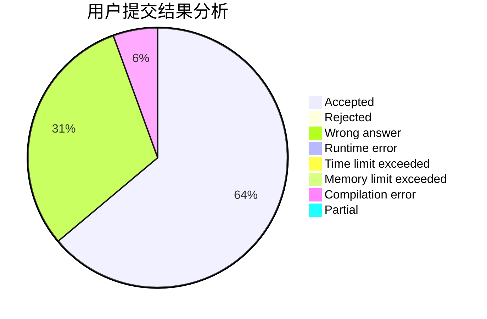
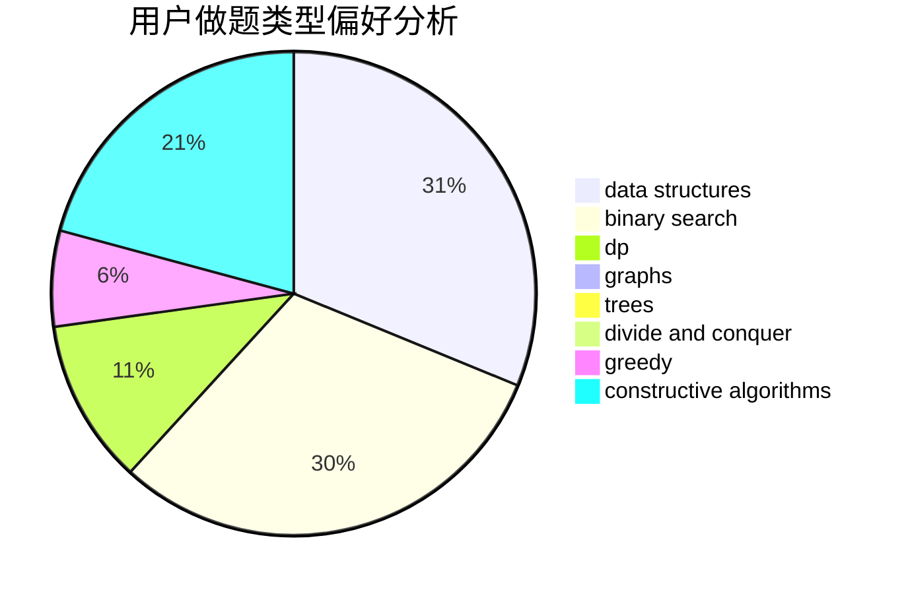

# YeahPotato

<!-- tabs:start -->

#### **用户提交结果分析**

#### **用户做题类型偏好分析**

#### **用户错题知识点分析**

<!-- tabs:end -->
# 推荐题目
[887B](https://codeforces.com/contest/887/problem/B)		brute force,
                        implementation		  
[1238B](https://codeforces.com/contest/1238/problem/B)		greedy,
                        sortings		  
[1066C](https://codeforces.com/contest/1066/problem/C)		implementation		  
[383E](https://codeforces.com/contest/383/problem/E)		combinatorics,
                        divide and conquer,
                        dp		  
[1151B](https://codeforces.com/contest/1151/problem/B)		bitmasks,
                        brute force,
                        constructive algorithms,
                        dp		  
[632B](https://codeforces.com/contest/632/problem/B)		brute force,
                        constructive algorithms		  
[7D](https://codeforces.com/contest/7/problem/D)		hashing,
                        strings		  
[800C](https://codeforces.com/contest/800/problem/C)		dsu,graphs,sortings,trees		  
[1434E](https://codeforces.com/contest/1434/problem/E)		dsu,
                        games		  
[689A](https://codeforces.com/contest/689/problem/A)		brute force,
                        constructive algorithms,
                        implementation		  
