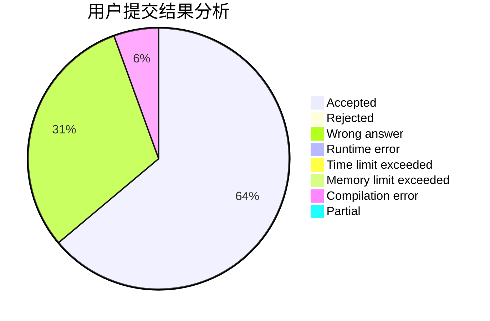
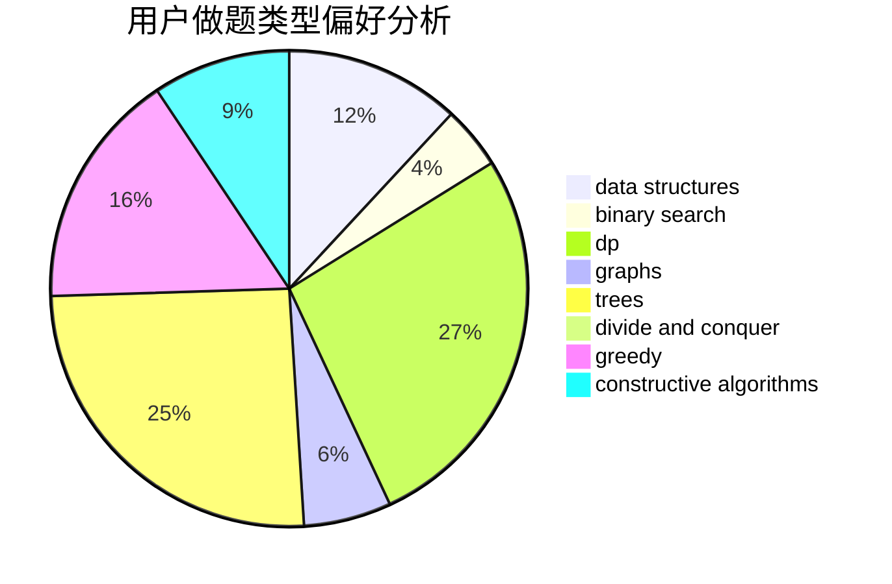
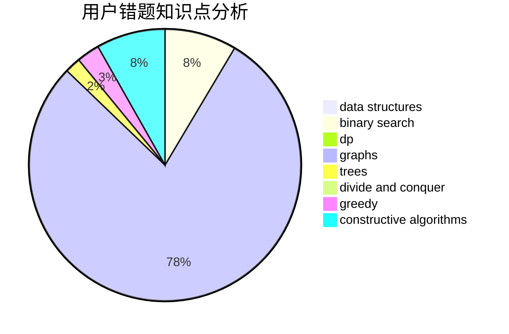

# YeahPotato

<!-- tabs:start -->

#### **用户提交结果分析**

#### **用户做题类型偏好分析**

#### **用户错题知识点分析**

<!-- tabs:end -->
# 推荐题目
[906C](https://codeforces.com/contest/906/problem/C)		bitmasks,
                        brute force,
                        dp,
                        graphs		  
[1243A](https://codeforces.com/contest/1243/problem/A)		implementation		  
[1066F](https://codeforces.com/contest/1066/problem/F)		dp		  
[414E](https://codeforces.com/contest/414/problem/E)		data structures		  
[1153B](https://codeforces.com/contest/1153/problem/B)		constructive algorithms,
                        greedy		  
[662E](https://codeforces.com/contest/662/problem/E)		brute force,
                        dp,
                        greedy		  
[814E](https://codeforces.com/contest/814/problem/E)		combinatorics,
                        dp,
                        graphs,
                        shortest paths		  
[815D](https://codeforces.com/contest/815/problem/D)		binary search,
                        combinatorics,
                        data structures,
                        geometry		  
[1444E](https://codeforces.com/contest/1444/problem/E)		brute force,
                        dfs and similar,
                        dp,
                        interactive,
                        trees		  
[709E](https://codeforces.com/contest/709/problem/E)		dsu,graphs,sortings,trees		  
