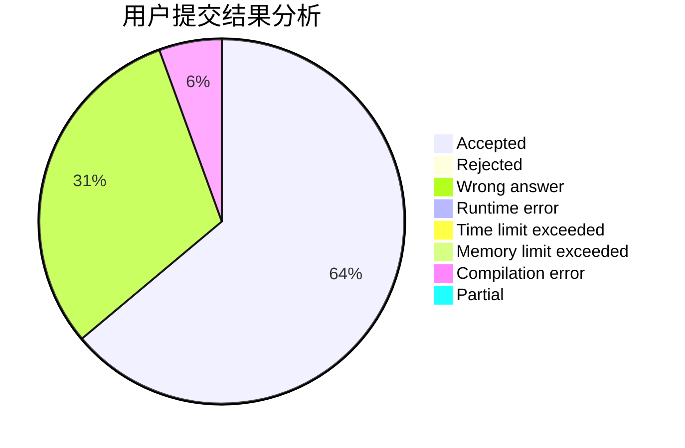
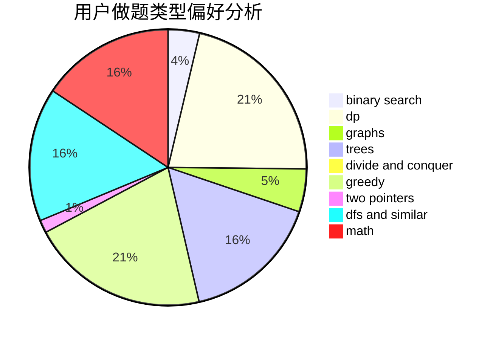

# YeahPotato

<!-- tabs:start -->

#### **用户提交结果分析**

#### **用户做题类型偏好分析**

<!-- tabs:end -->
# 推荐题目
[906C](https://codeforces.com/contest/906/problem/C)
[1243A](https://codeforces.com/contest/1243/problem/A)
[1066F](https://codeforces.com/contest/1066/problem/F)
[414E](https://codeforces.com/contest/414/problem/E)
[1153B](https://codeforces.com/contest/1153/problem/B)
[662E](https://codeforces.com/contest/662/problem/E)
[814E](https://codeforces.com/contest/814/problem/E)
[815D](https://codeforces.com/contest/815/problem/D)
[1444E](https://codeforces.com/contest/1444/problem/E)
[709E](https://codeforces.com/contest/709/problem/E)
