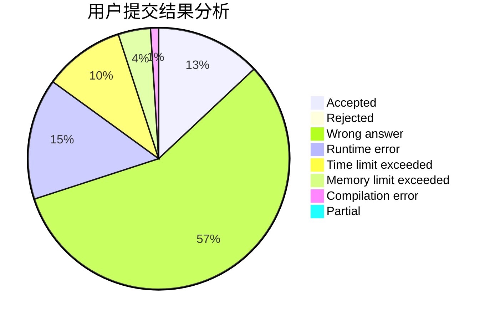
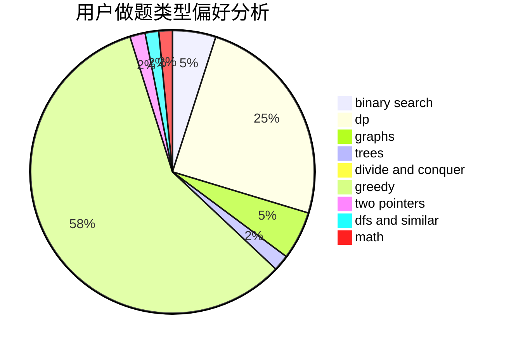

# YingLi_SF

<!-- tabs:start -->

#### **用户提交结果分析**

#### **用户做题类型偏好分析**

<!-- tabs:end -->
# 推荐题目
[519D](https://codeforces.com/contest/519/problem/D)
[680B](https://codeforces.com/contest/680/problem/B)
[380A](https://codeforces.com/contest/380/problem/A)
[1139A](https://codeforces.com/contest/1139/problem/A)
[1246C](https://codeforces.com/contest/1246/problem/C)
[13577](https://codeforces.com/contest/1357/problem/7)
[453D](https://codeforces.com/contest/453/problem/D)
[924D](https://codeforces.com/contest/924/problem/D)
[1199C](https://codeforces.com/contest/1199/problem/C)
[741A](https://codeforces.com/contest/741/problem/A)
