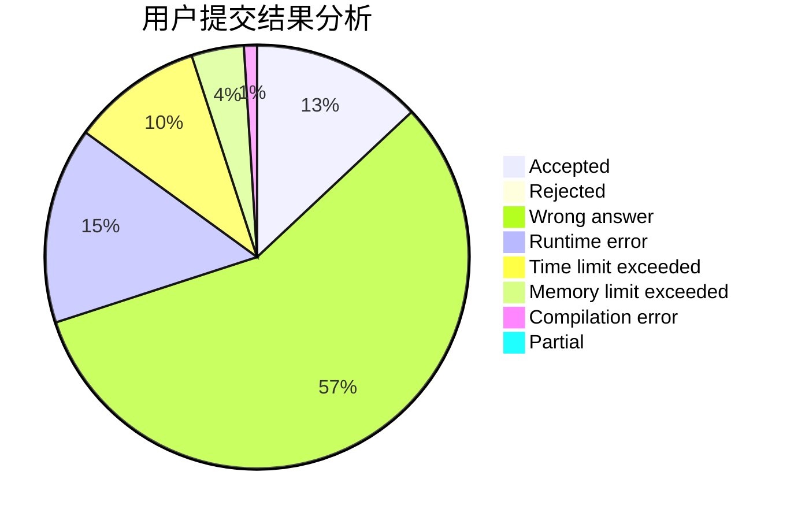
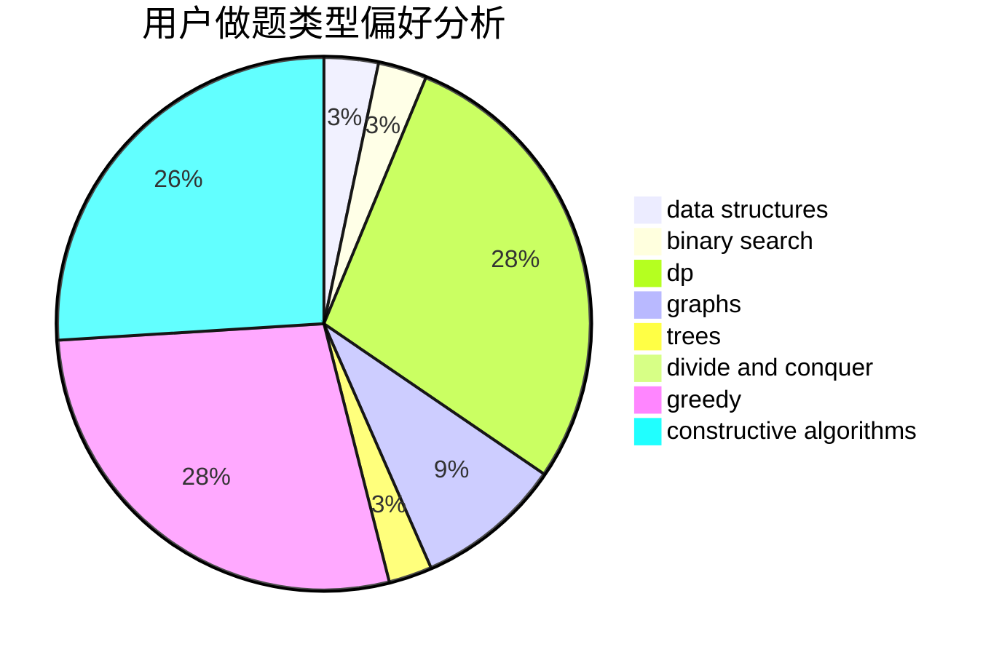
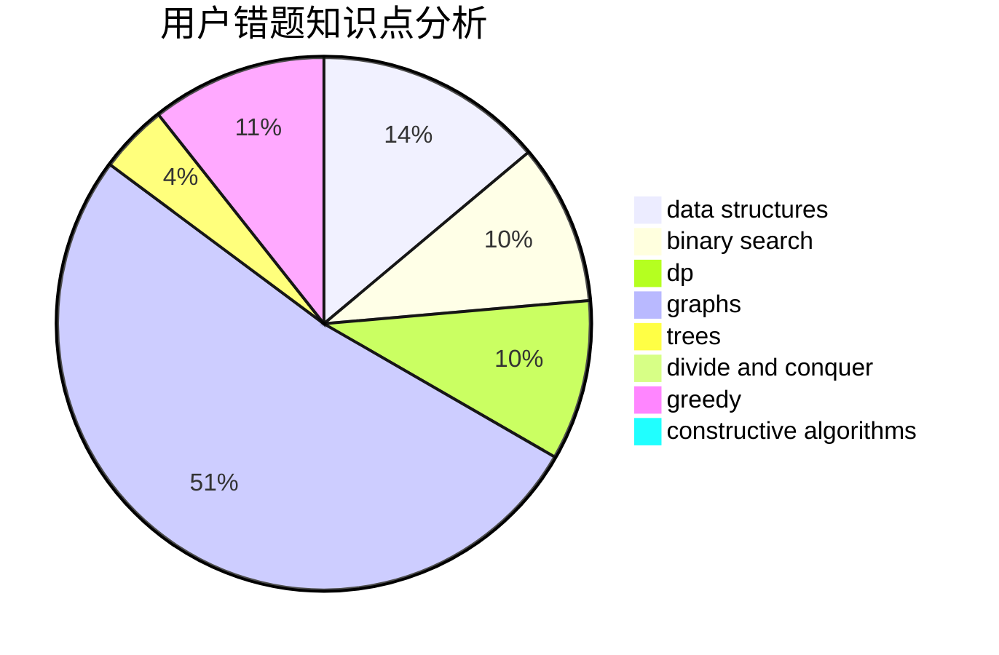

# YingLi_SF

<!-- tabs:start -->

#### **用户提交结果分析**

#### **用户做题类型偏好分析**

#### **用户错题知识点分析**

<!-- tabs:end -->
# 推荐题目
[498D](https://codeforces.com/contest/498/problem/D)		data structures,
                        dp,
                        number theory		  
[660A](https://codeforces.com/contest/660/problem/A)		greedy,
                        implementation,
                        math,
                        number theory		  
[354B](https://codeforces.com/contest/354/problem/B)		bitmasks,
                        dp,
                        games		  
[1136E](https://codeforces.com/contest/1136/problem/E)		binary search,
                        data structures		  
[1240F](https://codeforces.com/contest/1240/problem/F)		graphs		  
[1350D](https://codeforces.com/contest/1350/problem/D)		dsu,graphs,sortings,trees		  
[432D](https://codeforces.com/contest/432/problem/D)		dp,
                        string suffix structures,
                        strings,
                        two pointers		  
[909F](https://codeforces.com/contest/909/problem/F)		constructive algorithms		  
[1195A](https://codeforces.com/contest/1195/problem/A)		greedy,
                        math		  
[723D](https://codeforces.com/contest/723/problem/D)		dfs and similar,
                        dsu,
                        graphs,
                        greedy,
                        implementation		  
