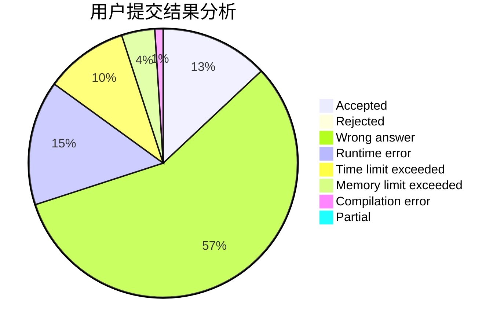
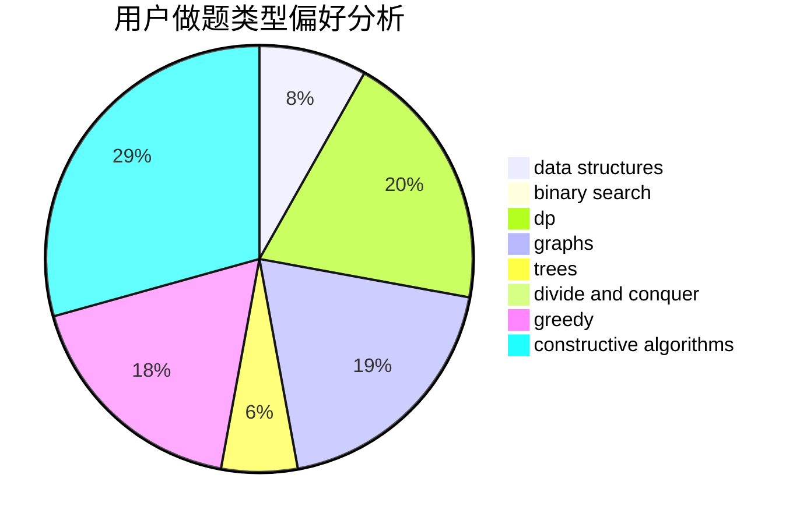
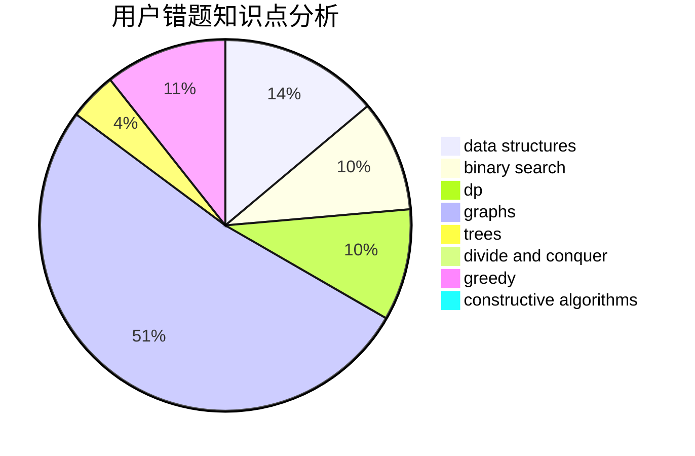

# YingLi_SF

<!-- tabs:start -->

#### **用户提交结果分析**

#### **用户做题类型偏好分析**

#### **用户错题知识点分析**

<!-- tabs:end -->
# 推荐题目
[519D](https://codeforces.com/contest/519/problem/D)		data structures,
                        dp,
                        two pointers		  
[680B](https://codeforces.com/contest/680/problem/B)		constructive algorithms,
                        implementation		  
[380A](https://codeforces.com/contest/380/problem/A)		binary search,
                        brute force		  
[1139A](https://codeforces.com/contest/1139/problem/A)		implementation,
                        strings		  
[1246C](https://codeforces.com/contest/1246/problem/C)		dsu,graphs,sortings,trees		  
[13577](https://codeforces.com/contest/1357/problem/7)		dsu,graphs,sortings,trees		  
[453D](https://codeforces.com/contest/453/problem/D)		dp,
                        matrices		  
[924D](https://codeforces.com/contest/924/problem/D)		nan		  
[1199C](https://codeforces.com/contest/1199/problem/C)		dsu,graphs,sortings,trees		  
[741A](https://codeforces.com/contest/741/problem/A)		dfs and similar,
                        math		  
