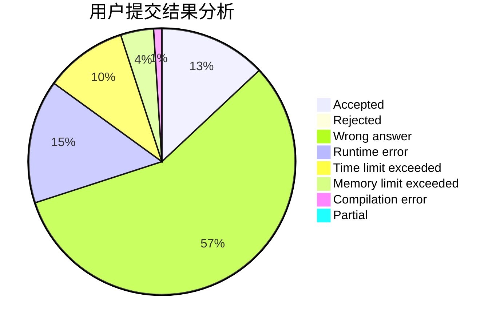
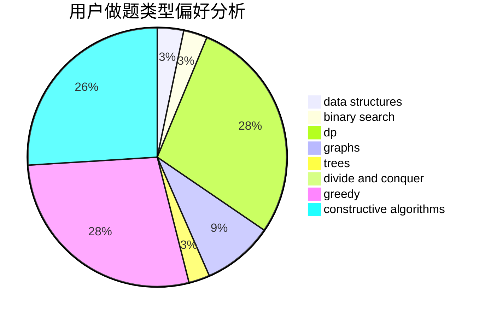
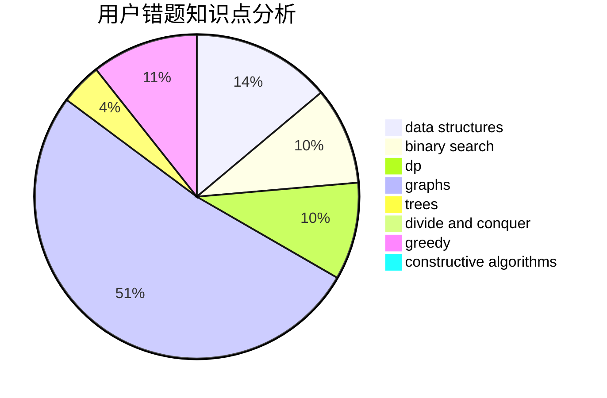

# YingLi_SF
<!-- tabs:start -->
#### **用户提交结果分析**

#### **用户做题类型偏好分析**

#### **用户错题知识点分析**

<!-- tabs:end -->
# 推荐题目
[Two Bracket Sequences](http://codeforces.com/problemset/problem/1272/F)		dp,
                        strings,
                        two pointers		  
[Football](http://codeforces.com/problemset/problem/1240/F)		graphs		  
[Pair Of Lines](http://codeforces.com/problemset/problem/961/D)		geometry		  
[Game with Strings](http://codeforces.com/problemset/problem/354/B)		bitmasks,
                        dp,
                        games		  
[AND-permutations](http://codeforces.com/problemset/problem/909/F)		constructive algorithms		  
[Nastya Hasn't Written a Legend](http://codeforces.com/problemset/problem/1136/E)		binary search,
                        data structures		  
[Arson In Berland Forest](https://codeforces.com/contest/1261/problem/C)		binary search,
                        graphs,
                        graphs,
                        shortest paths		  
[Stadium and Games](http://codeforces.com/problemset/problem/325/B)		binary search,
                        math		  
[Periodic RMQ Problem](http://codeforces.com/problemset/problem/803/G)		data structures		  
[Madness](http://codeforces.com/problemset/problem/822/F)		constructive algorithms,
                        dfs and similar,
                        trees		  
<!-- tabs:start -->
#### **data structures**
[Two Bracket Sequences](http://codeforces.com/problemset/problem/1136/E)		binary search,
                        data structures		  
[Football](http://codeforces.com/problemset/problem/803/G)		data structures		  
[Pair Of Lines](http://codeforces.com/problemset/problem/498/D)		data structures,
                        dp,
                        number theory		  
[Game with Strings](http://codeforces.com/problemset/problem/271/D)		data structures,
                        strings		  
[AND-permutations](http://codeforces.com/problemset/problem/786/C)		data structures,
                        divide and conquer		  
[Nastya Hasn't Written a Legend](https://codeforces.com/contest/1261/problem/B1)		data structures,
                        greedy		  
[Arson In Berland Forest](http://codeforces.com/problemset/problem/1098/D)		data structures		  
[Stadium and Games](http://codeforces.com/problemset/problem/1498/C)		brute force,
                        data structures,
                        dp		  
[Periodic RMQ Problem](http://codeforces.com/problemset/problem/1492/C)		binary search,
                        data structures,
                        dp,
                        greedy,
                        two pointers		  
[Madness](http://codeforces.com/problemset/problem/1490/G)		binary search,
                        data structures,
                        math		  
#### **binary search**
[Two Bracket Sequences](http://codeforces.com/problemset/problem/1136/E)		binary search,
                        data structures		  
[Football](https://codeforces.com/contest/1261/problem/C)		binary search,
                        graphs,
                        graphs,
                        shortest paths		  
[Pair Of Lines](http://codeforces.com/problemset/problem/325/B)		binary search,
                        math		  
[Game with Strings](http://codeforces.com/problemset/problem/958/E2)		binary search,
                        dp,
                        greedy,
                        sortings		  
[AND-permutations](https://codeforces.com/contest/1040/problem/D)		binary search,
                        interactive,
                        probabilities		  
[Nastya Hasn't Written a Legend](http://codeforces.com/problemset/problem/1178/H)		binary search,
                        flows,
                        graphs		  
[Arson In Berland Forest](http://codeforces.com/problemset/problem/1423/B)		binary search,
                        flows,
                        graph matchings,
                        graphs		  
[Stadium and Games](http://codeforces.com/problemset/problem/1492/C)		binary search,
                        data structures,
                        dp,
                        greedy,
                        two pointers		  
[Periodic RMQ Problem](http://codeforces.com/problemset/problem/1463/D)		binary search,
                        constructive algorithms,
                        greedy,
                        two pointers		  
[Madness](http://codeforces.com/problemset/problem/1490/G)		binary search,
                        data structures,
                        math		  
#### **dp**
[Two Bracket Sequences](http://codeforces.com/problemset/problem/1272/F)		dp,
                        strings,
                        two pointers		  
[Football](http://codeforces.com/problemset/problem/354/B)		bitmasks,
                        dp,
                        games		  
[Pair Of Lines](http://codeforces.com/problemset/problem/498/D)		data structures,
                        dp,
                        number theory		  
[Game with Strings](http://codeforces.com/problemset/problem/958/E2)		binary search,
                        dp,
                        greedy,
                        sortings		  
[AND-permutations](http://codeforces.com/problemset/problem/983/C)		dp,
                        graphs,
                        shortest paths		  
[Nastya Hasn't Written a Legend](http://codeforces.com/problemset/problem/432/D)		dp,
                        string suffix structures,
                        strings,
                        two pointers		  
[Arson In Berland Forest](http://codeforces.com/problemset/problem/1118/F2)		combinatorics,
                        dfs and similar,
                        dp,
                        trees		  
[Stadium and Games](http://codeforces.com/problemset/problem/448/C)		divide and conquer,
                        dp,
                        greedy		  
[Periodic RMQ Problem](http://codeforces.com/problemset/problem/1498/C)		brute force,
                        data structures,
                        dp		  
[Madness](http://codeforces.com/problemset/problem/1492/C)		binary search,
                        data structures,
                        dp,
                        greedy,
                        two pointers		  
#### **graph**
[Two Bracket Sequences](http://codeforces.com/problemset/problem/1240/F)		graphs		  
[Football](https://codeforces.com/contest/1261/problem/C)		binary search,
                        graphs,
                        graphs,
                        shortest paths		  
[Pair Of Lines](http://codeforces.com/problemset/problem/983/C)		dp,
                        graphs,
                        shortest paths		  
[Game with Strings](http://codeforces.com/problemset/problem/723/D)		dfs and similar,
                        dsu,
                        graphs,
                        greedy,
                        implementation		  
[AND-permutations](http://codeforces.com/problemset/problem/1178/H)		binary search,
                        flows,
                        graphs		  
[Nastya Hasn't Written a Legend](http://codeforces.com/problemset/problem/1423/B)		binary search,
                        flows,
                        graph matchings,
                        graphs		  
[Arson In Berland Forest](http://codeforces.com/problemset/problem/1487/C)		brute force,
                        constructive algorithms,
                        dfs and similar,
                        graphs,
                        greedy,
                        implementation,
                        math		  
[Stadium and Games](http://codeforces.com/problemset/problem/1437/C)		dp,
                        flows,
                        graph matchings,
                        greedy,
                        math,
                        sortings		  
[Periodic RMQ Problem](http://codeforces.com/problemset/problem/1470/D)		constructive algorithms,
                        dfs and similar,
                        graph matchings,
                        graphs,
                        greedy		  
[Madness](http://codeforces.com/problemset/problem/1476/C)		dp,
                        graphs,
                        greedy		  
#### **trees**
[Two Bracket Sequences](http://codeforces.com/problemset/problem/822/F)		constructive algorithms,
                        dfs and similar,
                        trees		  
[Football](http://codeforces.com/problemset/problem/1118/F2)		combinatorics,
                        dfs and similar,
                        dp,
                        trees		  
[Pair Of Lines](http://codeforces.com/problemset/problem/1479/D)		binary search,
                        bitmasks,
                        brute force,
                        data structures,
                        probabilities,
                        trees		  
[Game with Strings](http://codeforces.com/problemset/problem/1511/C)		brute force,
                        data structures,
                        implementation,
                        trees		  
[AND-permutations](http://codeforces.com/problemset/problem/1499/F)		combinatorics,
                        dfs and similar,
                        dp,
                        trees		  
[Nastya Hasn't Written a Legend](http://codeforces.com/problemset/problem/1491/E)		brute force,
                        dfs and similar,
                        divide and conquer,
                        number theory,
                        trees		  
[Arson In Berland Forest](http://codeforces.com/problemset/problem/1466/D)		data structures,
                        greedy,
                        sortings,
                        trees		  
[Stadium and Games](http://codeforces.com/problemset/problem/1495/D)		combinatorics,
                        dfs and similar,
                        graphs,
                        math,
                        shortest paths,
                        trees		  
[Periodic RMQ Problem](http://codeforces.com/problemset/problem/1303/G)		data structures,
                        divide and conquer,
                        geometry,
                        trees		  
[Madness](http://codeforces.com/problemset/problem/1454/E)		combinatorics,
                        dfs and similar,
                        graphs,
                        trees		  
#### **divide and conquer**
[Two Bracket Sequences](http://codeforces.com/problemset/problem/786/C)		data structures,
                        divide and conquer		  
[Football](http://codeforces.com/problemset/problem/448/C)		divide and conquer,
                        dp,
                        greedy		  
[Pair Of Lines](http://codeforces.com/problemset/problem/1461/D)		binary search,
                        brute force,
                        data structures,
                        divide and conquer,
                        implementation,
                        sortings		  
[Game with Strings](http://codeforces.com/problemset/problem/1466/G)		combinatorics,
                        divide and conquer,
                        hashing,
                        math,
                        string suffix structures,
                        strings		  
[AND-permutations](http://codeforces.com/problemset/problem/1490/D)		dfs and similar,
                        divide and conquer,
                        implementation		  
[Nastya Hasn't Written a Legend](https://codeforces.com/contest/1483/problem/C)		data structures,
                        divide and conquer,
                        dp		  
[Arson In Berland Forest](http://codeforces.com/problemset/problem/1491/E)		brute force,
                        dfs and similar,
                        divide and conquer,
                        number theory,
                        trees		  
[Stadium and Games](http://codeforces.com/problemset/problem/1303/G)		data structures,
                        divide and conquer,
                        geometry,
                        trees		  
[Periodic RMQ Problem](http://codeforces.com/problemset/problem/1494/D)		constructive algorithms,
                        data structures,
                        dfs and similar,
                        divide and conquer,
                        dsu,
                        greedy,
                        sortings,
                        trees		  
[Madness](http://codeforces.com/problemset/problem/1482/E)		data structures,
                        divide and conquer,
                        dp		  
#### **greedy**
[Two Bracket Sequences](http://codeforces.com/problemset/problem/958/E2)		binary search,
                        dp,
                        greedy,
                        sortings		  
[Football](http://codeforces.com/problemset/problem/660/A)		greedy,
                        implementation,
                        math,
                        number theory		  
[Pair Of Lines](https://codeforces.com/contest/1350/problem/D)		constructive algorithms,
                        greedy,
                        math		  
[Game with Strings](http://codeforces.com/problemset/problem/1203/E)		greedy,
                        sortings		  
[AND-permutations](http://codeforces.com/problemset/problem/723/D)		dfs and similar,
                        dsu,
                        graphs,
                        greedy,
                        implementation		  
[Nastya Hasn't Written a Legend](http://codeforces.com/problemset/problem/1472/A)		greedy,
                        math		  
[Arson In Berland Forest](https://codeforces.com/contest/1261/problem/B1)		data structures,
                        greedy		  
[Stadium and Games](http://codeforces.com/problemset/problem/1195/A)		greedy,
                        math		  
[Periodic RMQ Problem](http://codeforces.com/problemset/problem/448/C)		divide and conquer,
                        dp,
                        greedy		  
[Madness](http://codeforces.com/problemset/problem/1185/C1)		greedy,
                        sortings		  
#### **constructive algorithms**
[Two Bracket Sequences](http://codeforces.com/problemset/problem/909/F)		constructive algorithms		  
[Football](http://codeforces.com/problemset/problem/822/F)		constructive algorithms,
                        dfs and similar,
                        trees		  
[Pair Of Lines](https://codeforces.com/contest/1350/problem/D)		constructive algorithms,
                        greedy,
                        math		  
[Game with Strings](http://codeforces.com/problemset/problem/513/A)		constructive algorithms,
                        math		  
[AND-permutations](http://codeforces.com/problemset/problem/1453/B)		constructive algorithms,
                        implementation		  
[Nastya Hasn't Written a Legend](http://codeforces.com/problemset/problem/1493/A)		constructive algorithms,
                        greedy		  
[Arson In Berland Forest](http://codeforces.com/problemset/problem/1463/D)		binary search,
                        constructive algorithms,
                        greedy,
                        two pointers		  
[Stadium and Games](https://codeforces.com/contest/1456/problem/B)		bitmasks,
                        brute force,
                        constructive algorithms		  
[Periodic RMQ Problem](http://codeforces.com/problemset/problem/1492/D)		bitmasks,
                        constructive algorithms,
                        greedy,
                        math		  
[Madness](https://codeforces.com/contest/1504/problem/D)		constructive algorithms,
                        games,
                        interactive		  
#### **sortings**
[Two Bracket Sequences](http://codeforces.com/problemset/problem/958/E2)		binary search,
                        dp,
                        greedy,
                        sortings		  
[Football](http://codeforces.com/problemset/problem/1203/E)		greedy,
                        sortings		  
[Pair Of Lines](http://codeforces.com/problemset/problem/1185/C1)		greedy,
                        sortings		  
[Game with Strings](https://codeforces.com/contest/1496/problem/C)		geometry,
                        greedy,
                        math,
                        sortings		  
[AND-permutations](http://codeforces.com/problemset/problem/1495/A)		geometry,
                        greedy,
                        math,
                        sortings		  
[Nastya Hasn't Written a Legend](http://codeforces.com/problemset/problem/1497/A)		brute force,
                        data structures,
                        greedy,
                        sortings		  
[Arson In Berland Forest](http://codeforces.com/problemset/problem/1427/A)		math,
                        sortings		  
[Stadium and Games](http://codeforces.com/problemset/problem/1461/D)		binary search,
                        brute force,
                        data structures,
                        divide and conquer,
                        implementation,
                        sortings		  
[Periodic RMQ Problem](http://codeforces.com/problemset/problem/1437/C)		dp,
                        flows,
                        graph matchings,
                        greedy,
                        math,
                        sortings		  
[Madness](http://codeforces.com/problemset/problem/1473/A)		greedy,
                        implementation,
                        math,
                        sortings		  
<!-- tabs:end -->
