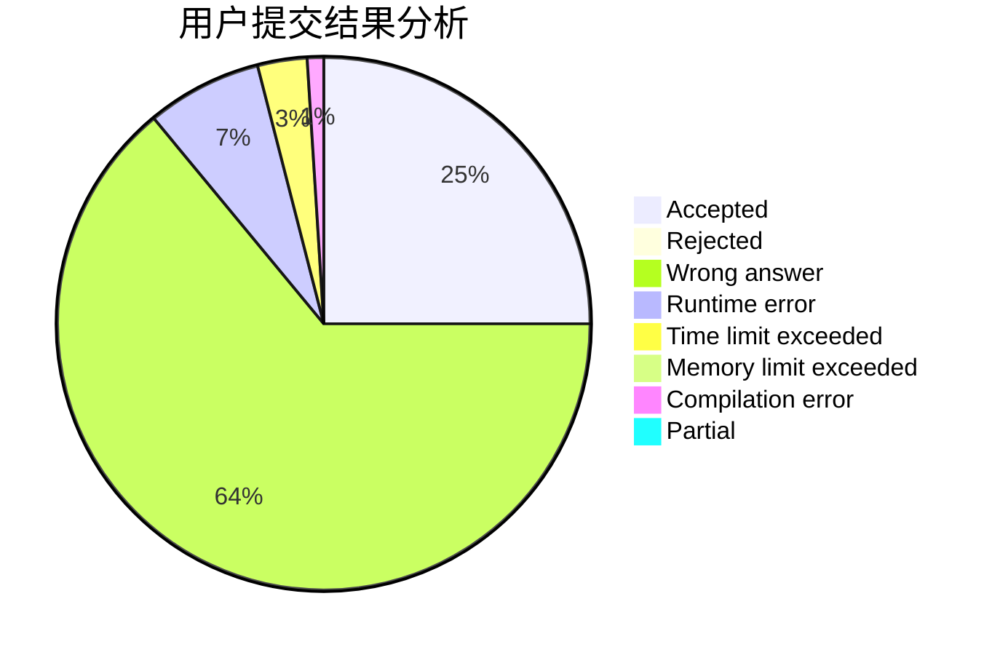
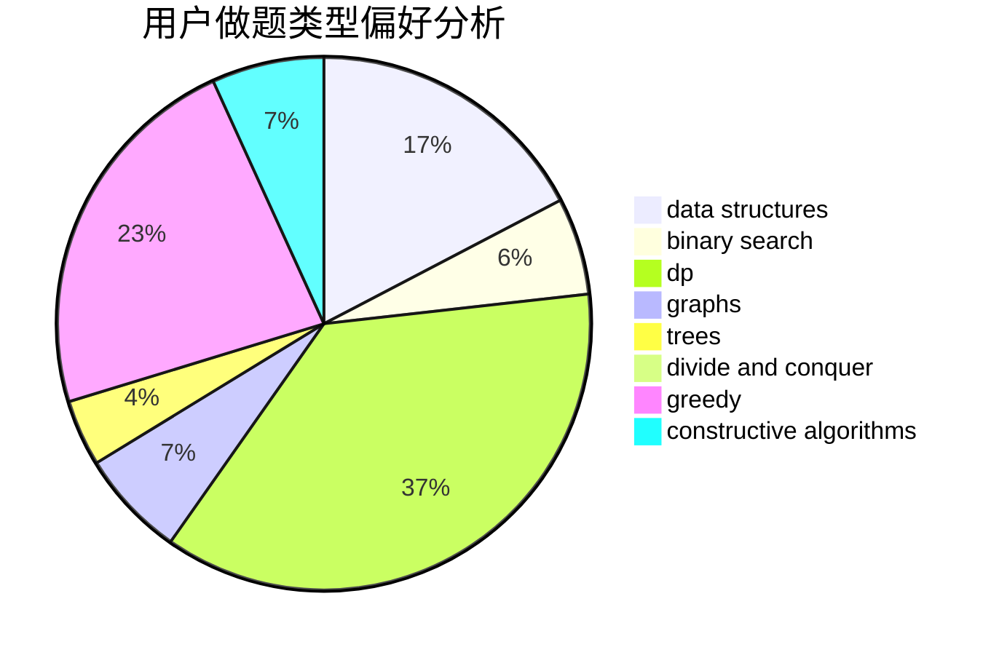

# YjmStr

<!-- tabs:start -->

#### **用户提交结果分析**

#### **用户做题类型偏好分析**

#### **用户错题知识点分析**

<!-- tabs:end -->
# 推荐题目
[1228D](https://codeforces.com/contest/1228/problem/D)		brute force,
                        constructive algorithms,
                        graphs,
                        hashing,
                        implementation		  
[1254E](https://codeforces.com/contest/1254/problem/E)		combinatorics,
                        dfs and similar,
                        dsu,
                        trees		  
[1183C](https://codeforces.com/contest/1183/problem/C)		binary search,
                        math		  
[325B](https://codeforces.com/contest/325/problem/B)		binary search,
                        math		  
[1346A](https://codeforces.com/contest/1346/problem/A)		*special problem,
                        math		  
[1098E](https://codeforces.com/contest/1098/problem/E)		binary search,
                        implementation,
                        math,
                        number theory		  
[449D](https://codeforces.com/contest/449/problem/D)		bitmasks,
                        combinatorics,
                        dp		  
[525C](https://codeforces.com/contest/525/problem/C)		greedy,
                        math,
                        sortings		  
[793F](https://codeforces.com/contest/793/problem/F)		data structures,
                        divide and conquer,
                        dp		  
[353A](https://codeforces.com/contest/353/problem/A)		implementation,
                        math		  
