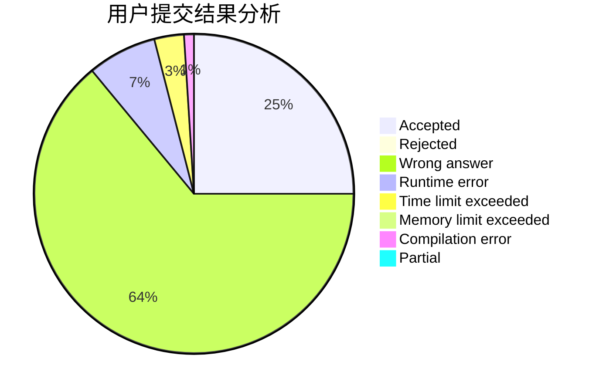
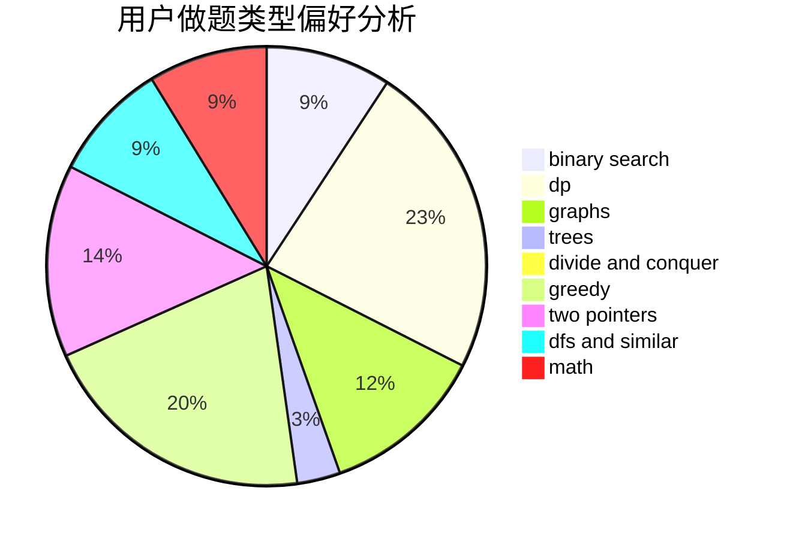

# YjmStr

<!-- tabs:start -->

#### **用户提交结果分析**

#### **用户做题类型偏好分析**

<!-- tabs:end -->
# 推荐题目
[1228D](https://codeforces.com/contest/1228/problem/D)
[1254E](https://codeforces.com/contest/1254/problem/E)
[1183C](https://codeforces.com/contest/1183/problem/C)
[325B](https://codeforces.com/contest/325/problem/B)
[1346A](https://codeforces.com/contest/1346/problem/A)
[1098E](https://codeforces.com/contest/1098/problem/E)
[449D](https://codeforces.com/contest/449/problem/D)
[525C](https://codeforces.com/contest/525/problem/C)
[793F](https://codeforces.com/contest/793/problem/F)
[353A](https://codeforces.com/contest/353/problem/A)
