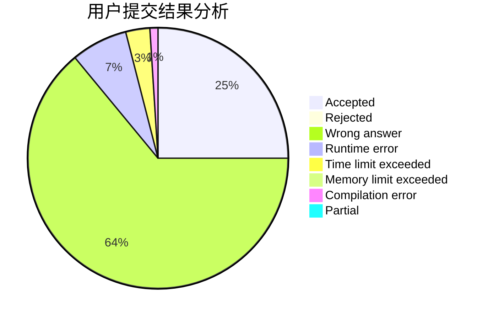
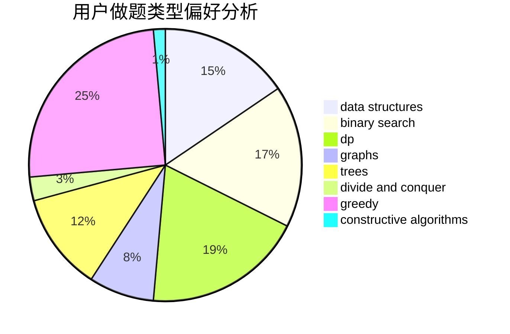

# YjmStr

<!-- tabs:start -->

#### **用户提交结果分析**

#### **用户做题类型偏好分析**

#### **用户错题知识点分析**

<!-- tabs:end -->
# 推荐题目
[1220D](https://codeforces.com/contest/1220/problem/D)		bitmasks,
                        math,
                        number theory		  
[1250F](https://codeforces.com/contest/1250/problem/F)		brute force,
                        implementation		  
[1180B](https://codeforces.com/contest/1180/problem/B)		greedy,
                        implementation		  
[304D](https://codeforces.com/contest/304/problem/D)		dsu,graphs,sortings,trees		  
[1339A](https://codeforces.com/contest/1339/problem/A)		brute force,
                        dp,
                        implementation,
                        math		  
[1098B](https://codeforces.com/contest/1098/problem/B)		brute force,
                        constructive algorithms,
                        greedy,
                        math		  
[426B](https://codeforces.com/contest/426/problem/B)		implementation		  
[505A](https://codeforces.com/contest/505/problem/A)		brute force,
                        implementation,
                        strings		  
[774G](https://codeforces.com/contest/774/problem/G)		*special problem,
                        number theory		  
[321D](https://codeforces.com/contest/321/problem/D)		dp,
                        greedy,
                        math		  
